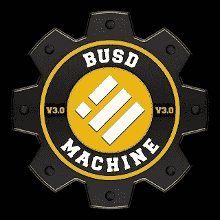
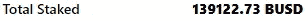
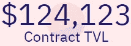
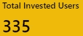
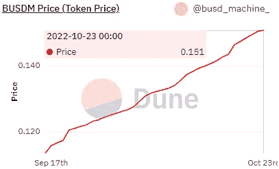
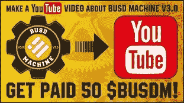

# BUSD 机器 V3 —每周更新 10 月 23 日

> 原文：<https://medium.com/coinmonks/busd-machine-v3-weekly-update-oct-23-8f955dea121a?source=collection_archive---------5----------------------->

大家好，我叫 Nelson，和我一起回顾一下[机器的进展吧！](https://tokenminer.online/BUSDMachinev3/?ref=0x81C50fC313F17F84b7F9427e6ba6ceA8e3Bd1A4F)

**数字！**

当前存储的 BUSD 接近 140K BUSD 标记。

在我们所处的当前市场条件下，我们看到许多项目都在努力通过 10 万到 12 万的存款。

**这是为什么？我相信许多从事加密的人应该花点时间考虑一下这个市场是如何运作的，即使我们生活在世界各地的困难时期，当我们看新闻时，我们经常听到经济崩溃和普遍衰退…**

无论是在熊市还是牛市，人们经常成为自己冲动的受害者，让自己被看似是黄金的闪光物体所吸引，但在你真正检查它之后，它并不是…

在熊市中，我们看到提供合理报酬和收入机会的严肃项目，通常比其他项目低，这些项目是由体面的团队做出的，他们希望带来负责任的项目，这些项目可能会持续下去，并为大多数用户而不是少数用户带来利润……
然而，在熊市条件下，这些团队很难获得用户，而其他团队带着不切实际的 APR 和 APY %涌入，同样的人仍然会进去，并试图在大多数情况下只获得 rekt

***“重复同样的动作，希望结果可能是不同的……”***

**目前 TVL 被吃了 124K。**
这代表着 TVL 比上周增长了 2.1%，自 9 月 17 日我们开始跟踪[机器](https://tokenminer.online/BUSDMachinev3/?ref=0x81C50fC313F17F84b7F9427e6ba6ceA8e3Bd1A4F)数字以来增长了 13.9%。

用户数量现在是 335。
在过去的一周里，我们看到用户增长了 2.4%，总体增长了 23.2%。

目前的销售价格为每条总线 0.151 BUSD，我们看到本周的价格上涨了 7.0%，自第一次审核以来上涨了 31.1%。

价格的上涨也得益于 FOF——财富之乡——的资金注入，在不到两周的时间里，已经注入了大约 200 个 BUSD，在大约 24 到 48 小时内，将会有新的注入

口碑在任何项目中都是一个非常强大的工具，在[机器](https://tokenminer.online/BUSDMachinev3/?ref=0x81C50fC313F17F84b7F9427e6ba6ceA8e3Bd1A4F)中，我们很幸运地看到团队奖励那些采取行动将 [**机器**](https://tokenminer.online/BUSDMachinev3/?ref=0x81C50fC313F17F84b7F9427e6ba6ceA8e3Bd1A4F) 推向世界的人……**这取决于你自己！**

特别感谢社区成员 [@SashaGorgov](http://twitter.com/SashaGorgov) ，他是本文中使用的所有图表的负责人，并负责更新这些图表。

**有用链接**
>>[***机位***](https://tokenminer.online/BUSDMachinev3/?ref=0x81C50fC313F17F84b7F9427e6ba6ceA8e3Bd1A4F)<<
>>[**FOF—福地**](https://farmoffortune.fortunehunters.space/index.html?ref=0x5D9E96068f42943e7e9e6e9468Ff8Bd933d5cf3A)<<
***>>***[*Defi-Eco TG*](https://t.me/defiecosys2) [*Defi-Eco 以往项目*](https://tokenminer.online/)< *>>*[*计算器电子表格*](https://docs.google.com/spreadsheets/d/1T2qxPvMxf7xF-at4EIQX49sf355UESZqOmh5Vrcnyvo/edit?usp=sharing)<< *>>*[*图表*](https://dune.com/busd_machine_v3/busd-machine-v3)<<
>>

如果你喜欢我的文章，请考虑一些掌声，因为它有助于达到更多的人，如果你想知道更多关于我的加密之旅考虑订阅。

本文中的任何内容都不构成投资建议。作者和出版物均不对您可能因这些信息而招致的任何投资、利润或损失承担任何责任或义务。我们鼓励读者在做出任何和所有投资决定之前，进行尽职调查和研究，或咨询持牌金融顾问或经纪人。此内容仅用于一般信息和教育目的。尽管作者力求准确，但文章中的数据并不可靠。作者可能拥有文中讨论的加密货币和代币。文章可能包含附属链接。

> 交易新手？试试[密码交易机器人](/coinmonks/crypto-trading-bot-c2ffce8acb2a)或者[复制交易](/coinmonks/top-10-crypto-copy-trading-platforms-for-beginners-d0c37c7d698c)