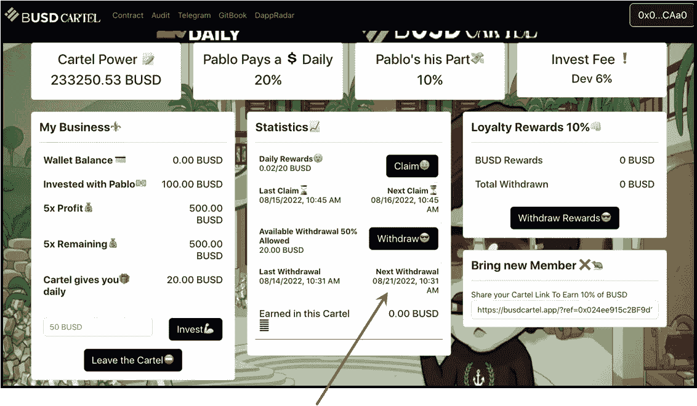

# 巴斯德·卡特:最新的迪菲克隆人，用来对付迪诺布德

> 原文：<https://medium.com/coinmonks/busdcartel-the-newest-defi-clone-to-rough-up-dinobusd-e30b97f02a1b?source=collection_archive---------4----------------------->

## 我给这个小变化赌注协议 3 个月——最多。

20% daily return, huh? Not sure who’s burning money — him or any investor into the protocol…

我爱这个空间！每天，寻找甜蜜的被动收入机会的人都在研究新兴的 DeFi 投资项目，然后在这里写下来。

> 与此同时，任何阅读它们的人都会获得我们可能想要投资的项目的最新信息。如果我们有兴趣并决定进一步研究该协议，这些文章只是我们广泛研究的开始。

难以置信的是，在这个星期天早上醒来&阅读一个全新的——像 24 小时年轻的——零钱加密赌注协议，我已经很熟悉了。BUSDCartel 是使用**投资门户仪表板的克隆版本，**由仍然成功的 DinoBUSD.finance dApp 推广。

我想至少进一步探索一下恐龙布斯的任何克隆体。

## 见见第四代恐龙克隆人

对于一个基于贩毒主题的加密矿工来说，[巴士卡特](https://busdcartel.app/?ref=0x024ee915c2BF9d12F98b750119051A752e18CAa0)就像你想象的一样流畅。不过，提供 20%的日回报率是愚蠢的，这也是我不太信任它很久的主要原因。

> 请注意，伊卡洛斯式的回报并不是每天都有 20%的投资回报。为了鼓励这些协议的可持续性和持久性，你必须每天重新存入复利资金&你可以每周提取一半。请仔细阅读[原始 DinoBUSD](/coinmonks/one-month-in-with-the-dinobusd-roi-pocket-change-crypto-miner-f54d20ee630f) miner 协议&和 [3 DinoBUSD 克隆体](/coinmonks/attack-of-the-forking-clones-302b5718d0f5)，这样你就能了解仪表盘&项目是如何工作的。

这个投资协议的问题是:

This is a Normal Distribution Graph, from [Investopedia](https://www.investopedia.com/terms/b/bell-curve.asp), which resembles a bell. For pocket-change miner projects, we don’t want to see Bell Curves.

## 钟形曲线

我担心 BUSDCartel 的生命周期将类似于传统的钟形曲线，这在加密空间的这个角落不是一个好的形状。当然，这对早期投资者来说是好事:根据 Gitbook [演示文稿](https://aeek-d-dd.gitbook.io/busdcartel/)中的计算，由于利息如此之高，早期投资者应该在两周内收回投资。

我的预测是，该协议将有一个伟大的前几周——[跑上山](/coinmonks/running-up-that-hill-with-no-problems-f268d879a206)步行交通图将类似于上图所示的钟形曲线的前半部分。今天为未来投资的人&(2？)周会做的很好。因为我的水晶球有一个轻微的裂缝，协议如何下降到那座绿色山丘的另一边仍然有点模糊。

> 然而，我预计**卡特尔智能合约**一旦达到图表中的山顶，就会很快耗尽资金。它可能确实类似于上面的经典钟形曲线，下降的速度和上升的速度一样快。
> 
> 原因是:在 7-10 天内，第一批投资者将收回他们第一周的提款&将会有**巨额**资金退出协议。接下来的一周，甚至会有更多的合同被取消。如果相同数量(加上更多！)是不是已经被替换了，这个项目就会迅速崩溃。

## 其他协议

下图有所不同。对我来说，这就是一个可爱的人流量图表的样子。前半部分——山顶——直接取自 DinoBUSD BscScan 分析图。它显示了对该项目的缓慢而持续的投资数量——绿线的向上移动。

下半部分——下山——不需要像上面的钟形曲线那样刺耳。一个真正完美的人流量图将永远持续下去…

我们还没有到那一步，然而，这是这个密码空间最终将会出现的地方。

The ‘Foot-Traffic’ graph above indicates the relative strength of a project. The green represents new investment into the protocol. A nice, smooth hill on the other side — slowly descending for many years — would be the ideal.

## 同时:BUSDCartel 投资回报:

根据 BUSDCartel.app 协议，以下是我收回初始投资的时间表:

如果我投资 100 美元(BUSD)，我将获得 20%的每日回报，即 20 美元/天。对于 7 天，我必须计算该回报的复利(7 天 x 20 美元/天是 140 美元)。

## 第一周

第一周后，我的账户里有 140 美元。长寿的特点:我可以只提款一半；另一半留在我的账户里。所以 70 美元——10%的出境税给了我 63 美元放进我的口袋。

## **第二周**

剩余的 70 美元仍在我的奖励账户中。连续 7 天，我每天收到 20 美元，在第 2 周结束时是 140 美元。加上我账户上已经有的 70 美元，一共 210 美元。对于我每周的取款，同样，为了长寿，我可以取出那 210 美元的一半。所以 105 美元，减去 10%的退出费，总共是 94.50 美元**，以退出第 2 周**。

> 加上第一周和第二周的取款金额($63 + $94.50) **，我的口袋里总共有$ 157.50**。
> 
> 请注意，我的本金投资是 100 美元。

## 咻…

这是一个很大的想象:到第二周结束时，全部投资回报，加上 57.5%以上的回报。如果该协议在第三周的合同中有资金，我将在出口税后赚 110.25 美元放入我的口袋。

如果有风险的协议在 3 周内仍然有效，我的被动收入将是 267.75 美元，或 21 天内 267%的投资回报率。太好了。

> 我探索和剖析新的口袋变化加密赌注协议。我要么把它们拆开，要么决定投资这个项目，鼓励它们的可持续性和持久性。这些矿工中很少有人会升到最高层；那些是我正在寻找的。BUSDCartel 是一项高风险的试验性投资…

## 本质上

我想我是个赌徒。我控制不住自己…在这个项目开始的时候到达有一些优势，特别是在像这样一个高风险的项目中。

> 知道这是高风险的对我来说是兴奋的一部分；我愿意冒这个险。

昨天，我向 BUSDCartel.app 投资了 100 BUSD——见上面的截图。

根据上面的数字，我应该在这个周末收到 63 美元；下一周结束时是 94.50 美元，下一周可能是 266 美元——在 9 月初。如果协议在那之后继续，我将继续获得超过我最初投资的奖励。这值得最初的 100 美元…

请跟随我几个星期——我将探索这个 BUSDCartel 零钱加密挖掘器，直到它自然结束…

> 我总是鼓励朋友们自己做研究，只玩你不需要的东西。

我只投资我研究过的项目&我觉得写起来很舒服。点击上面的 BUSDCartel.app 本文包含所有注意事项；或者下面的 SpaceBUSD.finance 链接，带你去那个投资协议；使用该平台将为我提供一个小的金钱介绍…谢谢。

## 很高兴有你跟着我。又是 Thx。

我哥们什么都画！我称之为他的账本系列。我喜欢下图。

SunRise

> 交易新手？试试[密码交易机器人](/coinmonks/crypto-trading-bot-c2ffce8acb2a)或者[复制交易](/coinmonks/top-10-crypto-copy-trading-platforms-for-beginners-d0c37c7d698c)