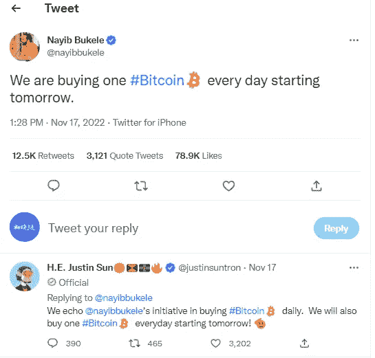
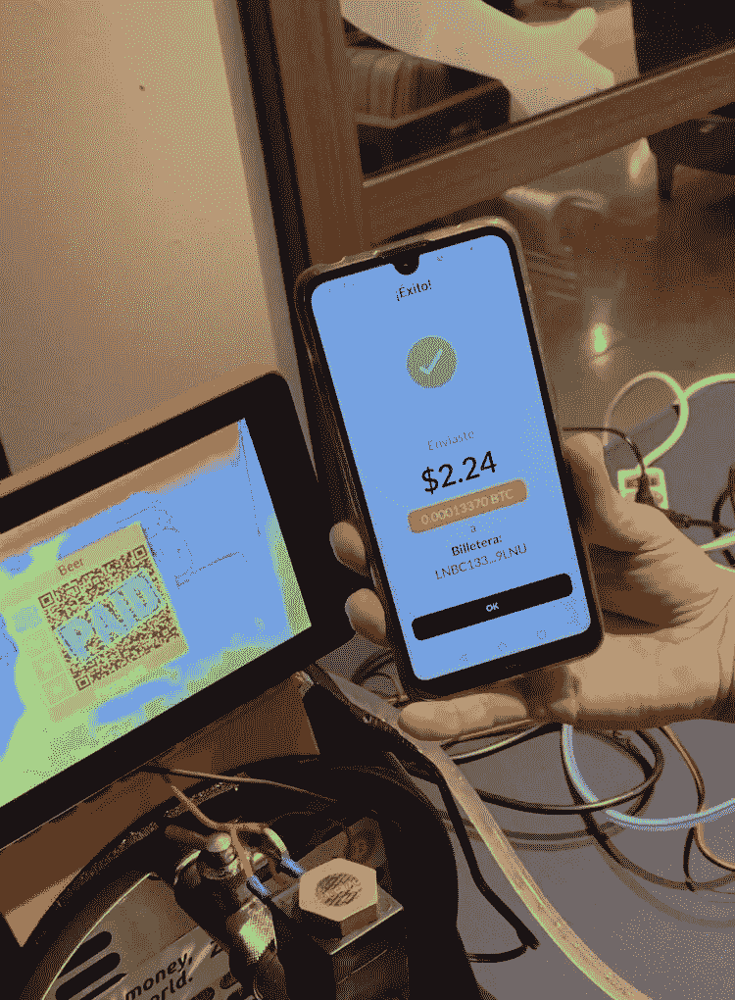
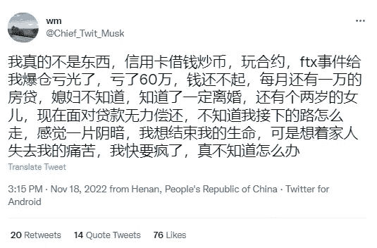
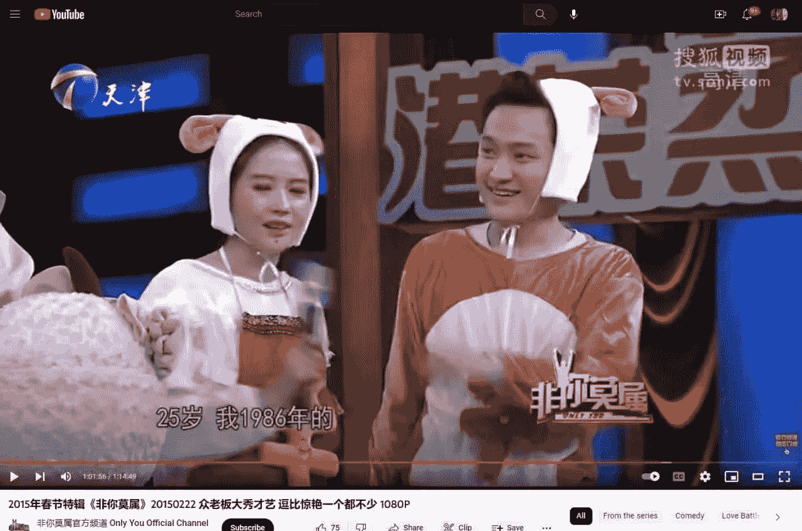

# 买 BTC 亏了 6200 多万美元，萨尔瓦多还会继续买 BTC

> 原文：<https://medium.com/coinmonks/buying-btc-lost-more-than-62-million-u-s-dollars-and-el-salvador-will-continue-to-buy-btc-4e1f1b5525cb?source=collection_archive---------14----------------------->

萨尔瓦多总统纳伊布·布克勒(Nayib Bukele)昨天在其推特中宣布，“从明天开始，我们将每天购买一枚比特币”，目前比特币的价格为 16700 美元。

萨尔瓦多于 2021 年 9 月 7 日开始购买比特币，并将比特币作为国家法定货币。

根据报道的数据，萨尔瓦多目前持有约 2381 枚比特币，平均购买价格约为 4.3 万美元。按照现在的价格，亏损约 6200 万美元，亏损 61%。

这个总统真的是举全国之力炒比特币，他的成败将被载入史册。他是第一个吃螃蟹的人。

President of El Salvador announces to buy 1 BTC per day

萨尔瓦多人在 BTC 使用 Chivo 钱包付款。一开始，政府向每个萨尔瓦多账户持有人空投价值 30 美元的 BTC。萨尔瓦多的 BTC 支付和用支付宝、微信扫码支付一样方便。

无法评论萨尔瓦多总统发起的改革是否会给该国人民带来好处，或者是否会随着 BTC 价格下跌而继续亏损。

萨尔瓦多购买的第一把 BTC 的价格是 5.2 万美元，现在已经跌到 1.67 万美元，跌幅超过 67%，相当于国库资产的一半以上。

Salvadorans Pay with Chivo Wallet

加密市场一直不稳定，BTC 的价格也不稳定。

从去年的高点 69k 到 16K，已经跌了 75%。整个市场受消息影响较大，时有黑天鹅事件。

例如，FTX 平台在月初发生爆炸，导致许多普通玩家遭受巨大损失。有些人在 FTX 平台上的资产没有撤资，现在投诉无门，很难追回。

也有一些合同玩家在 FTT 暴跌的影响下直接平仓。如果是借款投资或者杠杆高的人，早就把钱亏进无底洞了。

也有一些玩家不重视数字钱包的使用。助记词被盗，钱包直接归零。在密码市场，赔钱更快！

Lost 600,000 on the contract

今天，圈内有传言称，何易和孙在 2015 年的求职电视节目《属于你》上表演了他们的才艺秀。当时他们只是某个公司的老总，需要通过人才招聘人才。

时过境迁，现在他们两个已经是加密圈有影响力的人物，碾压同时代人好几个街区。

加密的世界给他们带来了意想不到的社会地位和财富积累，区块链极大地改变了普通人，实现了阶级的飞跃。

有人在加密的世界里丢了内裤，有人在巨变中把握了完全不同的机会。

He Yi and Sun Yuchen in 2015

中本聪在他的白皮书中介绍了“比特币:一种点对点的电子现金系统”，似乎目前只有萨尔瓦多在实践它。

更多的人是做多或者做空 BTC，从中获利或者归零；一些人在区块链革命中获得了新的机会，迎来了不同的生活。

A peer-to-peer electronic cash system

现在的加密市场更像是一个巨大的投资市场。涨了就免费，输了就归零；如果每天上涨或下跌 10 点或 20 点，财富将增长和消失得非常快。

对于比特币还无法下结论，因为没有人能说清未来的市场走向，是泡沫破灭还是变革席卷全球。

也许在我们的有生之年，我们真的可以见证一个全新世界的诞生。

当然，风险和机遇还是同时诞生的。

以上只是我个人观点，没有投资建议。我是楚小莲，我正在关注元宇宙和 web3。

> 交易新手？试试[加密交易机器人](/coinmonks/crypto-trading-bot-c2ffce8acb2a)或者[复制交易](/coinmonks/top-10-crypto-copy-trading-platforms-for-beginners-d0c37c7d698c)