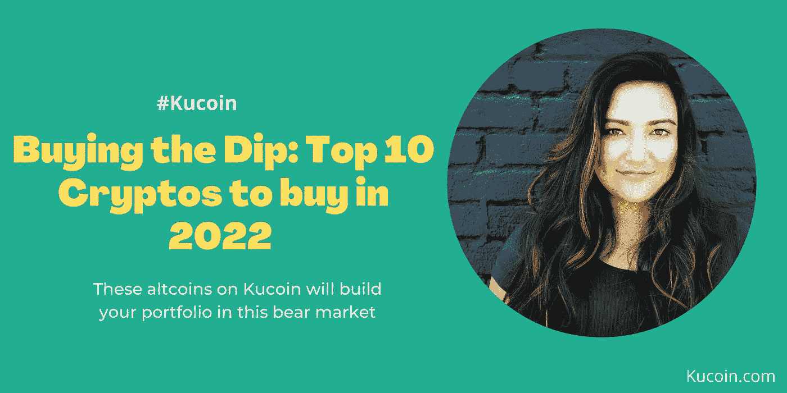

# 购买 Dip:现在购买的十大密码(2022)

> 原文：<https://medium.com/coinmonks/buying-the-dip-top-10-cryptos-to-buy-now-2022-25437aaa3a68?source=collection_archive---------0----------------------->

*购买 10 倍于你投资组合的 dip &股票*

衰退来了。从表面上看，它会留在这里。专家表示，我们可能会在 2023 年初之前一直被困在这片浑水中。与其关注消极的一面，不如充分利用这种情况？

你不知道，这通常是一批新的百万富翁出现的季节。这些人是普通人，他们只是利用机会。不多不少！！而这一切都归结为 ***【买盘】！！！***

*把它放在上下文中；在经济衰退期间，如果你能以 24000 美元的价格买到一辆 69000 美元的 BTC，为什么还要买呢？*

这确实是你去购买和*大买的最佳时机！！！*因为没有比这更好的了。

如果你觉得自己错过了像 BTC 和瑞士联邦理工学院这样的顶级加密公司，我整理了一份名单，列出了预计在未来几年将大幅增长的“*”不被看好的加密公司。*

*而 Kucoin *(密码兑换)*作为“ ***山寨币之王*** ”，对于新手来说会是一个很棒的平台。*

1.  *索拉纳——如果你没听说过索拉纳，那它就是给以太坊带来不眠之夜的象征。瑞士联邦理工学院一直是创建 dApps 的领导者，但索拉纳肮脏廉价的交易费和更快的交易证明并非如此。*

*目前，Eth 1.0 每秒只能处理 15 个交易，而 Solana 每秒可以处理高达 50，000 个交易。即使与即将到来的 Eth 2.0 合并，索拉纳预计会比 Eth 表现得更好。*

*索拉纳已经成功地在 NFT 开辟了一个利基市场。大多数开发人员发现 Solana 的低铸造费和闪电般的速度是以太坊的更好替代方案。*

*以上因素使得索拉纳在买家中呈上升趋势。截至本文撰写时，索拉纳的售价为([**SOL Price**](https://www.kucoin.com/price/SOL))$ 41.103。代币一度达到 259 美元的历史高点，很容易看出这是它的低点之一。因此，索拉纳绝对是你的“立即购买”密码列表中的重中之重。*

***2。雪崩(Avax)**——雪崩被称为区块链领域最快的智能合约平台。它成功地为 Web 3.0 dApps 提供了一个交易费用低、交易速度快的可扩展解决方案。简而言之， [**雪崩**](https://www.kucoin.com/price/AVAX) 提供以太坊所做的，但更好。Eth 仅由一条链组成，而 Avalanche 带来了 3 条链，形成了一个更大的区块链，每条链都有自己的功能。*

*在高峰期，Avalanche 的交易价格为 134.53 美元，而在撰写本文时，其交易价格为 25.89 美元。*

***3。Cardano(ADA)**——Cardano 作为一个提供可伸缩性、互操作性和可持续性的区块链平台脱颖而出。它为开发安全、可伸缩和健壮的平台带来了动态功能。它以解决问题的功能而闻名。*

*与以太坊相比，Cardano 运行在一个利益证明协议上，不像以太坊的工作证明。此外，卡尔达诺拥有固定数量的 ADA ( *卡尔达诺区块链的加密令牌)*赋予其通缩特征，因此估计其升值幅度超过以太坊。*

***截至本文撰写时，ADA 的价格为 0.530256 美元，在 2021 年 9 月达到 3.09 美元的历史高点。Cardano 即将推出升级" *Cardano Vasil* "，带来更高的可扩展性、高级互操作性和改进的智能合约。这个令牌肯定有一个光明的未来。***

*****4。KCS**——KCS，库币加密交易所的原币拥有指数级的潜在增长。KCS 在 Kucoin 生态系统中发挥着重要作用，当持有人在 Kucoin Crypto Exchange 中进行交易时，可以享受 20%的折扣。***

***KCS 以其独特的利润分享系统脱颖而出，该系统在名为 Kucoin share(KCS)的 ERC20 令牌上运行。拥有和持有 KCS 的用户有资格获得库币加密交易所利润的 50%。然而，这项特权只适用于库币交易所的持有者。***

***在撰写本文时，KCS 价格 目前为 10.33 美元，曾创下 28.79 美元的历史新高。这种原生币在未来有 10 倍的容量，尤其是随着 Kucoin 的巨大增长。我总是喜欢把它视为下一个 BNB(币安的本土硬币)。***

*****5。Vechain(VET)** - Vechain 成立于 2015 年，采用权威共识机制证明。它有两个令牌，即*兽医*和*兽医*。 *VET* 主要用于存储和转移价值，而 *VTHO* 充当用于处理交易的 gas。用户可以下注兽医代币，并获得 *VTHO* 奖励。***

***这个区块链平台在供应链和物流领域表现出色，与沃尔玛、宝马和路易威登建立了合作伙伴关系。2018 年，随着 mainnet 的推出，Vechain 发展成为通用产品，因此可以集成 dApps 和 ico。***

***不像区块链的其他供应链，如 Waltonchain 和 Wabi，都很失败，Vechain 真正经受住了时间的考验，并继续带来巨大的价值。 [**Vechain(VET)价格**](https://www.kucoin.com/price/VET) 截至本文撰写时，交易价格为 0.0261386 美元，2021 年 4 月创下 0.280991 美元的历史新高。专家认为，这个区块链将打破增长的机会。***

*****6。Polygon (MATIC)-** 这个二层以太坊扩展解决方案成立于 2017 年，最初命名为 MATIC network，2021 年更名。Polygon 使用利益一致机制的证明。它是以太坊的侧链，可以处理大约 7,000 TPS。这种高速度是侧链本身集中化的结果。***

***2022 年 4 月，[**Polygon(MATIC)**](https://www.kucoin.com/price/MATIC)推出了超网链，让开发者能够在一个可定制的环境中构建项目，而无需任何运营或托管成本。这一推出被认为最终会对 Web 3 的大规模采用产生影响。***

***截至本文撰写时，多边形(MATIC)价格为 0.8087 美元，2021 年 12 月创下 2.92 美元的历史新高。随着即将到来的以太坊合并，Polygon 有可能改进其缩放解决方案，使其更加环保。***

***7。奇点道 -这个 Defi 平台创造了一个独特的利基市场，本质上是利用人工智能来观察市场趋势，以帮助投资者管理他们的资产。它在保护投资者的加密资产免受崩溃和损失方面发挥了关键作用。***

***它的 [**SDAO**](https://www.kucoin.com/price/SDAO) 令牌负责管理它的动态集。动态集代表由*动态资产管理器(DAM)管理的令牌集合。一个 DAM 包括人类和人工智能交易者。****

***Singularity DAO 最近与 Hugin Expert 建立了合作伙伴关系，试图对其决策公式和过程进行数学建模。这一因素有望提升 Defi 平台的性能。截至本文撰写时，SDAO 价格为 0.3851 美元，2021 年 9 月达到 6.62 美元的历史高点。***

*****8。Zilliqa(ZIL)**——Zilliqa 已经将自己定位为驱动下一代 dApps 的燃料。2017 年创建的公共区块链平台目前被用于数字广告、游戏和金融领域。其公用令牌 ZIL 在 Zilliqa 生态系统中用作天然气，以执行智能合同，作为对矿工的激励(奖励)以及支付网络交易成本。***

***Zilliqa 以其分片(*将节点分成不同的组*)元素脱颖而出，该元素旨在解决隐私、可伸缩性和去中心化问题。因此，Zilliqa 能够以每秒 2500 次交易的速度执行，而不像 BTC 的 7 TPS 和 Eth 的 15 TPS。***

***[**齐力卡(ZIL)价格**](https://www.kucoin.com/price/ZIL) 本文写作时的交易价格为 0.03747 美元，2021 年 5 月创下 0.2563 美元的历史新高。这个秘密宝石，绝对是一个值得警惕的。***

*****9。Flow**-Flow 区块链是 cryptokitties 背后的团队专门为 NFTs 设计的。它使用了利益相关者共识模型的证明，并使用一种新的编程语言 *(cadence)* 从头开始构建，以执行智能合约。***

***[**流程**](https://www.kucoin.com/price/FLOW) 的独特之处在于其几乎零错误的特性，这是因为其智能合约有可能被开发人员部署为测试版。在 NFL、NBA 和 UFC 在 its 区块链上推出他们的 NFT 后，Flow 开始流行起来。***

***截至本文撰写时，流动价格为 2.24 美元，2021 年 4 月创下 46.16 美元的历史新高。这种区块链有可能是您投资的 5 倍甚至 10 倍。***

*****10。这个 Defi 项目正在把隐私带到月球上。Findora 是一家专注于隐私保护技术的公共区块链。它利用 ZK-rollup 实现可扩展性，利用 Discret(域特定语言)实现安全性。它还以通过可验证计算的互操作性而闻名。*****

***Findora 旨在通过引入机密性和透明度来实现金融领域的多样化用例。抢先运行和保持数据点的机密性是分散平台中的一个主要问题，基于隐私的技术可以方便地解决这个问题。***

***[**芬多拉(FRA)价格**](https://www.kucoin.com/price/FRA) 截至本文撰写时为 0.007235 美元，2021 年 4 月创下 0.100421 美元的历史新高。据推测，随着分散平台开始采用隐私技术，该项目将会有巨大的增长。***

## ***结论***

***要想投资成功，你必须像现实世界的投资者一样思考。这需要考虑长远，而不是追逐短期收益。因此，衰退是成倍提升你的投资组合的终极杠杆。*“买蘸”*今天，10 倍你的未来！！***

***[***在这里打开您的 Kucoin 账户> >***](https://www.kucoin.com/ucenter/signup?rcode=rP1HTX2)***

****(Kucoin 在有限的时间内为期货和保证金部分的新用户提供了一些丰厚的奖金)****

*****免责声明**:本文仅用于教育目的，不应理解为投资建议。***

******关联披露:*** *本帖可能包含关联链接* s***

***查看我的其他文章***

***[*逢低买入:元宇宙十大投资项目(2022)*](/coinmonks/buying-the-dip-top-10-metaverse-projects-to-invest-in-now-2022-b06a40d8db0b)***

***[*如果你有一个币安账户，你会爱上一个 Kucoin 账户> >*](/coinmonks/if-you-have-a-binance-account-youll-love-a-kucoin-account-5c68b6037b32)***

***[*什么是 OCO 订单，它是如何工作的？*](/coinmonks/just-what-is-an-oco-order-and-how-exactly-does-it-work-e77dde2020b3)***

***[*Kucoin 刚刚上市的新代币(7 月&8 月)*](/coinmonks/kucoin-just-listed-new-tokens-july-august-8c44def32442)***

> ***交易新手？试试[加密交易机器人](/coinmonks/crypto-trading-bot-c2ffce8acb2a)或[复制交易](/coinmonks/top-10-crypto-copy-trading-platforms-for-beginners-d0c37c7d698c)***