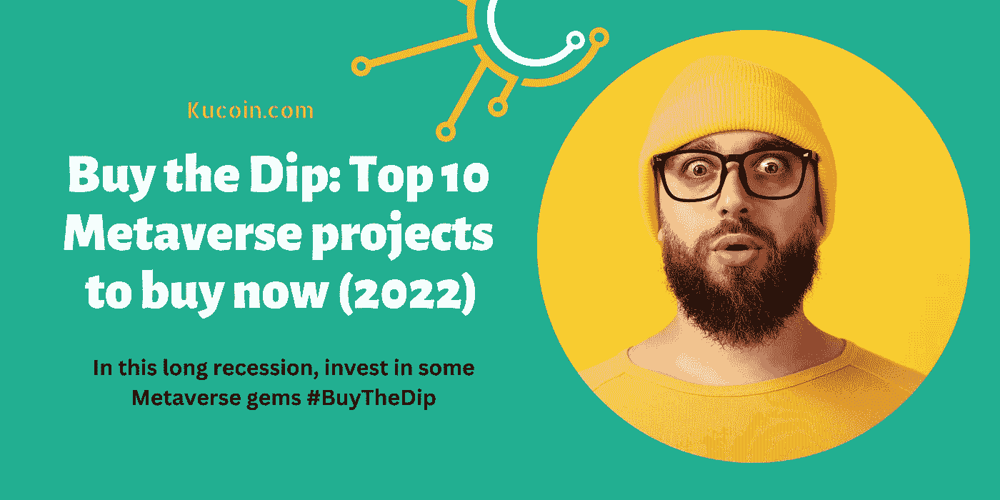

# 买入 Dip:现在投资的十大元宇宙项目(2022)

> 原文：<https://medium.com/coinmonks/buying-the-dip-top-10-metaverse-projects-to-invest-in-now-2022-b06a40d8db0b?source=collection_archive---------0----------------------->

从大处着眼，从元宇宙着眼！

如果你是一个老派的秘密投资者，是时候试试新的水域了。当 BTC、以太坊、BNB 和所有其他的*OG*cryptos 正在运行这个空间的时候，未来是元宇宙。

未来十年，我们一定会看到元宇宙项目的*崛起和*崛起。

显然，这是千禧一代和 z 世代的兴趣所在。

不管怎样，你都想成为这场革命的一部分。就像脸书一样。他们字面上重新标记为“ *meta* ”。如果这还不够有说服力，我不知道什么是…

相信我，我不是很喜欢游戏，还有那些虚拟现实的东西…

然而，分散投资不会让你付出任何代价。这可能是一个很好的选择，尤其是现在我们陷入了长期的衰退。

你猜怎么着，我已经为你做了所有的*【脏活】*，在这篇文章中，我会给你我的元宇宙十大项目清单，这些项目在未来 5 年内可能会增长 100 倍。

你可以在 Kucoin 这样的平台上开始这段旅程。*(这些家伙在上市元宇宙项目时吸引了一些关注)*

1.  **沙盒(SAND)**——如果你还没有了解沙盒，那么，它是一个奇特的平台，允许用户在其虚拟世界中租赁、拥有和出售土地。这个社区驱动的论坛也让创作者能够在虚拟世界中使用体素编辑器和游戏制作工具来制作游戏、物品和建筑。

[**SAND**](https://www.kucoin.com/price/SAND) 充当用于在沙盒生态系统中运行事务的实用令牌。这个 ERC-20 代币固定在区块链以太坊上。在撰写本文时，SAND 目前的售价为 0.921301 美元，限量供应 30 亿只。

沙子名列榜首，因为它是元宇宙最赚钱的硬币之一。

2.**分散土地(MANA)**——这个虚拟 3D 平台于 2020 年 2 月推出，让用户有权以 NFTs 的形式购买虚拟土地。

这都是通过它的加密令牌 [**(法力)**](https://www.kucoin.com/price/MANA) 在以太坊区块链上操作的。在阿迪达斯、三星、Millerlite、雅达利、苏富比和普华永道在该平台上购买虚拟财产后，该平台变得流行起来。

它的效用令牌 MANA 目前的交易价格为 0.711224 美元，历史最高价为 5.90 美元。它总共供应了 21.9 亿个法力令牌。

**3。Axie Infinity(AXS)** -这款来自 NFT 的在线视频游戏源于天空 Mavis 工作室，以其“游戏内”经济脱颖而出。游戏包括玩家收集和铸造充当“*轴*”(数字宠物)的 NFT。本质上，这些生物在游戏中被繁殖并被用来互相战斗。玩家在市场上交易 Axies 时要支付 4.25%的费用。

[**AXS**](https://www.kucoin.com/price/AXS) ，它的加密令牌在浪人网络下的以太坊区块链上运行。截至本文撰写之时，它目前的售价为 12.83 美元，历史最高价为 50.91 美元。它的总供应量为 8305 万 AXS。代币。

**4。怀尔德世界(狂野)-** 建立在 [**狂野**](https://www.kucoin.com/price/WILD) 令牌上，这个身临其境的 5D 元宇宙通过 NFTs 供电，建立在以太坊上。它喜欢与 zero.space 合作建立一个逼真的现实世界。在这个空间里，怀尔德可以获得虚拟的土地，表达自己，自由漫游。

其元宇宙经济由设计独特的 NFT 元宇宙市场驱动。Wilder World 的出现是为了解决 NFT 市场的流动性问题，在这里，非金融交易可以被细分为更优惠的价格。

截至本文撰写之时，WILD token 目前的交易价为 0.229009 美元，历史最高价为 7.60 美元。它总共有 5 亿个野生代币。

**5。Netvrk (NTVRK)-** 这个基于虚幻引擎的多链元宇宙平台以其为非技术用户提供开发虚拟世界的基础的能力而脱颖而出，它是基于区块链技术构建的。它允许用户通过 NFTs 和虚拟土地将他们的创作货币化。

持有 [**NTVRK**](https://www.kucoin.com/price/NTVRK) token 可以在其虚拟世界内购买房屋、车辆等资产。截至本文撰写时，NTVRK 令牌目前的售价为 0.207584 美元，历史最高价为 7.33 美元。它最多供应 100，000，000 NTVRK 代币。

6。GALA(GALA)——GALA 已经确定了一个独特的利基，为玩家提供了一个交换游戏内*资产的平台。联欢晚会是为联欢晚会赢得生态系统的动力的公用令牌。联欢晚会可以在用户之间转让，他们完全有权使用它。此外，该平台正在建立一个节点网络，让用户将任何资产货币化，比如音乐。*

*截至本文撰写时，GALA token 目前的交易价格为 0.041638 美元，历史最高价为 0.84 美元。它最多供应 350 亿个庆典代币。*

***7。sensor ium Galaxy(SENSO)**-sensor ium Galaxy 是将娱乐提升到下一个水平的平台。这个元宇宙在数字平台上带来了真实的生活体验。这个空间中的用户获得了在一个安全的全球生态系统中聚会、加入这个世界之外的节目和玩游戏的最终机会。*

*如果你是一个家庭音乐迷，这绝对是你的位置，因为史蒂夫·青木*(获奖 DJ)* 刚刚加入它的棱镜世界。*

*[**SENSO**](https://www.kucoin.com/price/SENSO) 令牌是为感官星系提供燃料的货币。SENSO token 目前的交易价格为 0.155768 美元，历史最高价为 3.27 美元。它总共供应 715，280，000 枚 SENSO 代币。*

***8。meta HERO(HERO)**——这个被大肆宣传的平台让用户能够在 3D 扫描技术上创建自己的头像。因此，参与者在元宇宙世界中以虚拟形象的形式获得他们确切的身体特征。首先，用户扫描他们的身体，建立一个虚拟形象的 NFT，然后将 NFT 放在元宇宙上。很棒，是吧？*

*[**英雄**](https://www.kucoin.com/price/HERO) 是用来在这个空间交易的代币。HERO token 目前的交易价格为 0.002325 美元，历史最高价为 0.25 美元。它总共供应 100 亿个英雄代币。*

***9。Bloktopia (BLOK)** -Bloktopia 是一个虚拟游戏平台，包括一个 21 层的建筑，玩家可以在这里居住，与其他玩家互动，并参加活动以获得奖励。加入这个元宇宙让玩家完成建筑的建造，激发参与者的创造力。该建筑还有一个 WWE 娱乐空间。*

*它的实用令牌 [**BLOK**](https://www.kucoin.com/price/BLOK) ，给予持有者各种特权，比如参加预售和参加独家活动。截至本文撰写时，BLOK 目前的交易价格为 0.002974 美元，历史最高价为 0.13968 美元。其总供应量为 2000 亿布洛克币。*

*10。分散式游戏(DG) -如果你是一个赌场迷，那么你绝对应该去看看分散式游戏。这个平台基本上是一个在元宇宙上运营的赌场。持有其令牌[**【DG】**](https://www.kucoin.com/price/DG)或使用平台保证你的所有权。*

*在这个元宇宙，参与 21 点、扑克和轮盘赌等游戏是赚取一些钱的一种方式。赢得更多代币意味着您有特权对赌场做出决定。*

*分散式游戏上的加密令牌 DG 目前的交易价格为 0.0514693 美元，而在本文撰写之时，它的历史最高价为 679.28 美元。它总共供应 571，565，976 DG 代币。*

***结论***

*元宇宙的项目会一直留在这里，你不得不“*准备好*或者“*准备好”*。现在是时候抓住这些宝石，看着你的投资组合在未来几年里爆炸式增长。*

*我强烈推荐使用 Kucoin，因为该平台非常热衷于元宇宙项目的上市。而对于美国用户来说，你其实是没有资格验证的。从大处着眼，从元宇宙着眼！！！*

*[***在此开立 Kucoin 账户> >***](https://www.kucoin.com/ucenter/signup?rcode=rP1HTX2)*

***免责声明**:本文仅用于教育目的，不应理解为投资建议。*

****关联披露:*** *本帖可能包含关联链接* s。*

*查看我的其他文章*

*[*买入 Dip:现在就买的十大密码(2022)*](/coinmonks/buying-the-dip-top-10-cryptos-to-buy-now-2022-25437aaa3a68)*

*[*如果你有一个币安账户，你会爱上一个库币账户*](/coinmonks/if-you-have-a-binance-account-youll-love-a-kucoin-account-5c68b6037b32)*

*什么是 OCO 订单，它是如何工作的？*

> *交易新手？尝试[加密交易机器人](/coinmonks/crypto-trading-bot-c2ffce8acb2a)或[复制交易](/coinmonks/top-10-crypto-copy-trading-platforms-for-beginners-d0c37c7d698c)*