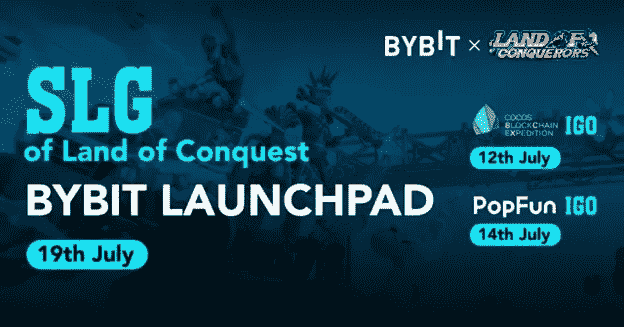

# 通过白名单和 IGO 列出$SLG GameFi Token 征服之地

> 原文：<https://medium.com/coinmonks/bybit-exchange-to-list-slg-gamefi-token-land-of-conquest-following-whitelisting-and-igo-808b63769b7f?source=collection_archive---------61----------------------->

***新加坡，2022 年 7 月 11 日***——[征服之地](https://www.landofconquest.com/#/home)，即将在 GameFi 空间推出的备受期待的区块链游戏，今天宣布其 **$SLG 治理令牌**将于 7 月 19 日在 [Bybit](https://www.bybit.com/en-US/) 加密货币交易所上市。本周将进行代币发行活动，如由领先孵化器 [PopFun](https://www.pop.fun/en-us/) 列入白名单，以及由 [Cocos](https://www.cocosbcx.io/) launchpad 于 7 月 12 日主办的限量发行 IGO(初始游戏发行)。

> “我们很高兴在像 Bybit 这样的全球知名交易所上市$SLG，”征服之地游戏制作人 Amore Wong 说。“在过去的几个月里，我们一直在努力建设‘征服之地’，我们很高兴地宣布，alpha 测试将于 7 月底开始，封闭测试将于 8 月份进行。通过 Cocos IGO 和 PopFun 白名单筹集的资金也将帮助我们很快推出最终游戏。看到我们已经获得的巨大支持，我们预计《征服之地》将会非常受欢迎。”

$SLG 是征服之地治理令牌，可用于在游戏的 SLG 市场进行 NFT 交易。除了 Bybit、Cocos 和 PopFun 上的代币购买选项外，还可以通过 play 在游戏内赚取$SLG。只有 10 亿美元的 SLG 将被发行，成为通货紧缩的象征。

Bybit 全力支持《征服之地》的代币上市。7 月 15 日， [Bybit NFT 市场](https://www.bybit.com/en-US/nft/)将出售由征服之地驱动的 NFT 神秘盒子，作为提高该项目的知名度的促销活动的一部分。

**征服之地:为想找乐子的游戏玩家打造的下一代 GameFi**

征服之地是一个即将到来的 MMOSLG 游戏，设定在一个世界末日的荒地。作为一款 MMO 模拟游戏，该游戏为玩家提供了许多令人兴奋的互动方式，从基地和资源的生产到为挑战性的 PvE 和 PvP 战斗训练英雄。

> **交易新手？试试** [**密码交易机器人**](/coinmonks/crypto-trading-bot-c2ffce8acb2a) **或** [**复制交易**](/coinmonks/top-10-crypto-copy-trading-platforms-for-beginners-d0c37c7d698c)

游戏有三种 NFT 供玩家购买和赚取:土地、英雄和要塞强化机甲。它还提供了一个免费游戏选项，让新玩家有机会与 NPC 战斗，并帮助土地所有者收获资源，而英雄 NFT 持有者可以享受激动人心的 PvP 比赛。

除了链上 SLG 令牌之外，征服之地还会有另外两种令牌。$XTAL 是一种游戏赚取奖励货币，所有有经验的 GameFi 玩家都应该熟悉，而 LOC GOLD 是一种游戏内货币，可通过 USDT 购买，使传统游戏玩家更容易在游戏中领先。

**吸引大量支持**

除了拥有超过 97，000 名粉丝的热情的社交媒体社区外，征服之地还获得了许多投资者的支持，包括 PopFun、Cocos、米拉娜风险投资公司、新起点风险投资公司、CCV、C2、NGC 风险投资公司、K300 风险投资公司和 CryptoPhd。

作为今年年初推出的 GameFi 孵化器，PopFun 正在领导征服之地游戏开发的孵化工作，并为游戏发布提供广泛的营销支持。本周，PopFun 将向白名单中的用户推出限量版的$SLG。感兴趣的人应该关注 PopFun 的 Twitter 频道。

> “征服之地是我们孵化器迄今为止第三个也是最大的支持项目，我们非常兴奋能将这款游戏推向市场，”T21 PopFun 的创始人李双雷说。“目前，GameFi 领域对娱乐性的挣钱游戏有着巨大的需求。太多的 P2E 游戏过度关注财务方面，让玩家感到无聊和无所事事。我们的目标是用《征服之地》来终结这种情况。”

经验丰富的游戏玩家被邀请参加征服之地的 alpha 和 beta 测试活动，该活动将于 7 月底开始。请关注他们的 [Twitter](https://twitter.com/landofconquest) 页面以及 Bybit 的 [Twitter](https://twitter.com/Bybit_Official) 页面，了解关于 SLG 代币列表和 NFT 神秘盒子的最新更新，以了解更多关于这个和更多“征服之地”公告的信息。

**关于征服之地**

[征服之地](https://www.landofconquest.com)是一款“玩赚”的区块链游戏，提供加密行业中最好的战斗模拟游戏体验。《征服之地》设定在一个世界末日般的荒原上，玩家可以建造自己的基地，生产资源，训练英雄，与敌对的 NPC 和其他玩家角色战斗。该游戏提供了许多不同种类的 NFT 和游戏风格，包括一个独特的免费游戏选项，确保免费和付费玩家之间愉快的战略互动。“征服之地”SLG 令牌在 Bybit 全球交易所上市，游戏的封闭测试版将于 8 月推出。

**关于 Bybit**

Bybit 是一家成立于 2018 年 3 月的加密货币交易所，它提供了一个专业的平台，加密交易员可以在这里找到超快速的匹配引擎、卓越的客户服务和多语言社区支持。Bybit 是一级方程式赛车队、甲骨文红牛车队、电子竞技队 NAVI、Astralis、Alliance、Virtus.pro 和甲骨文红牛车队电子竞技队以及足球协会(足球)队 Borussia Dortmund 和 Avispa Fukuoka 的骄傲合作伙伴。

**征服之地官方渠道**

网址:[https://www.landofconquest.com](https://www.landofconquest.com)

推特:[https://twitter.com/LandofConquest](https://twitter.com/LandofConquest)

不和:[https://discord.gg/3SRenvFw](https://discord.gg/3SRenvFw)

电报: