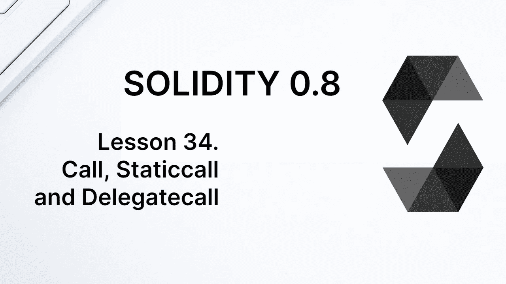
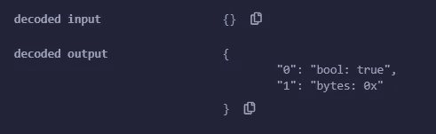
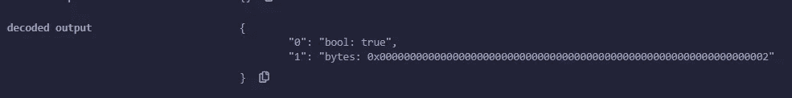
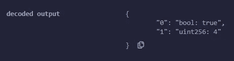
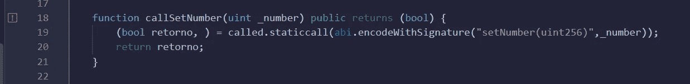

# 学习第 34 课固体。调用、静态调用和委托调用

> 原文：<https://medium.com/coinmonks/call-staticcall-and-delegatecall-1f0e1853340?source=collection_archive---------0----------------------->



EVM 有 3 个操作码可以在 Solidity 中直接调用:**调用**、**委托调用**和**静态调用**。它们都用于向其他契约发送调用，目的是调用函数或只是向该契约发送以太网。

最近，使用*调用*方法向任意地址发送以太成为推荐方式。使用*调用*和*转移*的主要区别在于*调用*将所有气体转发到地址，可以是一个合同的地址。正因为如此，要使用*呼叫*发送以太，你必须小心重入问题。

顾名思义，重入是目标契约重新进入原契约的一种方式。重入方法可以被恶意使用，就像著名的 TheDAO 项目黑客事件中发生的那样。在其中，黑客使用重入从原始合同中提取乙醚，而不改变合同中的帐户余额。

# 打电话

我们来看看如何在 solidity 中使用*调用*方法。首先，我们创建一个将被另一个调用的契约。要调用的合同将被命名为`Called`。

```
contract Called {

  uint public number;

  function increment() public {
    number++;
  }
}
```

必须部署此合同。在我们的示例中，部署是针对`0xd9145CCE52D386f254917e481eB44e9943F39138`的。现在让我们写一份合同，合同的名字叫`Called`。它的名字将是`Caller`。

```
contract Caller {

address public called = 0xd9145CCE52D386f254917e481eB44e9943F39138; 

function callCalled() public returns(bool, bytes memory) {

    (bool success,bytes memory data) = called.call(abi.encodeWithSignature("increment()"));

    return (success, data);
}

}
```

在`Caller`契约中，我们首先创建一个状态变量，它将存储要调用的契约的地址。从地址来看，我们使用的方法*叫做*。**调用**(*有效载荷】*)。让我们来谈谈有效载荷。

调用的有效负载必须包含要调用的函数的签名，4 个字节，加上由 ABI 编码的函数参数。这可以使用 **abi** 对象的 **encodeWithSignature** 方法来完成。在我们的函数中，没有参数。

*调用*方法返回一对值:一个通知函数是否成功执行的布尔值，以及一个包含函数返回的字节类型的值，也是 ABI 编码的。



The return of the call.

调用的结果可以在上图中看到。布尔值为`true`，表示交易成功。bytes 类型的变量为空，因为该函数不返回任何内容。

# 带参数和返回的函数

让我们稍微修改一下要调用的函数。现在它将接收一个参数并返回变量`number`的新值。

```
function increment(uint _increment) public returns (uint) {
  number = number + _increment;
  return number;
}
```

请注意，您需要再次部署合同，因为`Called`在`Caller`的地址必须更改。该地址目前正被直接写入代码中，但也可以保存在一个变量中。这就是我们如何编写可升级合同，不同之处在于我们使用**委托调用**而不是*调用*。我们很快就会看到*委派电话*的情况。

让我们也改变一下`Caller`中的调用函数。

```
function callCalled() public returns(bool, bytes memory) {
  (bool success,bytes memory data) = called.call(abi.encodeWithSignature("increment(uint256)",2));
  return (success, data);
}
```

现在我们需要传递参数给*调用*函数。在我们的示例中，参数直接在代码中传递，编码如下:

```
abi.encodeWithSignature("increment(uint256)",2)
```

*encodeWithSignature* 方法接受任意数量的参数，我们必须传递调用该函数所需的所有参数。



The return of a call from a function that has a return.

在上图中，我们看到函数的返回类型为 bytes。该回报由合约的 ABI 编码。我们也可以解码返回。让我们在下面的函数中看到这一点。

```
function callCalled() public returns(bool, uint) {
  (bool success,bytes memory data) = called.call(abi.encodeWithSignature("increment(uint256)",2)); 
  uint decoded = abi.decode(data, (uint256));
  return (success, decoded);
}
```

为了解码返回，我们使用 ***abi*** 对象的 **decode** 方法。它需要两个参数:要解码的字节类型的变量和包含字节将被解码的类型的元组。



We can decode the return into its types.

在上图中，我们看到使用*解码*方法解码的返回结果。

# 发送以太网

如前所述，目前推荐的发送以太网到另一个地址的方法是使用*调用*。使用*调用*时，可以显示要发送的值和要发送的气体量。

指示要发送的值是常见的，但不建议指示要发送的气体量。要将以太发送到一个地址，无论是否是合同，我们使用如下的*调用*方法。

```
address.call{value: 1 ether}("")
```

在上面的例子中，1 Ether 的值被发送到地址*地址*，其有效载荷为空。如果我们还想调用一个函数，也可以发送一个有效载荷。

为了定义要输送的气体量，我们使用*气体*属性，如下所示:

```
address.call{value: 1 ether, gas: 10000}("")
```

# 静态调用

**Staticcall** 是一个类似于*调用*的方法，但是它不允许改变区块链的状态。这意味着我们不能使用 *staticcall* ，例如，如果被调用的函数改变了某个状态变量。

在下图中，我们将方法*调用*替换为*静态调用*。通过这样做，编译器给我们一个警告，函数`callSetNumber`可以声明为*视图*，因为 *staticcall* 不允许改变区块链的状态。



The staticcall method does not allow changing the state of the blockchain.

如果我们使用 *staticcall* 来调用一个改变区块链状态的函数，这个函数调用将不会成功。

我们可以使用 *staticcall* 来读取状态变量。以下代码行完全有效。

```
(, bytes memory data) = called.staticcall(abi.encodeWithSignature("number()"));
```

和*调用*一样， *staticcall* 返回两个值。一个布尔值，指示调用是否成功，以及一个 bytes 类型的值，它是调用的返回。由于 *staticcall* 不会改变区块链的状态，所以只有当我们想要检索某个值时，执行这个方法才有意义；也就是说，当我们期待一些回报的时候。

# 委派电话

也有可能在另一个契约中执行一个函数，但是这样会改变调用契约的状态变量。为此，使用方法 **delegatecall** 。

让我们创建一个将被调用的契约，命名为`Called`。

```
contract Called {

  uint public number;

  function setNumber(uint _number) public {
    number = _number;
  }
}
```

让我们现在写合同，将调用`Called`，命名为`Caller`。

```
contract Caller {

  uint public number;
  address public called = 0xd9145CCE52D386f254917e481eB44e9943F39138;

  function callSetNumber(uint _number) public {
    called.delegatecall(abi.encodeWithSignature("setNumber(uint256)",_number));
  }
}
```

`callSetNumber`函数将调用`Called`上的`setNumber`函数，这将改变`number`变量。然而，它将改变契约`Caller`的变量`number`，而不是定义该函数的契约的变量`number`。

与*调用*一样， *delegatecall* 也返回两个值。第一个是布尔值，表示事务是否成功，第二个是 bytes 类型，表示函数的返回(如果出现任何返回)。

在上面的例子中，我们在两个契约中使用了相同的状态变量名称，*号*，但这不是必须的。变量的名字并不重要，重要的是它在存储中的位置。我们需要理解这一点。

使用 *delegatecall* ，在调用契约的存储器中执行。因此，我们需要确保两个合同的变量正确配对。

以太坊的存储由一系列 32 字节的容器组成，每个容器可以包含一个或多个状态变量。在调用契约中，变量`number`占用第一个容器，而变量`called`部分占用第二个容器。

当我们调用函数`setNumber`时，它改变第一个容器，而不管那里是哪个变量。因为调用契约中的变量是我们想要改变的变量，`number`，所以一切都按计划进行。

现在我们来做个改变。让我们颠倒一下变量`number`和`called` 的声明顺序，如下所示。

```
contract Caller {

  address public called = 0xd9145CCE52D386f254917e481eB44e9943F39138;
  uint public number;

  function callSetNumber(uint _number) public {
    called.delegatecall(abi.encodeWithSignature("setNumber(uint256)",_number));
  }
}
```

`setNumber`函数会一直改变第一个容器，但是现在变量`called`在第一个容器中，不再是`number`了。在执行`callSetNumber`的时候，会改变变量`called`，改变要调用的契约的地址，完全破解代码。

这就是为什么我们在使用 *delegatecall* 时要小心的原因。需要确切地知道正在做什么，理想的情况是将两个契约中的变量配对，调用契约和被调用契约。

**感谢阅读！**

欢迎对本文提出意见和建议。

欢迎任何投稿。[www.buymeacoffee.com/jpmorais](http://www.buymeacoffee.com/jpmorais)。

> 交易新手？尝试[加密交易机器人](/coinmonks/crypto-trading-bot-c2ffce8acb2a)或[复制交易](/coinmonks/top-10-crypto-copy-trading-platforms-for-beginners-d0c37c7d698c)