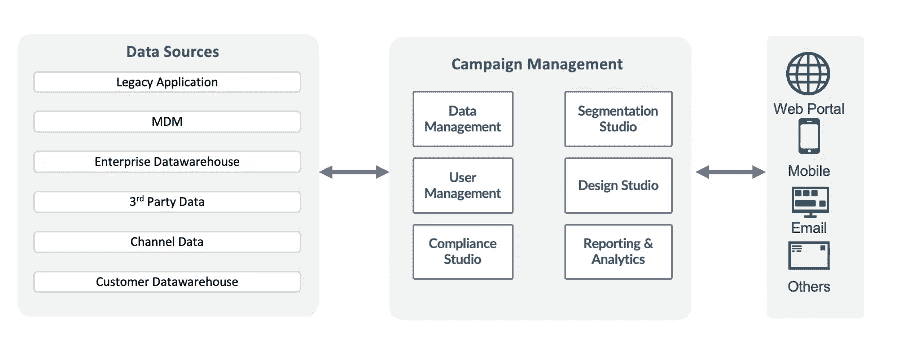
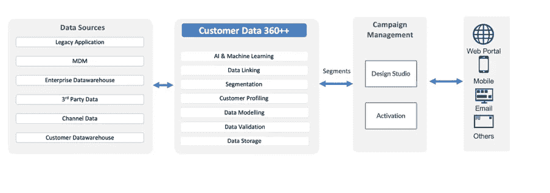

# 活动管理平台的时代即将结束

> 原文：<https://medium.com/coinmonks/campaign-management-platforms-are-nearing-the-end-of-their-era-c565b4848620?source=collection_archive---------1----------------------->

活动管理是企业通过不同渠道与客户进行一对一沟通的能力的重要组成部分。活动管理平台已经从单渠道平台、多渠道平台发展到全渠道平台。通过沟通渠道，客户已经从喷雾和祈祷发展到基于细分市场的目标定位。活动管理系统主要处理这些。

商业活动管理系统通常用于

宏观和微观分割

基于规则的通信引擎

客户数据建模

电子邮件设计者平台

联系历史

交付和跟踪日志

延伸到其他渠道

在过去的 2-3 年中，企业开始将数据整合到客户数据平台/客户数据中心或单一细分平台中。其理念是将客户数据、交易数据和渠道数据聚合到一个平台中，建立适用于多个渠道的多级规则，最后将细分市场激活到一个客户参与平台，如活动管理平台。这使得营销活动管理平台除了营销活动规划和沟通执行之外几乎没有其他事情可做。

你的企业为这种更广泛的转变做好准备了吗？我认为这是企业运营模式的一个更大的变化，而不仅仅是一个技术上的进步。是的，这将是公司运作方式的一个重大变化，因为它不仅需要整合客户数据，还需要过渡到一个生态系统，在这个生态系统中，所有 MarTech 将拥有一个公共数据库。

让我们来了解一下营销活动管理平台的未来发展，以及 MarTech 将如何集中利用客户数据来优化更广泛的生态系统。

**从过去开始，向前迈进**

让我们尝试想象一下活动管理平台如何融入现有的生态系统，以及它在过去是如何发挥作用的。

Image: Current and past campaign management ecosystem

如果我们看看现有的活动管理系统，我们可以看到客户参与层主要负责数据建模、细分以及通过各种渠道接触最终用户。

与许多数据源或整合的客户数据仓库相连的活动管理平台。这个接口主要是基于批处理的，方便了客户和交易数据。

Web analytics 是营销活动管理工具的另一个重要数据来源，它允许将活动数据近乎实时地发送给营销活动，从而接触到最终用户。通常，这是通过使用基于 Kafka 的连接器来实现的。

数据流中的其他嫌疑对象通常是内部应用程序，这些应用程序为营销活动管理提供特定行业的客户数据和交易。

活动管理由关键模块组成，包括

o 数据管理监督数据建模，并确保数据建模为模式。彼此相关的模式保证了客户和事务可以相互链接

o 用户管理根据不同用户的专业知识授予他们访问活动管理平台的权限

o Compliance Studio 对于管理消费者订阅各种通信服务和偏好至关重要

o Segmentation studio 支持创建多种级别的业务规则，以便根据活动目标对消费者数据进行细分

o Design Studio 支持创建各种沟通模板，与客户建立有意义的联系

o 报告和分析使您能够跟踪各种活动的成功以及投资回报

根据客户的通信选择，如电子邮件或其他，细分市场在多个渠道中都是活跃的

这是大多数企业的活动管理平台的工作方式，并允许消费者参与。

这种配置需要客户进行大量投资，不仅要投资于活动管理及其服务器以实现预期性能，还要投资于熟练的资源以充分利用活动管理系统。

营销活动管理投资:企业在营销活动管理平台上进行了大量投资，无论是在内部还是在 SaaS。

合规性投资:营销活动管理系统作为一个参与系统进行了大量投资，以确保数据和生态系统遵循当地和全球规则。

熟练的资源:为了向客户提供及时的沟通，需要大量熟练的资源来运行活动管理引擎。

**营销活动管理时代即将结束**

MarTech 正进入数据整合阶段，这将为所有 MarTech 系统提供单一数据源。这意味着组织不需要在单个 MarTech 平台上花费大量资金来进行数据管理、合规性，当然还有细分。这并不意味着营销活动管理将会消失，但我们将会看到营销活动管理系统和 customer 360 之间功能重叠明显的变化。

让我们试着想象一下，然后一砖一瓦地建造它

Image: Future of Campaign Management System

在未来或在客户生态系统中，营销活动管理和其他数据源之间将没有直接的接口。营销活动管理将与 customer 360 平台完全连接，并将获得所有重要的客户群。

是的，客户细分将在未来营销活动管理系统中使用，而不是来自 Customer 360 平台的全部客户数据。

客户数据 360 将是活动管理平台的唯一真实来源。所有 Customer 360 平台将负责从各种数据源收集所有必要的客户数据以及交易和渠道数据。

理想情况下，Customer 360 应该是一个多模型平台，支持多种格式的数据输入和平台内部的平滑数据着色

身份管理将是客户 360 平台的一个重要组成部分，允许数据具有永久和非永久 id。

客户 360 将以标准规则集引擎或 AI 规则的形式持有所有业务规则，从而允许将客户数据段提供给活动管理平台。

根据使用案例，客户数据 360 平台和活动管理之间的集成将是基于批处理的或接近实时的。

这种整合将更容易锁定特定活动所需的客户群。这将是新结构中最重大的转变，在新结构中，活动平台将仅限于创建沟通模板和实施沟通。

未来，customer data 360 平台将管理所有数据管理、细分工作室和合规工作室。

对活动管理平台的投资将受到限制，企业将能够将其资源重新定向到其客户 360 平台。所有进入新生态系统的企业都必须考虑以下因素。

最大限度地减少客户 360 和活动管理平台之间的重叠。

避免在客户 360 度和营销活动管理中重复客户数据建模练习。

尽量减少活动管理中的运营操作。

建立双向系统集成，实现轻松的数据共享。

对于合规性问题，在企业内部有一个真实的来源。

在重新评估活动管理之前，企业应该问自己以下问题

为什么客户 360 和营销活动管理需要两个数据库？

为什么 MarTech 生态系统中需要有各种细分平台？

为什么需要两个不同的团队来管理客户数据和营销活动管理以及 customer 360？

为什么单个 MarTech 数据库做不到这一点？

[道格拉斯·伯德特](https://medium.com/u/1a0ee4baee41?source=post_page-----c565b4848620--------------------------------) [雷蒙德·卡姆登](https://medium.com/u/bf14ea4a1d6f?source=post_page-----c565b4848620--------------------------------) [莫斯布罗](https://medium.com/u/b31097e577e7?source=post_page-----c565b4848620--------------------------------) [杰米·布伦内尔](https://medium.com/u/6a062acc0b1b?source=post_page-----c565b4848620--------------------------------) [斯科特·贝尔斯基](https://medium.com/u/f8025419d9c8?source=post_page-----c565b4848620--------------------------------) [马特·阿萨伊](https://medium.com/u/6da8e4bf1445?source=post_page-----c565b4848620--------------------------------) [普拉瓦尔·谢蒂](https://medium.com/u/13943559a7a9?source=post_page-----c565b4848620--------------------------------)。你们同意我的观点吗？

> 交易新手？尝试[加密交易机器人](/coinmonks/crypto-trading-bot-c2ffce8acb2a)或[复制交易](/coinmonks/top-10-crypto-copy-trading-platforms-for-beginners-d0c37c7d698c)