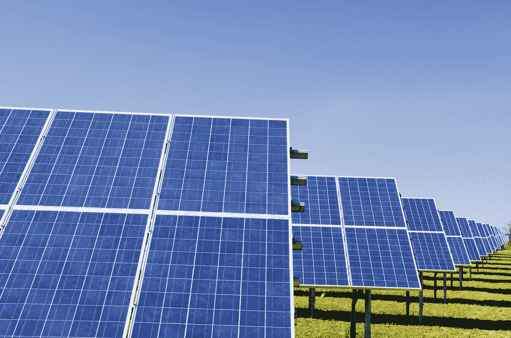

# 比特币能耗能好吗？事实和未来展望

> 原文：<https://medium.com/coinmonks/can-bitcoin-energy-consumption-be-good-facts-future-perspectives-31c99b087e61?source=collection_archive---------20----------------------->

## 这是一个特性，不是一个错误

Photo by [Zbynek Burival](https://unsplash.com/@zburival?utm_source=medium&utm_medium=referral) on [Unsplash](https://unsplash.com?utm_source=medium&utm_medium=referral)

在气候变化时期，比特币网络的能源消耗通常被视为反对比特币的最有力论据。

让我们仔细看看:它消耗了多少和什么类型的能量？与其他行业相比如何？这将如何演变？什么是…