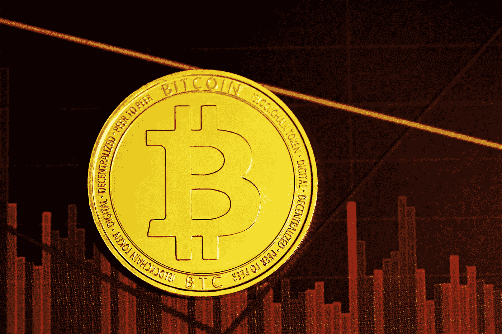

# 比特币会失败吗？

> 原文：<https://medium.com/coinmonks/can-bitcoin-fail-6db1311e8f71?source=collection_archive---------5----------------------->

Photo by [Kanchanara](https://unsplash.com/@kanchanara?utm_source=medium&utm_medium=referral) on [Unsplash](https://unsplash.com?utm_source=medium&utm_medium=referral)

比特币很有可能成为世界上最重要的货币。但这不一定会发生。也有比特币输的场景。

几年前，人们普遍将比特币作为一项实验来讨论，尽管有各种各样的议论，但还是警告不要投资超过你准备好的损失。毕竟，当你谈论调查时，失败总是一种可能性。