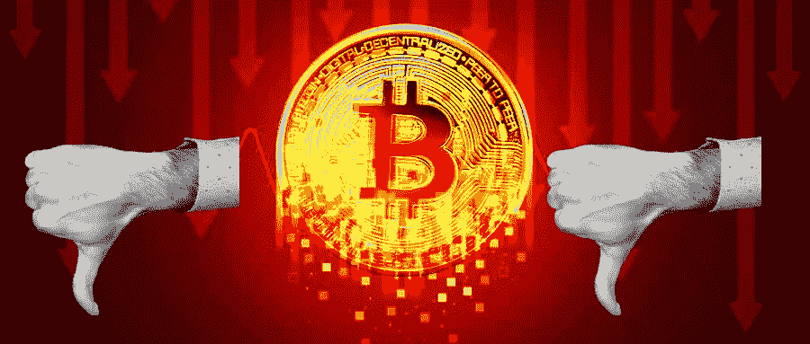

# BTC 能挺过全球危机吗？你的作品集呢？

> 原文：<https://medium.com/coinmonks/can-btc-survive-a-global-crisis-and-your-portfolio-6bfc9ef20729?source=collection_archive---------28----------------------->

比特币在几个宏观经济场景中进行了测试，包括疫情。它没有在一周接一周逼近的全球经济衰退中经受考验。BTC 出生于 2009 年，就在 2007-2008 年全球金融危机之后，因此其价格将会发生什么是不确定的:大多数交易员和分析师估计，BTC 可能会继续下跌，并跌破 14，000 美元，特别是如果美联储继续加息的话。

大多数加密投资者都知道 14000 美元的目标，但让我们更深入地了解一下全球宏观形势，以及它可能对你的投资组合产生的影响。

通货紧缩论题:凯西·伍德、埃隆·马斯克和杰弗里·冈德拉奇

最近，9 月 9 日，埃隆马斯克(Elon Musk)在推特上表示，美联储大幅加息可能会增加通缩的几率。美联储这样做是为了控制通胀，但这增加了信贷成本，减少了消费者和企业支出。因此，这降低了对产品和服务的总体需求。

Ark Invest 首席执行官凯西·伍德(Cathie Wood)回复了马斯克，并在一个帖子上深化了分析，强化了她自 2021 年以来一直警告的风险。

“债券大王”杰弗里·冈德拉奇最近也对通货紧缩风险发出了警告，并建议投资者购买长期国债。在随后的加息之后，通缩的论调越来越强。

**美联储加息的全球后果**

美联储可以被认为是世界的中央银行，如果那里的局势得不到控制，它可能会导致全球经济衰退。美联储加息的影响不仅发生在局部，也发生在宏观层面，其后果如下:

*   缩短全球进口需求；
*   金融市场的混乱；
*   信贷成本的增加；
*   各个部门用于偿还债务的现金流；

全球决策者的决策深受美国政策和金融决策的影响。美国以外的经济体正在等待美联储的下一步行动。他们还根据对美国可能发生的事情的预期来引导当地经济。

**这与您的加密资产有什么关系？**

在经济触底之前，公司不会将资金投入不稳定资产。他们宁愿专注于保持财务状况更健康，以便在动荡结束后实现软着陆。同样的情况也可能发生在零售加密投资者身上:他们将使用现金储备来支付账单、信用卡和抵押贷款，高风险资产的配置将会减少。

市场现在显示出 BTC 飙升的任何强有力的催化剂，我们看到 BTC 在 14，000 美元的可能性更大(永远记住:推动替代硬币价格下跌)。如果立法者正在评估全球危机的风险，你也应该在你的投资组合中采取行动。考虑你的风险偏好和市场预期，冷静思考，回答以下问题:

1.  在全球经济衰退的情况下，你认为市场会在哪里？
2.  你认为 BTC 会有怎样的表现？你 HODL 的硬币呢？
3.  你认为你投资的项目在 3-5 年内还会运行吗，特别是如果我们在 crypto 进入一个很长的整合期？

BTC 能挺过全球危机吗？

在我看来，是的。我仍然长期看好加密技术，尤其是比特币，但现在不是持有你真正不相信的资产的时候。

BTC 今年下跌了约 60%。如果它再下降 30%(至 14，000 美元)，这将意味着从顶部下降-80%。接下来的几个月可能会很艰难，你应该重新考虑为最坏的情况重新平衡你的投资组合。

如果你是比特币的坚定信徒，展望十年后，当市场超卖时，通常一个很好的方法是采用美元成本平均法，并在一段时间内将其添加到你的投资组合中。如果你在考虑未来一两年，世界可能会崩溃，那么你最适合坐在菲亚特里。

[*乔·罗伯特*](https://joerobert.com/) *现任罗伯特风险投资公司首席执行官，拥有超过 20 年的资产管理经验。自创办以来，乔已经为投资者和合伙人创造了可预见的两位数回报。Joe 已经投资了股权和代币的种子轮，以及比特币、以太坊和其他顶级加密货币的投资组合。*

*如果您是合格投资者，并想了解更多关于我们产品的信息，请联系我们。*

> 交易新手？尝试[加密交易机器人](/coinmonks/crypto-trading-bot-c2ffce8acb2a)或[复制交易](/coinmonks/top-10-crypto-copy-trading-platforms-for-beginners-d0c37c7d698c)