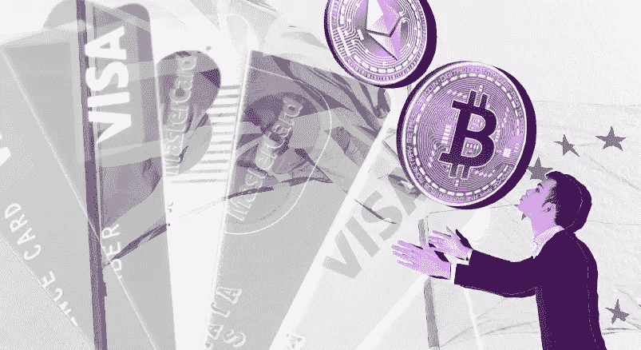

# Crypto 能胜过 Visa 或 Mastercard 这样的支付处理器吗？

> 原文：<https://medium.com/coinmonks/can-crypto-outperform-payment-processors-like-visa-or-mastercard-75ac95524731?source=collection_archive---------22----------------------->

非常好的 crpto 读者，众所周知，crypto 的目标是成为新的分散经济，为了实现这一目标，它将不得不在速度和处理能力上超越其传统的集中对手。毫无疑问，如果加密要成为一种真正的“支付手段”，它必须能够以非常低的成本处理大量的交易。在这个…