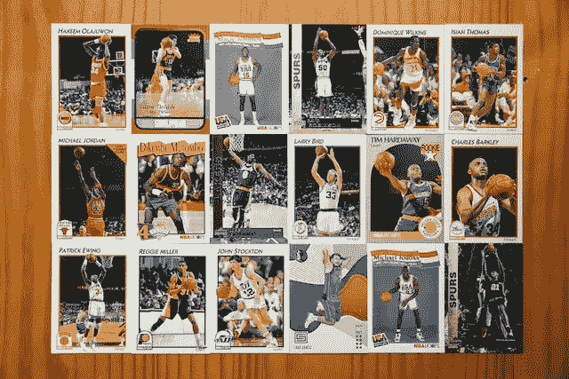

# 以太网(ERN)能从体育和 NFT 收藏品中赚钱吗？

> 原文：<https://medium.com/coinmonks/can-ethernity-ern-make-money-from-sports-and-nft-collectibles-ef80329232bf?source=collection_archive---------39----------------------->

以太网(ERN) 是为了利用粉丝们对体育和娱乐收藏品的贪得无厌的胃口。

因此，以太网自称是“[世界上第一个认证的&授权的](https://ethernity.io/)”NFT 平台。该平台包括一个出售数字不可伪造令牌(NFT)卡图像的市场。

