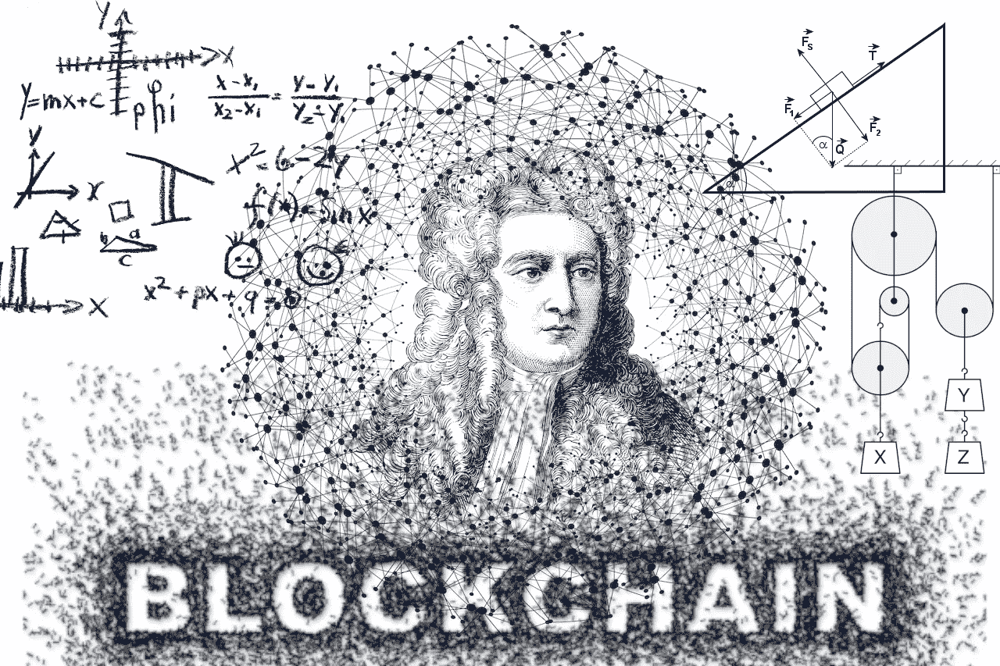

# 对牛顿物理学的无知会毁掉金融市场采用区块链的想法吗？

> 原文：<https://medium.com/coinmonks/can-ignorance-of-newtonian-physics-ruin-the-idea-of-blockchain-adoption-in-financial-markets-bae928366fb5?source=collection_archive---------16----------------------->

区块链无疑是让金融市场电气化的时髦词汇。我们被告知，这项技术将彻底改变当今市场的运作方式。更多的信任，更少的中介(在一些想法中减少到零)，更低的交易成本——这应该是一个未来。假设每个…