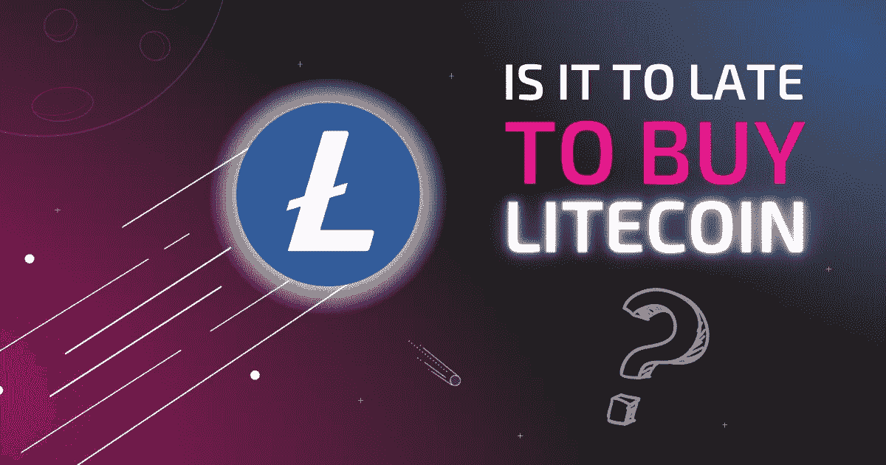

# 莱特币还能成为好的投资吗？$LTC 的利弊

> 原文：<https://medium.com/coinmonks/can-litecoin-still-be-a-good-investment-ltc-pros-and-cons-dfdf89937f80?source=collection_archive---------12----------------------->

莱特币(LTC)是一种数字货币，由毕业于麻省理工学院的查理·李先生在 2011 年创造，是比特币的复制品。它与比特币有许多相似之处，但更好，更具可扩展性。Litecoin 项目的最初目标是解决投资者和开发者对比特币的担忧。例如，很多人担心比特币过于集中控制，使得大规模开采的公司难以开采。有了 Litecoin，这些问题得到了解决，并得到了改进。

自“首次亮相”以来，这种硬币已经成为一种多用途硬币，因为它可以开采，甚至可以用于点对点支付。然而，它在最初推出时失败了，因为企业矿工获得了其采矿的最大份额。Litecoin 此后对这些缺点进行了改进，成为了更好的硬币。

# 了解莱特币(LTC)

Litecoin 项目的首要任务之一是阻止企业规模的矿工使用加密方法来控制采矿过程。不幸的是，这项任务没有成功完成。相反，矿工们通过创造专门的机器来适应使用莱特币带来的变化，确保他们仍然控制着采矿过程。事实上，他们的采矿能力继续增长。

莱特币使用与比特币相同的矿工 ASIC 矿工。他们使用了采矿软件，使矿工们可以看到石块。这些块包含矿工需要的交易信息。一旦矿块的信息对矿工可见，它将被验证，下一个矿块将被创建。完成后，矿工将获得莱特币(LTC)形式的奖励。

# 莱特币最大供应量

和比特币一样，莱特币也有可以流通的最大供应量。然而，它的供应量会随着时间的推移而减少，以维持硬币的价值。

当硬币投入流通时，大约有 150 枚预先开采的硬币，总共有 8400 万枚硬币。这确保了新来者能够得到硬币并与之交易。

Litecoin 目前的块生成时间为 2.5 分钟。截至 2022 年 4 月，它有超过 1400 万莱特币(LTC)留给我。

# 莱特币减半

如前所述，莱特币和比特币有很多相似之处。其中一个相似之处是减半。减半是一个过程，在此过程中，块的散列值减少，而块创建的其他必要部分保持不变。每个块中的事务信息保持不变，块创建过程也保持不变。减半后，矿工在验证每个方块后获得的莱特币奖励将减少前一个奖励的一半。这个过程降低了新硬币的创造速度。

莱特币在过去有过几次减半。以下是莱特币减半的日期:

*   **50 至 25 个长期贷款公司—2015 年 8 月 25 日**
*   **25 至 12.5 LTC—2019 年 8 月 5 日**
*   **12.5 至 6.25 LTC—2023 年 8 月 23 日(预计)**

# 莱特币哈希算法

莱特币与比特币有着镜像相似之处，但也有着明显的不同。其中一个区别在于它的哈希算法。与比特币不同，莱特币使用一种不同的哈希算法，称为 Scrypt。与比特币的 SHA-256 相比，Scrypt 需要更大的内存。加密货币社区最初拒绝 Scrypt 算法，直到 2011 年。2011 年，Tenebrix 项目对其进行了修改，使其能够与常规 CPU 一起用于采矿。

由于 Scrypt 需要大量内存，专用集成电路(ASICs)也很难开发。然而，随着世界上第一款 Litecoin ASIC miner 于 2016 年发布，抗 ASIC 设置并没有存在多久。

# 莱特币发展

自莱特币进入加密货币市场以来，它经历了稳步发展。它已经从最初由个体矿工主导的采矿生态系统转变为对企业更有利的体系。在这种企业结构中，知名科技公司经营着大型矿池。这些公司占据了莱特币开采的大部分。

相比更受欢迎的硬币，莱特币的市场容量要小得多。尽管如此，它仍然是交易量最大的加密货币之一，在 CoinMarketCap(一个跟踪超过 18，000 种加密货币的平台)上保持着前 30 种加密货币的地位。这表明它仍然是一种受欢迎的加密货币。然而，它不像比特币和一些较新的硬币那样受欢迎。

# 莱特币和比特币有什么不同？

莱特币和比特币的管理有明显的区别。以下是其中的一些差异:

*   莱特币和比特币的最大供给能力是有区别的。对于比特币，其供应量上限为 2100 万枚。另一方面，莱特币的供应量上限为 8400 万枚。
*   此外，比特币使用与莱特币不同的哈希算法。比特币使用 SHA-256 哈希算法，而莱特币使用 Scrypt。scrypt Litecoin 的当前版本被修改以生成更多的硬币。
*   这些算法的区别对这些硬币如何处理交易以及处理这些交易的速度有影响。目前，莱特币处理和确认交易的速度比比特币快 4 倍。然而，莱特币更多地受到这种“速度圈”的影响，因为硬币的安全性受到威胁。这是因为该算法对块中的事务进行较少的验证轮次。
*   比特币大约需要 10 分钟来确认交易。相比之下，Litecoin 的确认时间为 2.5 分钟，非常适合不希望或不需要超级安全交易的商家。
*   比特币的市值比莱特币大。尽管莱特币的市值明显小于比特币，但它仍是交易量最大的加密货币之一。

# 莱特币是怎么用的？

由于其高流动性，莱特币是一种比其他加密货币更容易交易的加密货币。因此，一些加密交易所接受莱特币，包括 Newegg，Sling TV，甚至像美国红十字会这样的非营利组织。

您甚至可以通过 BitPay 或 CryptoPay 等数字货币应用程序使用 LTC 进行支付。如果你需要与人交易，你可以选择像币安这样的点对点商家。

# LTC 的利弊

# 莱特币的优势

*   与加密货币市场领导者相比，莱特币的主要优势在于其交易速度。莱特币的区块链没有添加任何额外的技术层，是一种比比特币更快、更实惠的加密货币。
*   莱特币的交易成本也很低。截至 2022 年 5 月 6 日，莱特币交易费用约为每笔交易的 0.06%，而比特币为 3.92%。

# 莱特币的缺点

*   莱特币的一个主要缺点是对投资者的吸引力低。这个理由并不牵强。由于利益冲突，莱特币创始人李宗南在剥离了大部分莱特币股份后，在加密货币投资者中引起了一点恐慌，许多人也撤回了他们在该币中的股份。

SeedOn 的首席执行官兼联合创始人说，“吸引投资者眼球并影响投资者信心的一件事是，2017 年，Litecoin 的创始人李宗南已经出售了他在 Litecoin 的股份，”

*   21 Shares 的一名研究人员观察到，尽管闪电网络的设计交易吞吐量高于比特币，但它加快了比特币的交易速度，并削弱了莱特币作为更快支付网络的用例。

此外，新的加密货币提供更快的交易处理速度。比如 EOS 有 4,000 TPS，XRP 有 1,500 TPS，卡尔达诺有 257 TPS。

# 莱特币会有未来吗？

目前，没有准确的评估显示市场将如何根据投资者、交易者和政府的需求变化或调整。然而，随着时间的推移，更多的加密货币被创造出来。这些加密货币中的每一种都将建立在现有硬币的缺点上，并对其进行改进。

此外，加密货币市场非常不稳定，政府正在尽一切努力取缔数字货币。因此，很难这样预测莱特币的未来。

# 莱特币还是好的投资吗？

由于市场的不可预测性，很难大胆预测莱特币未来的表现。但是，假设你想继续投资莱特币。在这种情况下，最好找一个专业的顾问来帮你决定莱特币是否是一个好的投资。

# 影响莱特币价格的因素有哪些？

有几个因素导致了莱特币在市场和加密交易所的价格波动。其中一些是:

# 法规:

数字货币是分散的货币，这意味着它们不受中央机构的监管。由于莱特币不受监管，没有权力采取措施保持其价格稳定。

# 供应:

今天有大量的莱特币在流通。因此，硬币的价格也可以由它进入市场的速度决定。

# 公众看法:

莱特币的价格还会受到市场如何看待该币以及比特币和以太坊等市场领导者的影响。

# 收养:

莱特币的价格还受到采用它作为支付手段的知名企业、投资者和消费者数量的影响。尽管作为一种支付方式，区块链技术还没有发挥多大作用，但一些企业仍将它视为一种未来可以采用的技术。

# 莱特币和以太币哪个更好？

莱特币基本上是作为 P2P 交易的支付方式而建立的。然而，以太坊是作为其他密码技术的生态系统而建立的。虽然它是作为一个全局虚拟机构建的，但它有一个名为 Ether)的令牌用于交易和支付方法。以太被列为五大有价值的加密货币之一，与莱特币相比，其交易量更大。

然而，更好的数字货币将基于你的兴趣、需求和目标。

# 如何兑换莱特币

如果你在加密货币交易所购买莱特币，你通常会看到以美元表示的莱特币价格。这意味着你正在出售你的美元来购买莱特币。在加密货币交易所交易莱特币的基本原则是——当莱特币价格上涨时你卖出，当莱特币价格下跌时你买入。

要以最优惠的价格买卖莱特币，请访问 [Swapzone](https://swapzone.io/) ，这是一个加密货币兑换聚合器，它列出了各种汇率，因此您可以选择最佳的交易汇率。

# 流行对转换莱特币

[LTC 到 BTC](https://swapzone.io/exchange/ltc/btc)

[LTC 转 ETH](https://swapzone.io/exchange/ltc/eth)

[LTC 至 VET](https://swapzone.io/exchange/ltc/vet)

[至 BNB 的 LTC](https://swapzone.io/exchange/ltc/bnb)

[LTC 至 BCH](https://swapzone.io/exchange/ltc/bch)

[LTC 至 USDT](https://swapzone.io/exchange/ltc/usdt)

[LTC 到 THETA](https://swapzone.io/exchange/ltc/theta)

[LTC 至 XMR](https://swapzone.io/exchange/ltc/xmr)

[LTC 到 TRX](https://swapzone.io/exchange/ltc/trx)

[LTC 到 BSV](https://swapzone.io/exchange/ltc/bsv)

[LTC 至 DASH](https://swapzone.io/exchange/ltc/dash)

[至 ZEC 的 LTC](https://swapzone.io/exchange/ltc/zec)

> 交易新手？尝试[加密交易机器人](/coinmonks/crypto-trading-bot-c2ffce8acb2a)或[复制交易](/coinmonks/top-10-crypto-copy-trading-platforms-for-beginners-d0c37c7d698c)