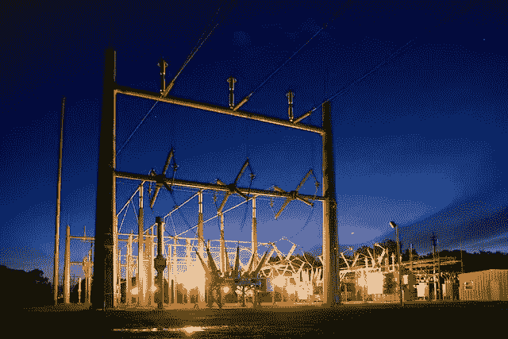

# Powerledger (POWR)能在区块链上用电赚钱吗？

> 原文：<https://medium.com/coinmonks/can-powerledger-powr-make-money-from-electricity-on-the-blockchain-b4af84590b70?source=collection_archive---------15----------------------->

Powerledger (POWR) 旨在将电力市场引入区块链。

Powerleger 的希望是建立点对点(P2P)区块链市场，公用事业公司、生产商、企业和房主可以通过区块链出售电力。例如， [Powerledger 的 xGrid 平台](https://www.powerledger.io/platform-features/xgrid)允许房主通过电网出售太阳能电池板产生的电力。

