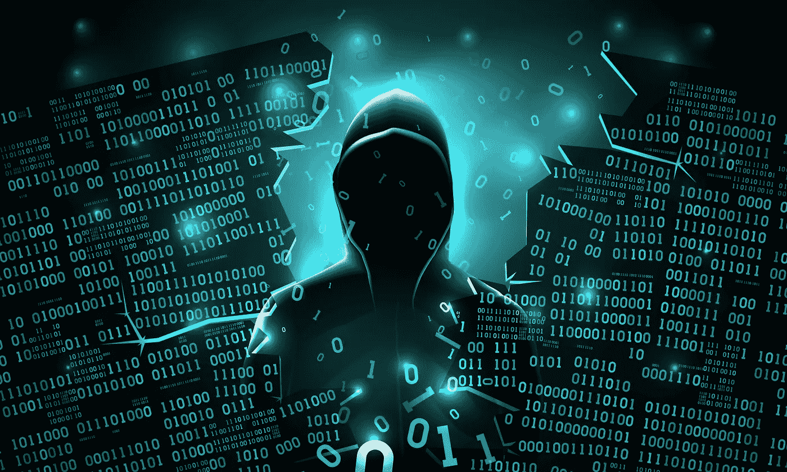

# 元宇宙能被黑吗？元宇宙的网络安全问题

> 原文：<https://medium.com/coinmonks/can-the-metaverse-be-hacked-cybersecurity-issues-in-the-metaverse-dd9c0875bf1f?source=collection_archive---------8----------------------->

许多文章都关注元宇宙的前景和机遇。尽管期待这些前景很好，但我们权衡其利弊也很重要。在这篇文章中，我的重点是研究元宇宙的安全问题。

具体来说，我指出了用户将面临的一些最突出的安全问题。其中一些问题已经存在，只会变得更加突出，而另一些问题与目前的标准相比将呈现新的层面。

为了不浪费更多的时间，我想直入主题。我们走吧。

# 首先，元宇宙可以被黑客攻击

你应该知道的第一件事是元宇宙可以被黑客攻击。元宇宙是一个依赖于互联网基础设施的虚拟世界，它为人类互动提供了身临其境的人际互动。

因此，不良行为者将试图获得对元宇宙的访问权，以便利用它并操纵用户。我们可以说，元宇宙将只是骗子、欺诈者和黑客利用的另一个途径，就像他们已经渗透到互联网一样。因此，元宇宙出于善意，也需要时刻加强安全，防止这些恶意实体犯下令人发指的罪行。

# 元宇宙的网络安全问题

元宇宙项目必须处理的一些网络安全问题讨论如下:

# 身份盗窃

元宇宙的所有用户都必须拥有一个在虚拟世界中代表他们的虚拟角色。实际上，这些化身仅仅是个人的代表，它们绝不会显示真实用户的脸。虽然这并不是说用户不能被追踪，因为他们已经在元宇宙留下了他们的数字足迹。

但是，问题就在这里。当用户从元宇宙注销，但回来时却发现在他们不在时发生了某些活动，而看起来用户执行了这些活动，会发生什么情况？这就是身份盗窃的问题。

黑客可以找到一种方法来破坏元宇宙，并在实施他们令人发指的行为时，使用另一个人的身份(使用他们的化身)。这就意味着所有这些活动只能追踪到受害者，给黑客一个完美的伪装。

在元宇宙，身份盗窃的影响不仅仅局限于受害者个人。黑客在获得新身份后，可以使用该身份来欺骗元宇宙中与受害者关系密切的其他用户。这些人可能是商业伙伴、玩伴、同事，甚至是家庭成员。

# 网络欺凌

这已经是 web2 领域的一个大问题，关于威胁和滥用的投诉越来越多。这在元宇宙可能变得更加明显。由于元宇宙的浸泡，这种类型的欺负将变得更加真实。使用者会觉得威胁就在身边，这可能会对心理健康产生影响。这是我们需要做好准备的事情，因为更多的心理健康问题可能会出现。压力会增加，可能还有骚扰。

# 隐私侵犯

元宇宙是更广泛的 web3 去中心化世界愿景的一部分，但与加密货币不同，元宇宙完全由构建这些虚拟世界的公司控制。

这就提出了用户隐私和用户数据保护的问题。正如大型科技公司已经成为用户数据的保管人一样，元宇宙项目也将成为用户数据的枢纽。公司将能够收集他们在世界上进行的每一项活动的用户数据，包括他们做什么，去哪里，他们的爱好等等。这些数据可以用来定位他们的广告位置。随着更多顶级品牌不断进军元宇宙，这一点将变得更加突出。

目前，在元宇宙还没有建立监管框架来保护用户数据和隐私。如果我们要根据目前可以实现的东西来预测未来，元宇宙项目可能是下一个大型科技统治的中心，因为他们可以通过侵犯用户隐私来轻松利用用户数据。

# 元宇宙的欺诈行为

这在某种程度上与侵犯隐私有关。如果黑客能够入侵网络，他们将能够获得受害者的个人数据。这意味着信用卡信息等个人数据可能会被窃取。这对隐私权构成了很大的威胁。

# 出路是什么？

元宇宙项目将不得不加强网络的安全性，并不断寻找机会，将可能出现的各种形式的威胁拒之门外。这将遵循 web2 技术公司目前可以实现的模式。

# 最后的想法

元宇宙目前正处于进化阶段，有很多地方需要完善。这只会随着时间的推移而发生，然而，重要的是用户知道他们在这个新世界中可能遇到的威胁，并以最好的方式做好准备。

> *加入 Coinmonks* [*电报频道*](https://t.me/coincodecap) *和* [*Youtube 频道*](https://www.youtube.com/c/coinmonks/videos) *了解加密交易和投资*

# 另外，阅读

*   [有哪些交易信号？](https://coincodecap.com/trading-signal) | [Bitstamp vs 比特币基地](https://coincodecap.com/bitstamp-coinbase) | [买索拉纳](https://coincodecap.com/buy-solana)
*   [加密交易机器人](/coinmonks/crypto-trading-bot-c2ffce8acb2a) | [维护审查](https://coincodecap.com/uphold-review)
*   [如何给 MetaMask 钱包添加 Arbitrum？](https://coincodecap.com/how-to-add-arbitrum-to-metamask-wallet)
*   [KuCoin vs 北海巨妖 vs BitYard](https://coincodecap.com/kucoin-vs-kraken-vs-bityard)
*   [加密交易的最佳 VPN](https://coincodecap.com/best-vpns-for-crypto-trading)