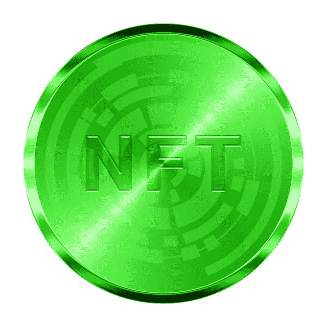

# Wax (WAXP)能从 NFTs 中赚钱吗

> 原文：<https://medium.com/coinmonks/can-wax-waxp-make-money-from-nfts-2410fb08d6ef?source=collection_archive---------23----------------------->

WAX (WAXP)或全球资产交易所(Worldwide Asset eXchange)是一个区块链平台，旨在交易 NFT、dApps 和视频游戏。

他们称 [WAX 为 NFTs](https://on.wax.io/about-wax/) 之王，因为它促进了数百万不可兑现的代币(NFT)交易。WAX 用户包括 Topps、Capcom、Atari 和 Sony。Topps 为美国职业棒球大联盟和其他受欢迎的运动制作交易卡。一些主要的艺人，包括*星际迷航的*威廉·夏特纳，都在使用蜡。

