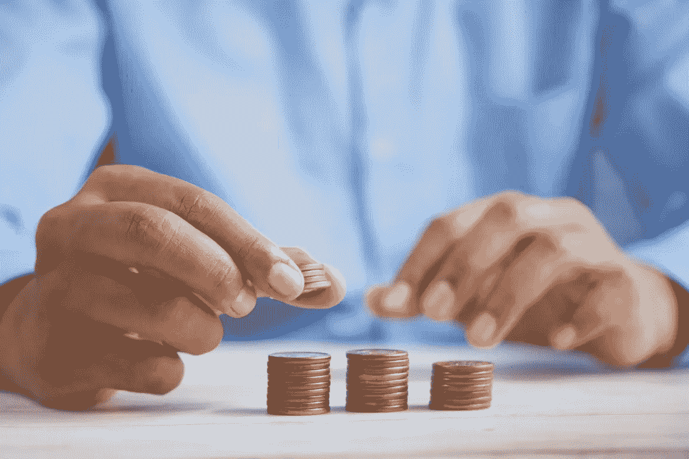

# 你能承受不投资加密吗？

> 原文：<https://medium.com/coinmonks/can-you-afford-not-to-invest-in-crypto-bfa06cf2c?source=collection_archive---------16----------------------->

在过去的 6 个月里，一些人问我一些类似的问题:“你确定要投资加密吗？”或者“你真的能承受在这上面赔钱吗？”。

我不得不考虑一段时间。任何时候当你有一群人一致质疑你的决定时，很难不花一分钟来检查你对这些决定的理由和论点。无论如何，我不是投资顾问或金融专家，但不管我想了多久，我总是会想到同一个问题。

***“你真的能承受不投资 crypto 吗？”***

房地产价值飙升，标准普尔 500 每年增长 10%左右，储蓄账户提供接近零的回报，通货膨胀肆虐，最富有的 1%拥有超过 32%的财富(美国统计)，技术每天都在取代越来越多的工作。我无意散布恐惧，但我的问题是，在这样的环境下，你怎么可能积累下一代人的财富？你供养你的家人和他们的家人度过余生的大好机会在哪里？

你可能会同意，我们所处的市场环境使得通过投资积累大量财富变得困难。大多数人不同意我的观点是，区块链和 crypto 是他们正在寻找的大机会。人们仍然不认为它有任何内在价值，它可能只是一个骗局，它将全部变为 0 等。如果你有这种感觉，我希望你继续阅读，因为我们使用“机会成本”的概念作为我们的镜头来探索加密作为一种资产。

# **退而求其次**

如果你从未听说过机会成本这个术语，这里有一些基本知识。机会成本是指你为了选择另一个选项而不得不放弃的东西的价值。这是没有选择的道路的价值，当你选择一条道路而不是另一条时，理解错过机会的可能性是很重要的。机会成本在经济学和投资中被普遍使用的原因是，根据定义，它是一种看不见的成本，忽略它是很危险的。那么加密的机会成本是多少呢？

由于我不是金融顾问、交易员或任何擅长预测的人，我将在下面的例子中使用一些粗略的数字。我也不会将您指向任何特定的数字资产或令牌，而是将空间作为一个整体来谈。如果感兴趣的话，我很乐意在另一篇文章中分享我的加密组合的分配。

去年年底，前对冲基金经理和加密投资鉴赏家拉乌尔·帕尔预测，加密将在 10 年内成为 200 万亿美元的资产类别。在那个预测的时候，200 万亿美元代表了资产类别的 100 倍增长。那是在牛市中期。按照今天的价格，这相当于未来 10 年增长近 200 倍。对于本例，我将“保守”地使用 100 倍作为 crypto 中的指数机会数。

# **加密机会成本**

假设你税后年收入为 12，000 美元(这里保持数字简洁)。这相当于每月 1000 美元的可支配收入。现在，让我们假设你住在一个城市，每月支付 300 美元的租金，另外 200 美元的食物，最后 100 美元的账单。你现在只剩下 400 美元，想买什么就买什么。你可以选择把一部分存进储蓄账户，或许去看电影，出去吃饭，买一双新鞋和一本新书。在你意识到之前，你一个月的可支配支出已经没了。为了这个例子，让我们把这 400 美元称为你的可自由支配支出，假设你选择在一年的每个月都花掉它。机会成本是多少？假设你仍然想做我刚才提到的事情，但是你愿意放弃一半。使用上一节中的粗略增长数字，我们可以很快找到你的自由支配支出习惯与将一半投资于加密的机会成本。

**自由支出池:**
**400 美元投资一半加密资产:**【200 美元 x 12 个月=
**2400 美元 10 年后 100 倍增长。2400 美元 X100 = 240，000 美元**

在这种情况下，周末用你的全部 400 美元去看电影、出去吃饭和喝酒的机会成本是 240，000 美元。每增加一美元投资，这些数字也会变得更加令人兴奋。如果这一点得到保证，大多数人不会三思而行。但是当然，投资没有什么是可以保证的。然而，这又把我带回了我开始的那个问题。看着这样的潜在数字，你怎么能不在这个领域投入一小部分资金呢？潜在的好处太大了，不容忽视。换句话说，如果你将投资组合的 5%投资到 crypto，而它增长了 100 倍，你的投资组合价值就翻了一倍。如果它变为零，你就损失了 5%。这是一个很好的风险回报比。

# **为什么这么牛？**

我能听到评论家们在他们的屏幕后面对我大喊大叫。我怎么可能假设如此淫秽的增长数字来说明机会成本的概念呢？简短的回答很简单。

我只是想说明一点。

更长的答案是，我从根本上相信，我们所知道的世界将会比你想象的更快地依靠区块链和数字代币运行。有许多强大的用例，crypto 为我们今天居住的已经充满活力的数字世界增加了一个强大的层。如果你不在加密领域，你可能会认为这仍然是炒作。但从太空内部来看，我可以向你保证不是。非常聪明的人正在以疯狂的速度建设和创新，并投入大量资金来继续发展这一领域。

我想让你回想一下互联网出现之前的时代。如果你还记得那是什么样子。我是在互联网兴起的时候长大的，所以我几乎不记得它之前的时间了。现在想想你今天的日常生活。你每天做多少依赖互联网的事情？很有可能，是很多。我在银行、工作、通勤、教育和娱乐等方面都依赖互联网。

在互联网的早期，人们对 crypto 的普遍看法和今天一样。一小部分技术发烧友(极客)相信这将改变世界，而其他人，包括政府，普遍持怀疑态度。在最近的一次播客中，Andreesen Horrowitz 的 Marc Andreesen 回忆说，在 1993 年以前，在互联网上做生意和使用加密网站都是非法的。这两者在今天都是理所当然的。

加密货币代币的价值在未来几年是否会指数级暴涨，我不知道。但有一点我可以向你保证。Crypto 会一直存在。

# **错过了加密**

尽管我不希望你把 FOMO 变成加密资产，但潜在的机会成本概念在一定程度上是基于 FOMO 的。今天错过加密的机会不是你想做的事情。好处太大了，不能不参与。如果你需要一个最后的推动来说服你开始，这样想。今年，互联网拥有[49.5 亿活跃用户](https://datareportal.com/reports/digital-2022-global-overview-report#:~:text=Global%20internet%20users%3A%20Global%20internet,of%20the%20world's%20total%20population.)。早在 2000 年，这个数字接近 3 亿(非常类似于今天 crypto 的用户数量)。想想这 22 年的时间框架，以及通过公司、网站、电子商务、移动应用和内容创作者在互联网上创造的所有价值。现在想象一下，如果你拥有它的一部分，所有的用户都必须付钱给你来建立他们的业务和交易。这就是多少加密资产工作，[如以太坊](/@callumcarlstrom/what-are-bitcoin-and-ethereum-and-why-should-you-care-2e4c1fa14787)。你有机会在一开始就购买这些网络的一部分，并拥有互联网下一次发展的一部分。我知道很多人对这种乐观情绪持怀疑态度，但请记住，每一种指数技术都有其批评者。

我将引用亚瑟·叔本华的一句话和两个问题留给你们。

> *所有的真理都经历三个阶段。第一，是嘲讽。二是激烈反对。第三，它被认为是不言自明的。*

**需要思考的问题**

1.  你能承受今天不使用互联网的代价吗？
2.  您确定您可以忽略加密这一资产吗？

> 交易新手？尝试[加密交易机器人](/coinmonks/crypto-trading-bot-c2ffce8acb2a)或[复制交易](/coinmonks/top-10-crypto-copy-trading-platforms-for-beginners-d0c37c7d698c)