# 你能通过在 BNB 智能链上做快速套利者来获得蓝宝吗？

> 原文：<https://medium.com/coinmonks/can-you-earn-a-lambo-by-being-a-flash-arbitrageur-on-bnb-smart-chain-b119701329fe?source=collection_archive---------0----------------------->

我在最活跃的区块链平台上深入套利交易的迷人故事。

## 介绍

这个故事开始于一个漫长的夜晚，当时我正在对区块链交易所的交易者的表现进行例行分析。我正在使用我们的 **Datamint 数据分析引擎寻找最赚钱的演员**。该引擎包含从每日活跃用户数量最活跃的区块链——BNB 智能连锁(原币安智能连锁)持续流出的历史和实时数据。我有一个假设，从这些交易者的行为中找到交易的洞察力是可能的。

突然，有件事引起了我的注意。我发现一个交易者通过 **270 BNB** (在写这篇文章的时候是 65，000 美元，在交易的时候甚至更多)成功高估了市场。他只用去中心化交易所(DEX)就达到了这个结果。

> 嗯，“不伟大也不可怕，”我想。然后，我运行了一个查询，以了解他用了多长时间来达到这个结果。查询控制台想了几秒钟，给我留下了一个惊人的答案:有一天。真的吗？好吧，但是他发了多少笔交易？就一个？怎么可能呢？

嗯，从技术上讲，在一笔交易中做多笔交易是可能的。在类似以太坊的区块链上(像 Polygon，Avalanche C-Chain，许多其他的，当然还有 BSC ),这将需要你编写和部署一个智能契约*。你需要用 Solidity 语言编写代码，但如果你有一些编码经验，这并不困难(只是要知道，网上宣传的“Uniswap Arbitrage Bot”的大多数代码示例都是只偷你钱的骗局)。*

> 但是你怎么能从一个原子 step❓中提取如此多的价值呢

该检查交易内容了。

[https://bscscan . com/tx/0x 724 e 64 f 8426 af 9329 c 71 ff 3 eee 16 e 2 BF 5 fc 03 b 979370217 c 277 e 8 bbf 917 F3 bb 7](https://bscscan.com/tx/0x724e64f8426af9329c71ff3eee16e2bf5fc03b979370217c277e8bbf917f3bb7)

让我们仔细看看这里发生了什么。

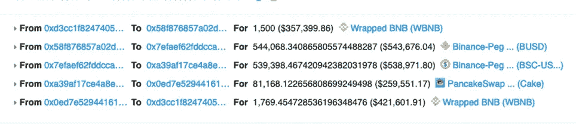

我们看到这个幸运的家伙拿着 1500 BNB 兑换成 BUSD 稳定币。然后，他将 BUSD 换成 BSC-USD(另一种与美元挂钩的稳定货币)。之后，交易者将 BSC-USD 换成 CAKE ( [Pancakeswap](https://coincodecap.com/buy-pancakeswap) DeFi 协议的本地令牌)，然后以打包的形式交换回 BNB。最终，交易者得到 **1769 BNB** ，有效提取 **269 BNB 利润**。

> 这就叫套利。许多资产在多个分散交易所(DEX)交易，不同 DEX 和资产对的价格不断变化。聪明的参与者可以利用这些价格差异，在一次交易中获取价值。

经过一些研究，我发现这个例子虽然令人印象深刻，但并不常见，原因有两点。首先，在这种情况下，玩家使用自己的资本进行交易。第二，他提取了大量的。

这是另一个更常见的套利例子:

[https://bscscan . com/tx/0x 257 af 7585 ca 32 e 8648 c 4307 e 839d 70 e 2e 7 D2 a 6879375 a 29 Abe 9 c 15145 b 204015](https://bscscan.com/tx/0x257af7585ca32e8648c4307e839d70e2e7d2a6879375a29abe9c15145b204015)

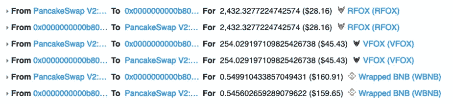

首先，你可能会看到操作顺序很奇怪。套利者在付款前从流动性池中提取代币。这叫做**【闪贷】**。像 uni WAP v2 这样的交换协议(Pancakeswap 和 BSC 上的大多数其他指数都是 uni WAP v2 的分支)允许您接受任何数量的资金(最多不超过池的总流动性数量)。**但你必须在交易结束前偿还所有借入资金并收取费用**。该协议在这里不承担任何风险，因为如果你没有完全偿还贷款，它将强制恢复交易。

因此，这个套利者利用快速贷款。这样，他可以在没有一分钱营运资金的情况下执行套利(除了油费)。但是我们这里还有一个区别:利润小。交易者只得到 1.26 美元，支付了大约 0.54 美元的汽油费。所以，他这笔交易的净利润不到 1 美元。然而，像这样的套利者可能每分钟做几十次套利尝试。这意味着他可能仍然赚了很多。很快，我们就会知道到底有多少了。

> 在这一点上，这些例子让我非常激动，所以我决定深入研究。我决心找出这个市场到底是如何运作的。也许……通过套利交易，你会发现如何获得蓝宝😃。

剧透:我仍然没有蓝宝，但这是一次迷人的旅程。我也学到了很多关于套利的知识，甚至试着设身处地为套利者着想。

你准备好跟随我踏上这段旅程了吗？那我们开始吧！

## **市场有多大，有多稳定？**

我决定从计算套利者的收入开始。

> 今天，我们只讨论所谓的快速“套利者”。这些人接受快速贷款，执行交易，偿还贷款，并保持利润——所有这些都在一次交易中完成。

这部分套利市场很甜。事实上，你不需要流动资金来做这件事，你也没有失去你的资本的风险。当您发送交易时，您要么获胜，要么交易被恢复。你只损失很少的油费，通常不到 10 美分。但是如何计算快速套利者的总利润呢？在进行了几次人工审查实验后，我想出了一个执行以下步骤的查询:

*   **仅过滤满足以下条件的交易:**
    - *在闭环中交易的资产(如 WBNB — DOGE — CAKE — WBNB。
    -从 BSC 上最具流动性的资产之一中提取的价值:BNB、BUSD、USDT、USDC、WBTC 或 WETH。
    -tx 接收器不是公共合同(例如 PancakeSwap 路由器)。我们排除了这些合同，以正确计算总套利天然气费用，包括失败尝试的费用。*
*   找出合约创建者——我们需要这样做，因为一个套利者可能有多个合约，我们希望将它们组合在一起。
*   **计算总收入，并使用交易当天的资产-BUSD 指数中间价将所有收入转换为美元价值。**
*   **计算成功和不成功尝试的天然气成本。**

> **注:**当谈到套利者的利润时，我们指的是**毛利**:收入减去汽油成本。事实上，套利者很可能还有其他重要的成本，包括研发团队的工资和基础设施费用(服务器租金、专用网络链接等)。).准确的成本结构是套利者的专有技术，我们不能用链上分析发现它。这个工具很强大，但显然有局限性。

最终的查询结果证明是计算密集型的。在正常情况下，可能需要几天或几周才能执行(尤其是考虑到 BNB 智能链归档的巨大规模)。**然而，由于 Datamint 数据分析引擎核心的快速分析数据库，以及我的同事在查询优化方面的一些帮助，我在几分钟内就获得了所有数据。然后，我将一个可视化工具连接到生成的数据集市。现在你有了:**Datamint BSC Flash 套利监视器**。你可以在我们的网站上现场查看(见文末链接)。**

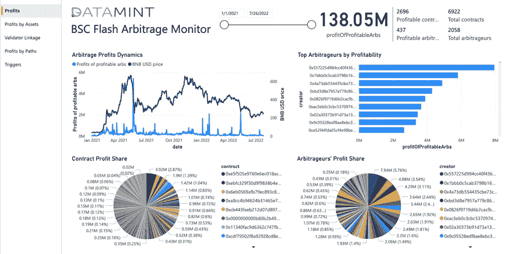

但是让我们回到我们的分析。我们可以看到，自 2021 年 1 月 1 日以来，所有盈利的套利者赚了 1.3805 亿美元。这基本上就是 BNB 智能链的全部历史。BNB 智能链于 2020 年 9 月推出，并于 2020 年第四季度获得增长势头。

我们还可以看到套利者的利润缓慢但稳步下降。(这不包括我们稍后将讨论的峰值)。我将这种下降解释为这样一个事实，即 DeFi 市场正变得越来越成熟和有效，通过套利提取价值的空间越来越小。

> 我很惊讶有这么多套利者遭受直接损失，其中一些人损失了数千美元。

这并不是因为天然气成本(对大多数套利者来说，天然气成本只是收入的一小部分)。他们真的不必承担这些损失，因为如果你看到交易即将出现负利润，你可以撤销交易。我只能认为他们的损失是因为一个糟糕的数学作业。这并不奇怪，因为这个甜蜜的市场吸引了专业人士和业余爱好者。

让我们来看看最成功的家伙，我叫他**、【BSC 套利王】**。他从一开始就一直在玩这个游戏，到 Q2 2022 年结束时已经赚了**将近 800 万美元。**

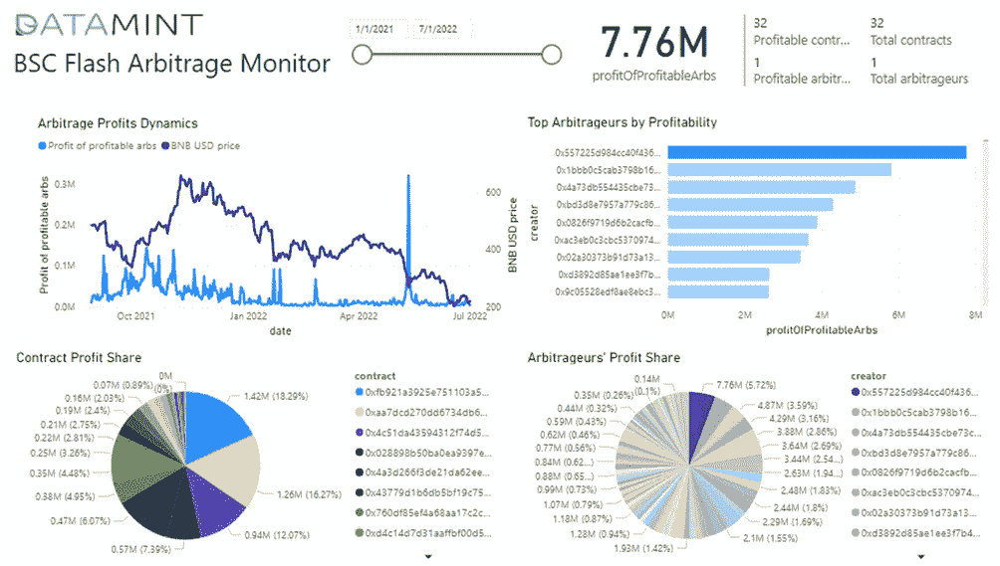

他拥有 32 份套利合约，都是盈利的(毫无疑问，他是专业人士)。看他的利润动态，我们看到他 2022 年的收益普遍低于 2021 年。这部分是因为更有效的市场，部分是因为更低的 BNB 价格(**2022 年 BNB 的平均价格约为 300 美元，而 2021 年约为 400 美元**)和整体市场的下降。然而，我们可以看到他的利润在 5 月份大幅飙升。在 2020 年，他通常每天能赚 5000-15000 美元。但是在 5 月 12 日，他赢得了惊人的 32 万美元！(可以想象那晚他的团队有多狂野)。怎么会？

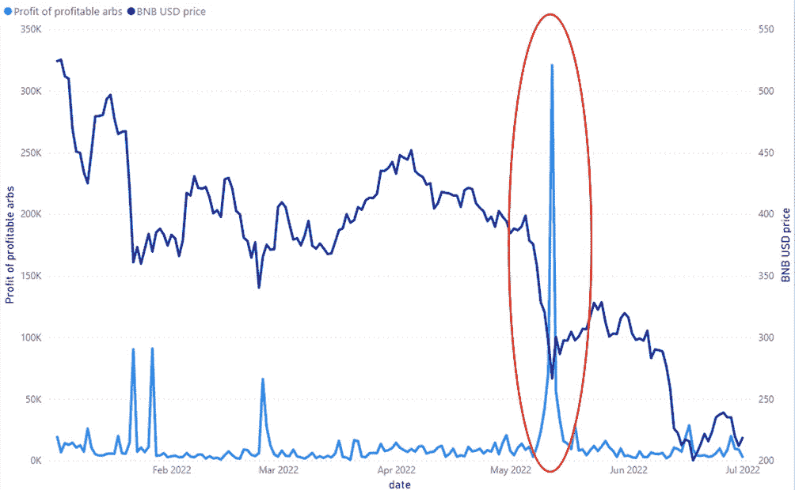

为了得到正确的答案，我只需谷歌一下“2022 年 5 月 11 日至 12 日，密码市场发生了什么？”。但是我决定更深入地研究链上数据。我想通过艰难的方式学习一切。因此，**我组装了第二个查询，它允许我按照套利中使用的资产来分解套利利润。**

> **注:**很多套利涉及连续 3 笔甚至 4 笔资产，所以下图的数字是非相加的(交易总利润记入所有参与的资产)。

当我运行查询并将日期过滤器设置为 5 月 11 日时，我一眼就明白了一切。

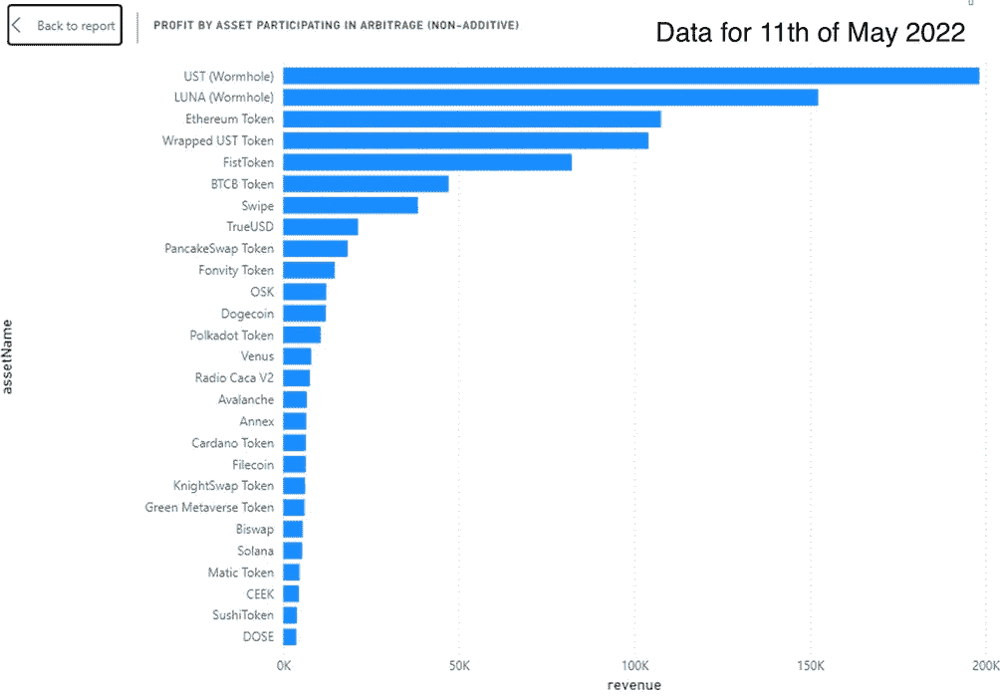

是的，是露娜和 UST。这一天，LUNA 协议中的流动性不足导致 UST 稳定币与美元脱钩。然后，月神令牌的大规模自动铸造导致其价格跌至深渊。

> 但是这是如何影响套利者的利润的呢？很简单。

当这样的事情发生时，就会出现大规模的抛售。**而 DEX 协议中的大销量意味着大的价格变化。这导致不同指数之间的价格差异很大(如 Pancakeswap 和 BiSwap)** 。这正是套利者渴望的。当人们开始恐慌时，他们倾向于更快地出售，而不是以最佳价格出售。在正常情况下，他们会拆分订单，开始以更高的流动性成对卖出，等待价格回升，等等。但是那天，他们没有足够的时间去做所有的事情。此外，过度抵押的连锁贷款协议(通常用于做空)中的许多头寸被清算人平仓。抵押品被自动出售以覆盖贷款。这些大规模的自动销售也造成了效率低下。**所有这些为我们骄傲的 BSC 套利之王带来了 32 万美元。所有套利者在那一天的总利润超过 200 万美元。**

为了了解什么资产(**，具体来说，我称之为“路径”**的资产组合)在“正常”时间最有利可图，我必须组装另一个查询。**该查询根据排序路径而不是单个资产对利润进行分组(还是以非累加的方式)**。然后，我调整了日期过滤器，从观察中排除峰值。

> 我预计，完全由蛋糕、羊驼和 SHIB 等流动性最强、最受欢迎的资产构成的路径利润最高。但那不是真的。

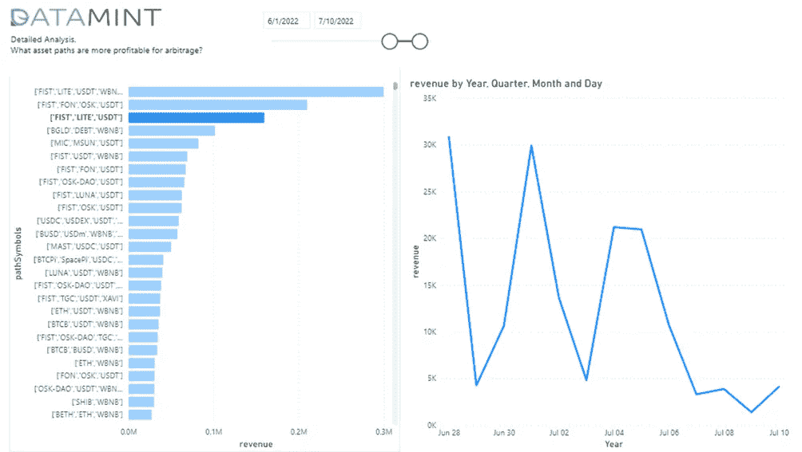

**出于某种原因，很多顶级盈利路径都包含 FIST token** ，这是我之前从未听说过的。一些简短的谷歌搜索让我看到了几个声称是 FistSwap 或 FstSwap DEX 的网站。至少有一部分肯定是骗局。我确信这里的更多调查会带来有趣的见解，但我认为这超出了本研究的范围。

> **有趣的是，我找不到市场波动性和套利收益之间的任何显著相关性**。

这是我最初的假设:市场波动越大，套利者赚得越多。然而，除了几次大幅飙升，我找不出套利利润和波动性之间有什么强有力的关系。

好了，现在我们知道了两件主要的事情。**第一，套利市场确实有些钱。第二，尽管整体美元利润稳步下降，勇敢的人仍然可以找到利润机会。**

> 然而，在我们深入探讨之前，我们想知道一件非常重要的事情:

## **市场有多公平？💭**

因为如果市场是不公平的，不管它有多少钱，你都不能用一些秘密优势来削减份额。我们有很多理由怀疑市场的公平性。这是因为 BNB 智能链上的一些参与者可能拥有巨大的优势。原因如下。

当套利机会出现时，所有的套利者都试图回撤。**这意味着在创造机会的交易之后，他们将交易放在下一个位置**(比如，用 2000 BNB 换蛋糕)。我把这个交易叫做**【一个触发器】**。赢家全拿走，其他人只是为一次不成功的尝试付油钱。为了达到这样的速度，套利者必须在 mempool(未决交易的临时存储)中快速检测触发器。然后，他们必须首先将他们的套利交易发送给验证器。

> 显然，两种类型的角色在这里有很大的优势——RPC 节点(通过 RPC API 从元掩码钱包中获取事务)和验证器节点。

验证器节点可以对事务进行重新排序，甚至可以私下挖掘事务，而无需将它们发送到 mempool。这种优势被称为 MEV(矿工可提取价值)。在以太坊网络上，我们甚至发现了一种叫做 Flashbots MEV 的特殊倡议。这一举措试图为私人采矿提供公平的机会。然而，BSC 没有这样的东西。它只有 21 个验证器。在任何时候，我们都可以怀疑这些验证者在玩套利游戏来增加他们的利润。

那么，我们先来看看市场份额分布。

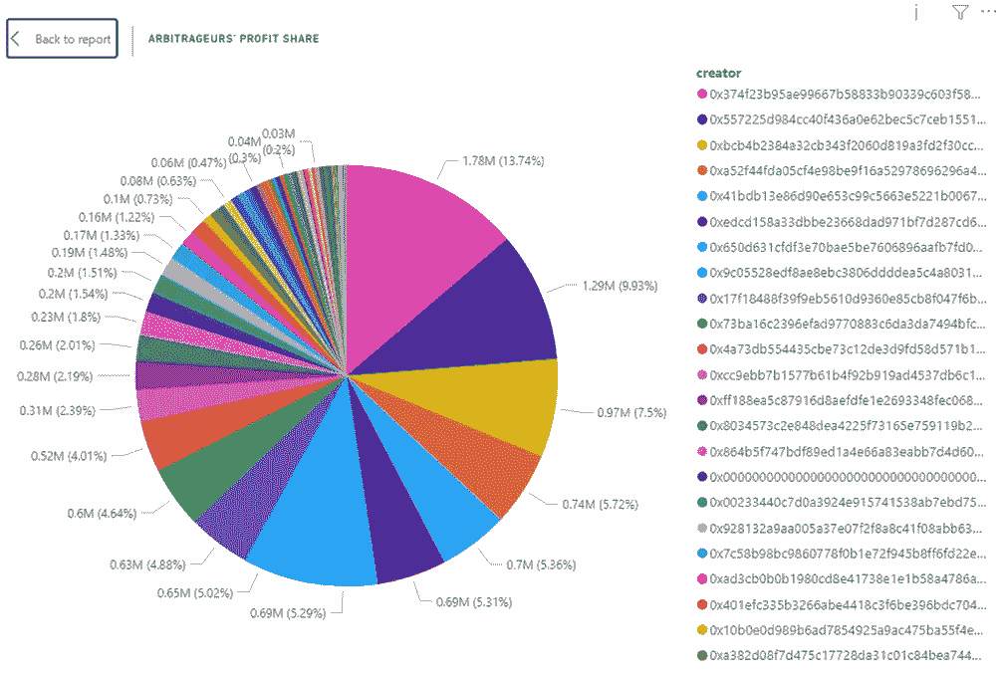

自 2021 年 1 月 1 日以来，我观察到 **1972 名套利者**使用 **6689 份定制合约**。而**其中只有 430** 是**盈利**(有 2648 份盈利合同)。如果我们看看目前的情况(比如说 Q2 2022 年)，我们看到总共 645 名套利者中有 129 名获利。市场也相当稳固——前 7 名占据 50%以上的市场，前 20 名占据 80%以上的市场。然而，许多较小的玩家仍然在利润分配的尾部之内，他们仍然赚取他们的一分钱。

嗯，这种市场分布并不能揭示市场有多公平。我们需要其他方法来解决。

> **这正是我们想要使用链上数据水晶球的时候🔮再次**。

此时，我们拥有所有成功套利交易的完整历史。对于每笔交易，我们都知道区块的编号。我们还知道其验证器的地址(有时是名称)。我们可以假设，任何套利者不太可能同时与所有 21 个验证者有“特殊”关系。因此，如果一个套利者正在利用 MEV，他的利润应该被某个验证者利用。

好了，看来是时候进行另一个查询了。这一次，我从 2021 年 1 月 1 日开始计算每个成功套利者的以下指标:**总利润，每笔交易的平均利润，他们成功交易的数量，最重要的是，他们在单个验证器中的最大利润份额。**

> 理论上，如果套利者对验证者没有任何偏好，这个**“topValidatorProfitShare”**指标应该接近 1/21 = ~5%。实际上，许多其他因素也会影响成功率。例如，仲裁人的节点可以与一些验证器共享同一个数据中心。或者它们的节点可以与验证器直接对等。启发式地说，我会假设所有低于 20%的都是公平竞争的指标。

因此，我运行了一个查询，并按总利润对结果进行了排序。还有…

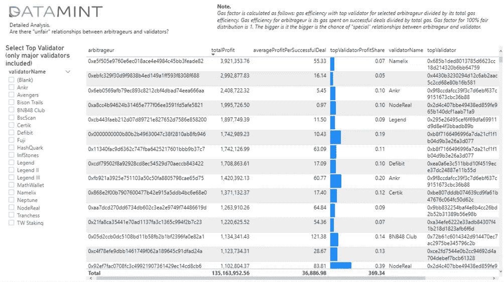

好吧，至少前 10 名套利者没有表现出与验证者有特殊关系的迹象。 ***第一个可疑进场(0x 92 ef 7 fac 0708 fc 3c 49921907361429 EC 14 CD 8 CB 6)在 15 位，利润 39%。它从 NodeReal 验证的区块中总共获利 110 万美元。*** 但是，这还不足以说这是不公平的打法。 ***一个更可疑的条目(0 xba 5276 f 63492 b 351 c 7227 a4 f 285593 cefa 250 ad 3)在 45 位，利润 89%。它从 HashQuark 验证的区块中总共获得了 56.6 万美元。*** 这可能是一个强烈的隶属标志，但在这种情况下，总利润看起来太小了。它大约比整个市场的 1/21 少 6 倍。

然后，我试图验证这个条目在与 HashQuark 的隶属关系中是特殊的。我只选择了受到 HashQuark“青睐”的套利者，并按照他们的“**topValidatorProfitShare”**降序排列。

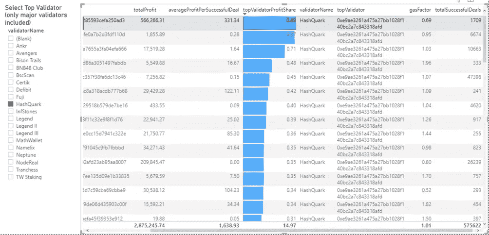

可疑的家伙在第一位。顺便说一句，他每笔成功交易的平均利润真的惊人，达到 331 美元。那太多了。然而，其次，我们绝对没有看到总利润低于 2k 美元的显著套利者。同时，他的**topValidatorProfitShare**只比第一个少了两个百分点。看起来他并没有从从属关系中获利。他也有超过 6674 笔成功交易，所以这看起来不像是意外。

嗯，也许两者只是不小心共用了数据中心的同一个架子？我们永远无法确定。

> 然而，**我可以说，总的来说，对于一个竞争如此激烈的市场来说，从属关系的证据是非常微弱的(或者伪装得非常好)**。看起来大多数玩家都在公平竞争，没有鲸鱼主宰市场。😌

## 有可能进入套利市场吗？

好的，我们现在知道 BNB 智能链上的快速套利市场有一个相当大的规模，一个看似公平的结构，和许多机会。看起来我们已经准备好进入并为蓝宝而战了！

嗯，没那么快！拼图还缺一块。

> **套利机会是如何创造的？**

我们知道这在一般情况下是如何运作的——大型指数掉期、清算等。但要开始监控 mempool，我们需要确切知道套利者观察到的触发交易类型。

再回到那个一次交易提取 60k$+的幸运儿。记得吗？那个家伙开始了我迷人的旅程。通过探索 BSCScan explore 上的块，我们可以很容易地找到他的触发事务。这是在套利者交易之前开采的同一区块中的交易。这是:

[https://bscscan . com/tx/0x 06 de 0901 e 11 BD 19 B3 a 42 f 0746 e 17604 a9 c8 c 502 BDC 4202737 f 24407 BF 1743 f 75](https://bscscan.com/tx/0x06de0901e11bd19b3a42f0746e17604a9c8c502bdc4202737f24407bf1743f75)

这是羊驼金融贷款协议的清算交易。**有人在这个协议中占据了很大的位置，很明显，今天不是他们的好日子。他们的头寸被清算，他们的抵押品在 PancakeSwap DEX** 上被自动出售。

显然，为每一笔数千万的套利交易检查触发器是不可行的。你已经知道我要怎么解决这个问题了。

> **Datamint 服务器和数据库，数据分析工具，还有几杯☕️** 。

这个查询可能是最复杂和计算密集型的。当我点击“执行”时，我几乎可以听到我们的数据服务器的风扇像喷气发动机一样嚎叫。谢天谢地，这种服务器折磨没有持续多久，我得到了我的结果。

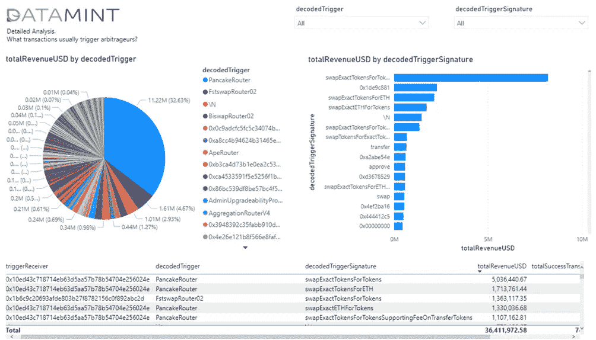

所以，结果一点也不令人惊讶。**超过三分之一的套利利润涉及以 PancakeSwap 指数为触发点的交易**。用作触发器的最流行的函数是**“swapExactTokensForTokens”**。占全部利润**~ 14%**。此功能是由 BSC 上的大多数索引派生的 Uniswap V2 的一部分，例如 BiSwap、ApeSwap 等。唯一令人惊讶的是 FstSwap(或 FistSwap？)排在第二位，就在煎锅外。

> **此时，我们可以简单地选择触发地址和功能的任意组合。现在，我们准备好做实验了！**

我和我的团队花了一些资源对触发器做了更深入的研究。主要是，我们分析了竞争和不同触发器的盈利能力之间的关系。然而，这显然超出了本文的范围。因此，如果您对更多细节感兴趣，请联系我们。

在这一点上，我有了我需要的所有理论，但是没有实践，理论什么都不是。这意味着…

# 我们试试套利吧！

我必须从免责声明开始——我的目标不是构建一个有利可图的 flash 套利机器人。我不抱任何幻想，我完全理解这是一项复杂的开发任务。

> 我的实际目标是尽可能地走捷径。我想了解市场上有经验的玩家和新手之间的差距有多大**。**

所以，我决定**我将**而不是:

1.对每笔交易创造的潜在利润进行模拟或启发式估计。我猜这就是专业套利者在计算速度上的竞争。对于我的研究，我将自己设计触发器，并且只对我自己的触发器做出响应。

2.**编写并部署一份实际的套利合同**。这并不难，但我的研究不需要它。如果我可以将我的虚拟事务放在我自己的触发器超越竞争旁边，那么写合同就是一个技术问题。

3.**做具体优化**。我不会调整区块链节点，优化基础设施，网络等。这是一个兔子洞。如果没有它我就赢不了，这绝对不是一场轻松的比赛。

考虑到这一切，我构建了一个 BSC 节点，并用 Python 编写了一个简单的脚本。这样，我可以通过 IPC 连接不断地获取内存池中的所有新事务来监视它们。然后，我可以寻找我精心制作的触发器，并立即发送一个响应的虚拟交易(将 0 BNB 转账到我自己的账户)。

> 理论上应该是这样的。

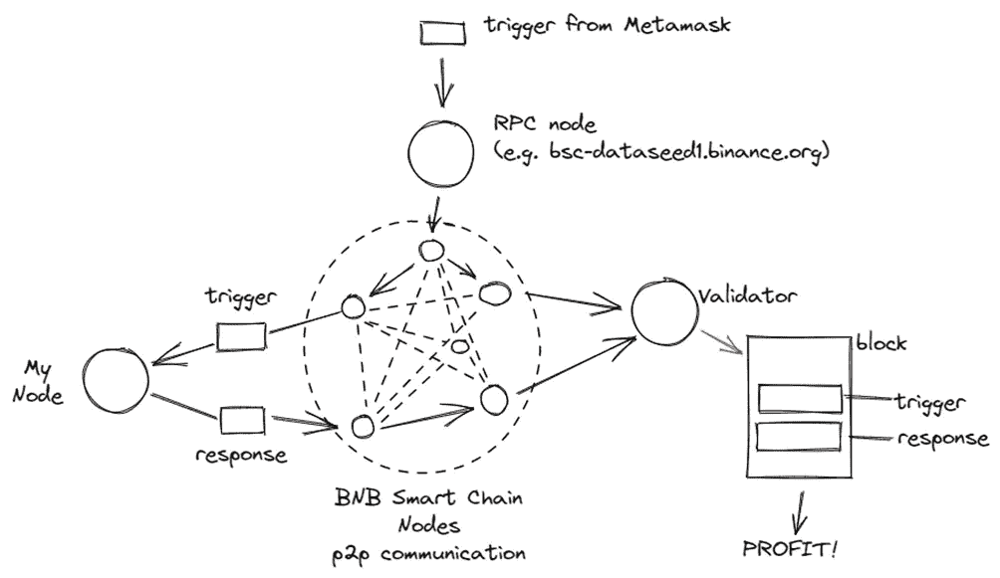

但我想说几句关于制作触发器的话。我需要发送一笔交易，引起活跃的套利者的注意。这应该是一笔至少 1 万美元的大交易。但是如果我不想在游戏中投入真金白银，我该怎么做呢？**幸运的是，当在 mempool 中竞争反应速度时，套利者没有时间检查发送者是否有资金进行所请求的互换。**

于是，我以自己的小额掉期交易为例，进行了编辑。

> 这样，**在 Pancakeswap** 就出现了 100 万美元(BUSD)换蛋糕的交易。

这是 BSCScan 上事务负载的样子。

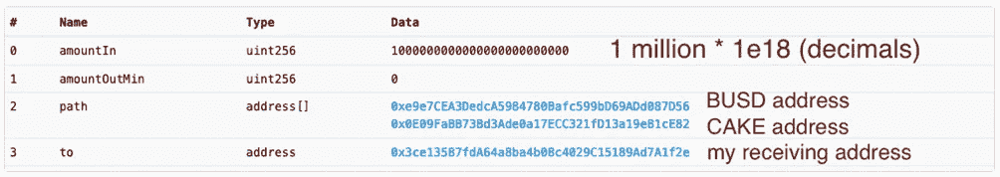

第一个实验表明这种方法非常有效。我的触发器被挖矿，还原(因为我的钱包里还没有 100 万美元😆)，以及通过大约 400 次套利尝试进行的**回溯。400…** 在那一点上，我在想，我夸大大人物的企图是注定要失败的。

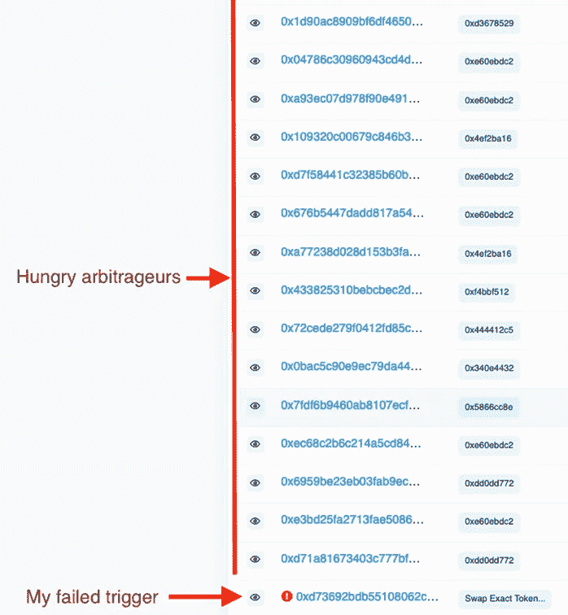

但我承诺要完成这件事。因此，我启动了我的 Python 脚本，等待节点连接初始化，并使用 Metamask 的自定义十六进制数据字段和在线 ABI(应用程序二进制接口)编码器【https://abi.hashex.org/发送了我精心制作的触发器。几乎立刻，我在节点的控制台中看到一个通知，在 mempool 中检测到一个触发器，并且发送了伪响应事务。几秒钟后，两个事务都被挖掘出来，我打开了 BSCscan(当你交叉手指时，这并不容易做到)。我评估了结果:

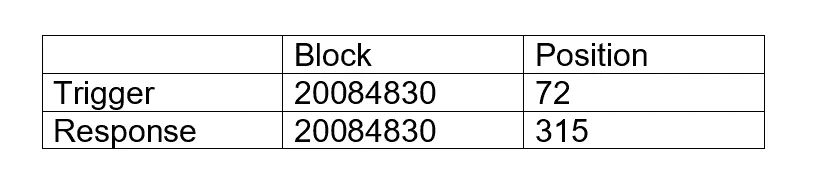

> *我的期望很低，但是天哪，结果太令人失望了。尽管我设法把我的回应交易和触发交易放在同一个区块，但我还是输给了数百名其他套利者*。

这意味着他们都有巨大的基础设施优势——他们调整了强大的节点，特殊的网络解决方案，更好地与其他节点对等，以及其他一些我甚至不知道的优化。

我们应该到此为止吗？这本来是明智的，但我想把事情做到极致。我将向活跃的套利者提出一个非常严峻的考验。

> 这里有一个简短的题外话来更好地理解**以太坊 P2P 协议如何工作**。当一个节点获得新的事务时(无论是来自 RPC 还是来自其他节点)，它会将它们添加到 mempool 中。然后，它将它们重新传输到其他连接的节点(对等节点)。这个过程有 **2 个特殊的**事情:

1.  一个节点只向对等体的一个子集(比如 10/100)发送完整的新事务。其余的对等体只获得新事务的散列。如果他们还没有完整的事务体，他们可以自由地请求它们。这减少了网络中不必要的混乱，但是如果运气不好的话，会减慢事务传播的速度。
2.  节点通常不会单独发送事务。相反，它们将多个事务打包到一个网络数据包中。否则，交易会有很大的延迟，因为以太坊 P2P 网络中的消息吞吐量是有速率限制的，以防止 DDoS 攻击。

知道了这两件事，我可以模拟出我这边的巨大优势。

> **我可以在一个数据包中发送触发和响应事务**。

我也可以确定我正在发送完整的交易。因此，理论上，套利者不应该能够在我的触发和我的反应之间插入他们的交易。它们被加入到一个数据包中，因此它们之间没有任何延迟。

在我花了几个小时深入研究 BSC-geth(BNB 智能链的官方节点软件)的源代码后，这个想法似乎没有一开始那么美好。然而，一切都过去了，最后，我能够向我的节点的 150 个对等点发送自定义数据包。

我精心制作了触发和响应事务，将它们打包成一个数据包，并发送给对等方。我从没在开 BSCScan 时这么紧张过。

> 我所看到的让我无言以对。

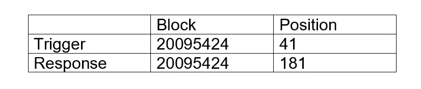

结果和之前跑的差不多！我还是输给了 100+套利者。怎么可能呢？我认为这里只有两个选择。要么验证者在游戏中(根据我的研究结果，这不太可能),要么，BNB 智能链有如此多的套利节点！这意味着他们可以在通往验证器的每条路径上拦截事务。套利者会找到触发器，插入自己的反应交易，延迟较弱的对手的交易(是的，像我这样的人😢).

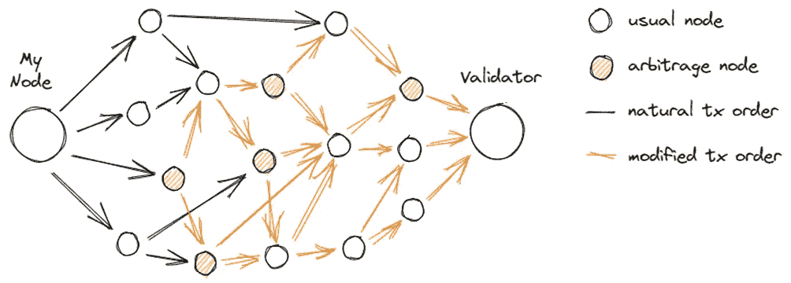

看来快速套利利润一点都不容易赚。我很有可能不会从这个市场获得蓝宝……然而，在我陷入沮丧，想到我破碎的梦想之前，我想起我的生意不是套利。

> **我从事链上数据分析和增值数据服务。这项研究对我的生意很有帮助！它显示了仅使用公开的区块链数据、合适的工具和承诺可以学到多少东西。**

## 结论

这是一次迷人的旅程，再次证明了链上数据的力量。但不只是任何数据；我指的是利用适当的分析和有效的工具，如 **Datamint 数据引擎**来驾驭数据。故事还没有结束，因为我们已经在网站上发布了[Datamint BSC Arbitrage Monitor](https://datamint.ai/research/#arbitragemonitor)分析应用程序。你可以继续自己的旅程，并从中寻找更多的见解。

**但为了总结这项研究，我将重申主要发现:**

1.  仅 BNB 智能链的快速套利市场每年就有 1 亿美元的可观规模。
2.  由于市场条件和 DeFi 不断增长的效率，市场缓慢但稳步下降。但是，它仍然有许多机会。顶级玩家每年仍能挣到 800 万美元。
3.  这个市场竞争激烈，有数百名职业球员，但它并没有显示出大规模“不公平竞争”的迹象。
4.  市场对勇敢的新玩家开放，但你应该为高昂的 R&D 和基础设施成本及风险做好准备。

今天就到这里。如果你喜欢这个故事，请告诉我们你对链上数据感兴趣的话题。这将有助于我们对即将发布的内容的主题进行优先排序，包括文章、研究、在线工具和网络研讨会。

> 愿数据伴随你！

*关于作者:* Ivan Vakhmyanin 是一位拥有多年经验的数据分析和可视化(BI、大数据、数据科学)专家。他也是一个区块链和 Web 3.0 专家，使来自领先的区块链平台(以太坊，BNB 智能链，索拉纳等)的链上数据可供分析。Ivan 热衷于通过为专家和高管开发数据驱动管理领域的教育和项目来分享经验。

**Datamint** 是一家专注于定制研发的区块链增值数据提供商。更多详情，请访问我们的网站 [https://datamint.ai](https://datamint.ai)