# 举例说明烛台图案

> 原文：<https://medium.com/coinmonks/candlestick-patterns-explained-with-examples-a20be0d969ee?source=collection_archive---------3----------------------->

Image From [Pixels](https://www.pexels.com/photo/desk-laptop-office-friends-4960464/)

交易者可以使用各种蜡烛图来识别图表上的关键区域。

摇摆交易者，长期仓位交易者，甚至日内交易者都从这些烛台模式中受益。

虽然一些烛台模式可能揭示了买方和卖方的相对实力，其他可能表明趋势逆转，延续，或犹豫不决。

这篇文章将带你了解一些重要的烛台模式及其形成背后的心理学。

1.  **晨星图案**

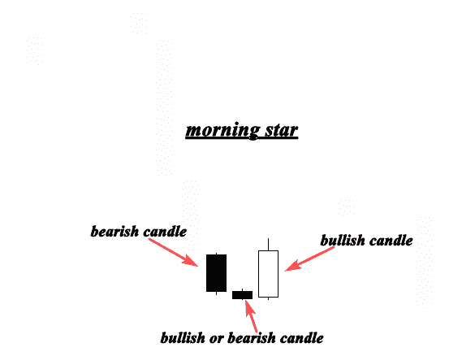

晨星(看涨反转形态)由三个烛台组成，通常出现在下跌趋势的底部。

由于第一个烛台是熊市，卖方仍然控制着市场。

第二根蜡烛线很小，表明卖家控制了市场，但无法推动市场大幅下跌。这根蜡烛可以看涨，也可以看跌。

一根看涨的蜡烛线在第一天的中点上方打开和关闭，标志着第三根蜡烛线是一个强大的趋势反转指标。

当这种形态出现在下跌趋势底部的支撑位附近时，它标志着明显的趋势反转。

晨星模式表明买方是如何从卖方手中控制市场的。

请参见下面的示例:

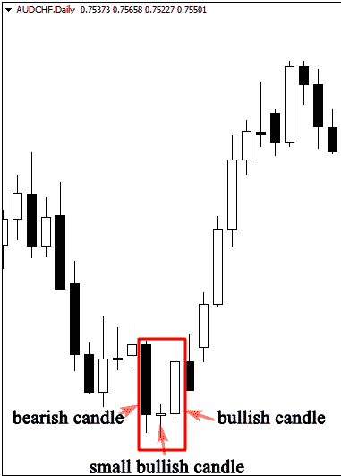

上图揭示了晨星形态及其在下跌趋势底部形成时的重要性。

如你所见，这种模式出现在熊市趋势中。

第二个烛台(多奇或任何其他蜡烛)在第一个烛台支持卖方的统治后创造了一个非决定性的市场。

然而，在这种情况下，多奇烛台显示，卖方发现很难推动市场下跌。

随着第三根看涨蜡烛线显示买家已经控制了卖家，市场预计会出现转机。

如果你学会了烛台模式的解剖和其发展背后的心理学，你将能够像有经验的交易者一样评估金融市场。

**2。黄昏之星图案**

晚星(看跌反转形态)也由三根蜡烛线组成，经常出现在上升趋势的顶点。

*   第一烛台看涨。
*   第二根蜡烛是一个小烛台，可以是看涨、看跌、多奇或任何其他烛台。
*   第三根蜡烛由一根大的熊蜡烛组成。
*   晚星形态一般是晨星形态的看跌变异。

请参见下图:

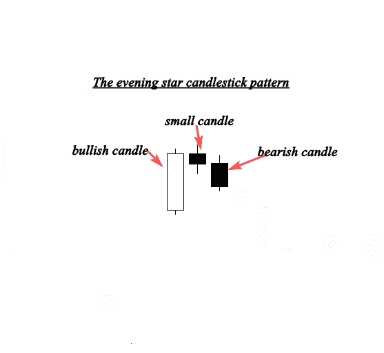

一根看涨的蜡烛线形成了晚上星的第一个组成部分，表明多头仍在推动市场上涨。

小型机构的发展表明，买家仍在市场上行使控制权，但继续这一趋势的力量较小。

第三根熊市蜡烛线显示，买方的主导地位即将结束，潜在的熊市趋势反转很可能发生。

看另一个图表，看看晚上的星星如何作为一个强大的趋势反转指标。

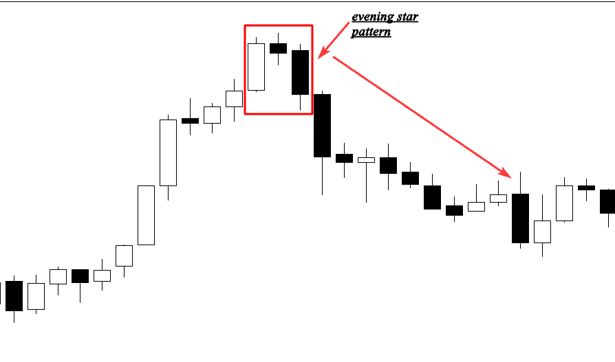

该模式中的第一个烛台显示了一个长期的上升，正如你在插图中看到的，这与市场的上升趋势相对应。

第二个是一个小烛台，代表价格巩固和犹豫不决。

也就是说，导致第一根多头蜡烛线的趋势正在失去动力。

最后一个蜡烛线跳空比前一个低，证实了反转，并预示着新的下降趋势的开始。

**3。**锤子(销棒)

当开盘价、最高价和收盘价几乎相等时，就形成了锤子烛台。它带有一个长长的下影线，表明买家拒绝看涨，并打算推高市场。

请看下面的例子，看看它是什么样子的:

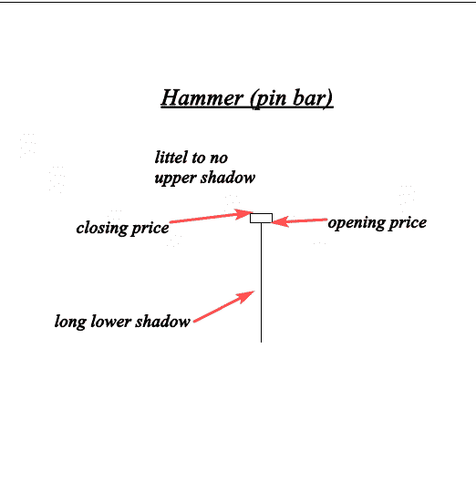

在下降趋势的底部出现锤子烛台模式表明反转。

当卖家试图在开盘后压低市场，但被买家拒绝，导致收盘价格高于最低价时，就会出现这根蜡烛。

请参见以下示例:

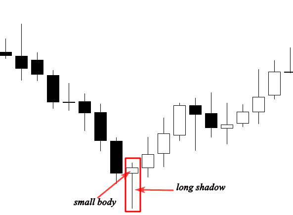

锤子(大头针)的出现是一个显著的反转形态，因为市场在下跌。

延伸的阴影表明此时的高买入压力。

市场被卖家推低，但在那个时候，购买力超过了抛售压力，这导致了趋势逆转。

要准确预测市场的走向，了解导致这种形态形成的心理是必不可少的。

*在我随后的文章中，我将讨论如何交易这种模式和过滤这种信号。*

**4。流星(看跌针棒)**

当开盘价、最低价和收盘价几乎相等时，流星就出现了。这支蜡烛上影长，身短。

这是一个看跌的锤子。

专家建议影子的长度是实际身体的两倍。

请参见下面的示例:

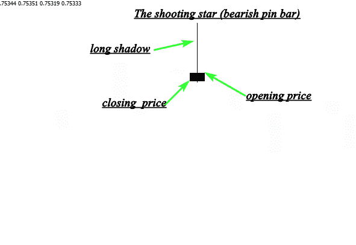

上面的图像描绘了一颗完美的流星，它有着小的身体和长长的上影。

这种形态出现在上升趋势中，表明熊市反转。

这种模式背后的情绪是，买家试图推高市场，但遭到了巨大的抛售压力。

当烛台接近阻力位时，它被视为一个高概率的设置。

参见下面一个类似的例子:

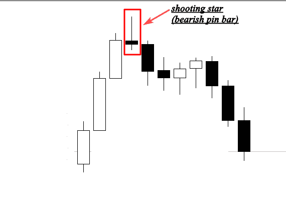

上面的图表显示了上升趋势顶点的流星。

当这种形态形成时，它标志着上升趋势的结束。

烛台模式可以与支撑和阻力、供需区和技术指标一起使用。

流星是我进入市场的一个强有力的信号，因为它很容易识别，而且利润惊人。

**5。哈拉米图案(内部线条)**

组成哈拉米图案的两个烛台——在日语中是怀孕的——被视为反转和延续的图案。

小烛台紧随长烛台之后。

第二个烛台需要在第一个烛台外面关闭，哈拉米图案才有效。

当这个蜡烛线出现在上升趋势的顶部时，它是一个看跌反转指标，当它出现在下降趋势的底部时，它是一个看涨信号。

请参见下图:

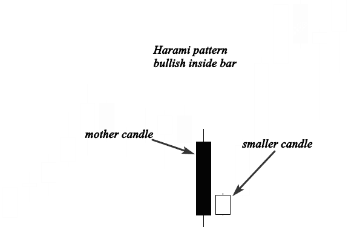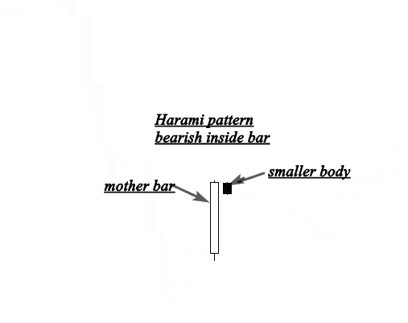

如你所见，母烛台完全盖住了短身体。

不要担心颜色；重要的是小身体靠近第一个长烛台。

哈拉米蜡烛预示着市场的不确定性。

换句话说，市场正在整合。

结果是，买家和卖家都不知道该怎么做，没有人能完全控制市场。

当这种烛台模式出现在上升趋势或下降趋势时，它被视为一种延续模式，是加入趋势的绝佳机会。

如果它出现在上升趋势的顶部或下降趋势的底部，它标志着趋势反转信号。

看一下下面的例子:

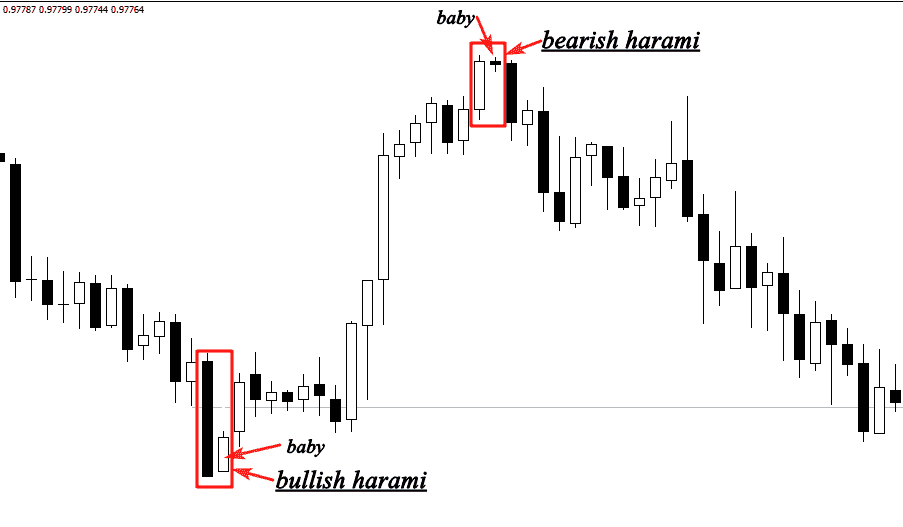

上面的例子显示了第一个看涨的 harami 形态在下跌趋势底部附近形成，此时卖家试图将市场拉低。突然，价格开始盘整，表明卖盘力量不再控制市场。

看跌的哈拉米形态(与看涨的哈拉米形态相反)出现在上升趋势的顶点，这意味着买方的优势即将结束，下跌趋势即将开始。

无论这种形态是在上升趋势还是下降趋势中形成的，它都是市场方向的延续信号。

**6。镊子顶部和底部**

镊子的顶部和底部形态分别显示下跌趋势底部的看涨反转形态和上涨趋势顶部的看跌反转形态。

下面的例子

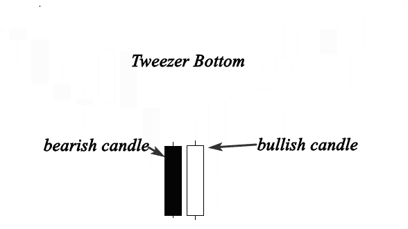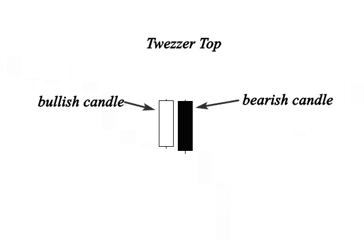

镊子顶图案由两个烛台组成(第一个烛台是看涨的，后面是看跌的烛台)。

镊子底纹也由两个烛台组成(第一个烛台看跌，第二个烛台看涨)。

因此，镊子底部是镊子顶部的看涨版本。

镊子顶在上升趋势中形成，此时买家将价格推高，给我们的印象是市场仍在上涨。

然而，卖家通过压低市场价格和关闭看涨烛台的开口来阻止买家。

镊子底出现在下跌趋势中，此时卖家将市场推低。

然而，下一个交易日的价格收盘高于或接近第一个熊市蜡烛线的价格，这表明买家正在改变市场的方向。

如果这一价格行为接近支撑位，熊市反转可能发生。

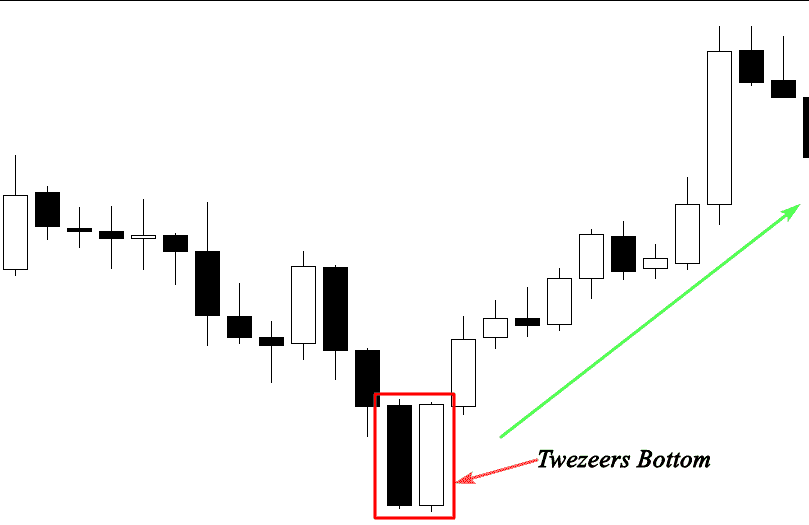

上图显示了下降趋势中形成的镊子底部。

第一个交易日，空头将市场推低；然而，第二个交易日开始前一个交易日的价格收盘，并直线上升。

这是一个反转买入信号，如果你有额外的因素支持你的买入决定，你可以交易。

**结论:**

烛台背后的心理学应该是你关注的焦点，而不是它们的名字。

因为如果你掌握了它们是如何形成的，你就可以很容易地理解市场上发生了什么，并预测未来的价格走势。

如果你读过我之前关于[日本烛台模式](/coinmonks/japanese-candlestick-patterns-explained-with-examples-5c7bc38e0bcc)的帖子，你应该已经了解了很多关于每种烛台模式的解剖及其形成背后的心理学。

*我的使命是让区块链教育和更新变得足够简单，让每个人都能理解。*

[*跟我学*](/@Bukz_dwriter) *。我会教你如何进入加密货币和区块链世界。*

> 交易新手？尝试[加密交易机器人](/coinmonks/crypto-trading-bot-c2ffce8acb2a)或[复制交易](/coinmonks/top-10-crypto-copy-trading-platforms-for-beginners-d0c37c7d698c)