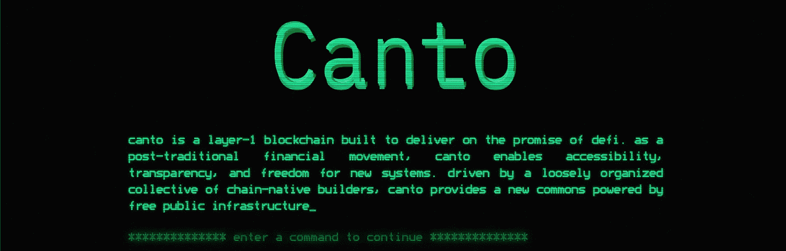

# 康托，DeFi 中的新原语？

> 原文：<https://medium.com/coinmonks/canto-a-new-primitive-in-defi-1f561fc3a31f?source=collection_archive---------2----------------------->

好的密码读者，你可能已经注意到当前的趋势，推出新的第 1 层网络的重点是 DeFi。看来目前的熊市并没有停止发展。在这篇文章中，我们将分析 Canto 项目，看看它是否真的给加密领域带来了新的东西，让我们开始吧！

> **什么是 CANTO？**