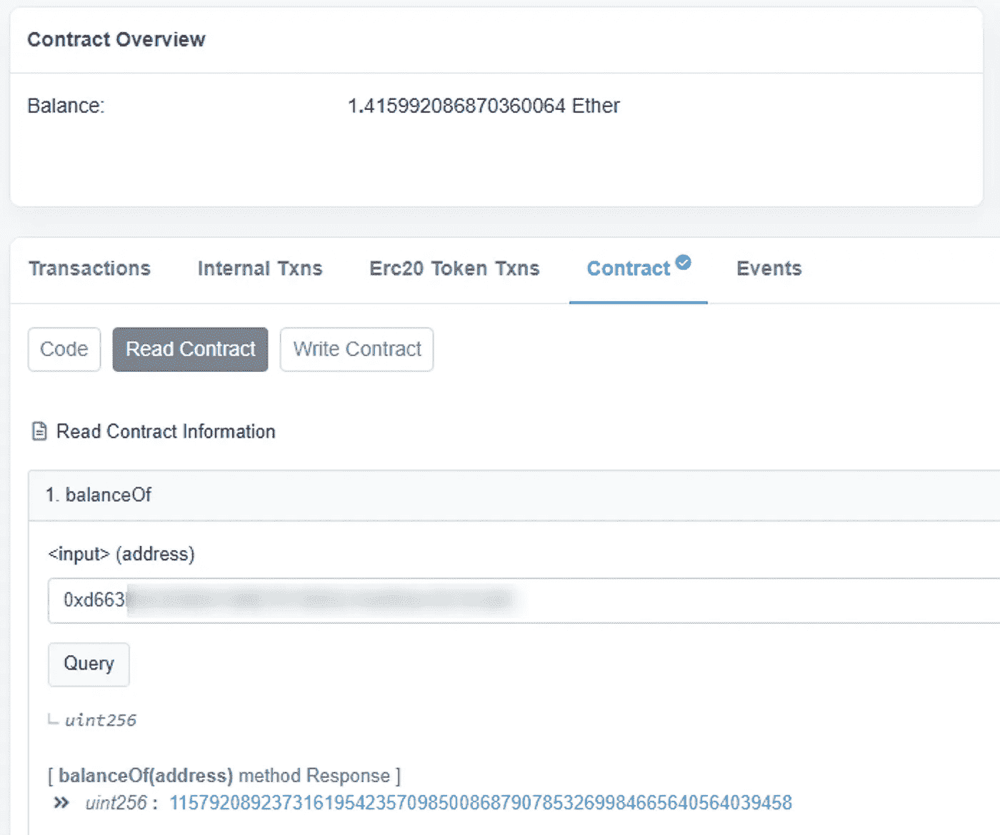
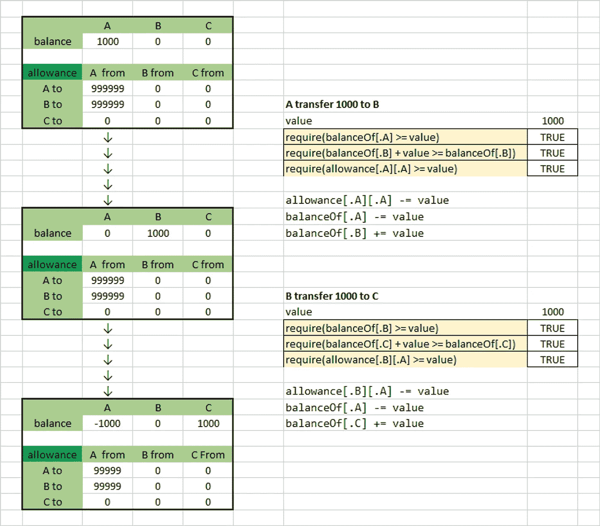

# 捕捉以太(所有挑战)第 2 部分:数学

> 原文：<https://medium.com/coinmonks/capture-the-ether-deprecated-part-2-math-4513592a789c?source=collection_archive---------31----------------------->

1.  象征性销售
2.  象征鲸
3.  退休基金

# 要阅读第 1 部分[，请点击此处](https://coinsbench.com/capture-the-ether-deprecated-part1-lotteries-234bba08e285)

[Capture The Ether](https://capturetheether.com/) 是一款基于 Solidity 和 EVM 的 CTF (capture the flag)游戏，目标是破解多个智能合约并窃取资金。

> 不知道什么时候买卖 cryp，试试[复制交易](http://coincodecap.com/go/bityard)。

几个月前，我已经完成了这些挑战(并写下了这些挑战),遗憾是，这些挑战已经不可玩了(至少从它的网站上),因为它被部署在 Ropsten 上，一个废弃的以太坊测试网。
但我认为与你们分享这些并展示我战胜了其中一些挑战还是很有趣的。通过阅读这篇文章，你可能会学到一些东西。最后一件事:自从这些文章写出来后，我没有做太多的修改。我在隐型僵尸教程结束后马上做了这些挑战。

如果你正在寻找这种挑战，你也有[以太](https://ethernaut.openzeppelin.com/)或 [DamnVunerableDeFi](https://www.damnvulnerabledefi.xyz/) 。

*免责声明:这些挑战基于 solidity 0.4.21，这是一个相当老的版本了。与最新版本(0.8.x)可能有一些不同，但大多数内容仍然适用。影响这些契约最大变化是加法、减法和乘法期间可能发生的上溢和下溢。从 solidity 0.8.0 开始，这些操作人员直接集成了安全措施。在 0.8.0 之前，人们使用@openzeppelin/SafeMath 库来防止合同溢出/下溢*

# 1.象征性销售

要破解的代码:

这个契约模拟了一个非常简单 DEX，用户可以用 ETH 购买令牌，或者用他的余额(balanceOf mapping)出售令牌

这个挑战是“数学”部分的一部分，意味着解决方案与数字和计算有关。这给了我们一些提示。

我首先想到的是“[溢出/下溢](https://www.notion.so/Token-Sale-93499619ce494c1d919ea0b5df17ee67)”

## 溢出和下溢

当我们试图将一个太大或太小的数字放入一个数据类型时，就会发生下溢和上溢。

例如，试图将值 260 放入 uint8(无符号整数 8 位)会产生溢出，因为 uint 在[0；255](一个单位 **N** 的最大值是 *2^N -1*

值-5 也是一样，它会产生下溢。

在 solidity 中，当发生上溢/下溢时，该数字只返回到该数据类型的第一个或最后一个数字

260 进一个 uint8 然后会给 255+5 = 4[**255**(+1)>>**0**(+1)>>**1**(+1)>>**2**(+1)>>**3**(+1)>>**4**

而-5 则会给出 0–5 =[0(-1)> >**255**(-1)>>**254**(-1)>>**253**(-1)>>**252**(-1)>>**251**

我用加法和减法向您展示了这一点，但显然它也适用于乘法，因为结果数字可能会超出界限。

## 回到合同上

那么，现在我们知道了，你能在代码中找到这种行为发生的地方[吗？](https://www.notion.so/Token-Sale-93499619ce494c1d919ea0b5df17ee67)

在这个挑战部分，我想做的是写下可能发生这种情况的位置，让我们看看我们得到了什么:

如您所见，有 4 行标记了注释:3 个潜在溢出，1 个下溢。

现在我们不得不考虑谁应该对如此糟糕的局面负责

第一个:

`require(msg.value == numTokens * PRICE_PER_TOKEN); //overflow`

这里，我们检查【T1【uint 256】乘以`PRICE_PER_TOKEN`【uint 256】是否等于用户发送的 ETH 值(这里是 msg.value)

这里没有暂停，这是溢出发生的地方。但是怎么做呢？

`PRICE_PER_TOKEN`等于合同开头所示的 1 乙醚。所以，无论我们在`numTokens`中放入什么值，都会得到一个 uint256 * 1，所以不会溢出，对吗？..

不对。在 EVM 上，1 以太等于 10 ⁸或 1e18 微

卫是乙醚的最小单位([见此处解释](https://gwei.io/fr/))

所以，实际上`PRICE_PER_TOKEN`并不等于 1，而是 10^18.你知道会发生什么吗？..


prepare for some numbers

一个 uint256 的最大值是 *(2 ⁵⁶)-1* ，等于:

`115792089237316195423570985008687907853269984665640564039457584007913129639934` 因此，如果我们将 10 个⁸乘以`115792089237316195423570985008687907853269984665640564039457`(我去掉了最后 18 个数字)，我们得到:

`115792089237316195423570985008687907853269984665640564039457000000000000000000`(简单加了 18 个‘零’)

这仍然小于 2 ⁵⁶，所以没有溢出，事实上，我们离最大值还有`584007913129639934`。

但是如果我用 10^18 乘以`11579208923731619542357098500868790785326998466564056403945**8**`(我加了 1，最后一位数字变了)，现在我们比 uint256 大 0.416 ETH(见下面的快速数学)

```
 11579208923731619542357098500868790785326998466564056403945**8000000000000000000**
(-)11579208923731619542357098500868790785326998466564056403945**7584007913129639934** 
=  ___________________________________________________________ **415992086870360064**
=  ___________________________________________________________ 0.416 ETH
```

所以，给定 as `numTokens`这个值，我们只需将`415992086870360064`魏送到契约中，如上所述大约是 0.416 ETH。

好吧，酷，但“现在怎么办”你认为，对不对？

请看下一行:

`balanceOf[msg.sender] += numTokens;`

合同会认为我们的余额中有`1157920892373.....564039458000000000000000000`！

这意味着我们可以根据合同出售尽可能多的代币，只要它少于或等于我们的余额。

因为这个挑战的获胜条件是:

```
function isComplete() public view returns (bool) {
        return address(this).balance < 1 ether;
    }
```

通过发送 0.416 ETH，我们能够检索 1 ETH，对吗？



果然奏效了！我们有一笔余额。

现在我们只需要调用值为 1 的 sell 函数来取 1 ETH。

顺便说一句，在实际情况下，合同余额可能远远超过 1.41 ETH，在这种情况下，我可以收回所有的钱…

**吓人吧？**

# 2.象征鲸

要破解的代码:

该合同模拟 ERC20 合同，包括其总供应量、每个地址的余额以及将令牌从一个地址转移到另一个地址的功能。

我已经把溢出和下溢注释放在了易受攻击的行上。这项挑战的目标是在总供应量为 1000 枚且无法铸造新代币的情况下，拥有超过 100 万枚代币的余额。

有 4 个函数，其中 3 个是可公开访问的(可以通过外部契约或 EOA 调用)

另一个是内部的，这意味着只有契约本身可以调用它，或者从这个继承的任何契约。

让我们一个一个来看看这些函数。

`_transfer`将目标账户和我们要转移的代币数量作为输入，并充分更新余额。

发送者看到他的余额由于他转移的代币的数量而减少，接收者看到它增加了相同的价值。

如我们所见，这里没有保护措施。但是由于这个函数是内部的，我们不能直接调用它。

我们仍会牢记在心。

**下一个功能:**

这是`_transfer`的公共函数。我们在这里看到为什么有两个功能。在调用`_transfer` 之前，用 require 语句做一些安全检查，我们在这里看到 require 语句中可能有溢出。但是，这并不意味着代码在这里是易受攻击的。

**下一个功能:**

该功能允许发送者批准另一个用户(消费者)代表他消费代币。

这更新了一个名为`allowance`的映射，每当一个花钱者想要花另一个用户的代币时，就会检查这个映射。

下一个功能:

这就是使用`allowance`的地方。这个功能允许某人将代币从任何地址转移到另一个地址，但这只能在他被允许的情况下才能完成，而且只能是允许数量的代币。

我们可以看到再次调用了`_transfer`函数。

那么，我们能做什么呢，这里有很多溢出/下溢漏洞，对吗？

我们需要一种方法来使用它们！

问题在于函数本身的逻辑。开发商出错了，你看得出来吗？

## 解决挑战

漏洞存在于`transferFrom`函数中。

让我们检查每一行:
`function transferFrom(address from, address to, uint256 value) public` 我们把`value`从`from`转移到`to` 比如说`from = msg.sender = A`，`to = B`和`value=1000` 这给了我们:

因此，要将令牌从 A 发送到 B，我们首先检查 balance[B]+value 仍然优于 balance[B]。这是一种溢出保护；)

然后，我们检查 A 是否允许 A 花费这些代币(价值)
然后，我们从允许 A 花费的价值中减去价值
然后，我们将代币从 A 转移到 b。
好了，这里没有问题了。

让我们再做一次，但是这次我们想把这些令牌从 B 发送到 c。区块链上的任何人都可以拥有任意多个地址。

1.  因此，对于 B，我们允许 A 使用 B 的钱包，使用`approve`函数花费 99999999 个代币。
2.  现在，我们用钱包 A 再次连接，从 B 转到 C，C 也会是我们的钱包。

你看到了吗？..我们将令牌从 B 发送到 C，但在逻辑上，这是从 B 到 A 检查的容差！这一点也不正常。这就是我们的弱点。
让我们看看现在调用`_transfer`会发生什么:

现在，A 的余额已经远远超过 100 万代币，挑战也就解决了。

这是我在 Excel 上做的一个可视化图，来帮助我虚弱的大脑找到解决方案，如果机制不清楚，这可能会帮助你理解它:



# 3.退休基金

承包黑客:

这个挑战是基于一个保险库合同，用户可以锁定他的 ETH 10 年。如果他试图在 10 年期限之前收回这些股票，他只能得到锁定价值的 9/10。

如果他这样做了，那么他可以把这份合同称为 HODL 金库。

这里的挑战是窃取穷人锁定的全部平衡。

这里的主人是挑战，受益者是我自己。

除非所有者提取他的资金，否则我将无法收取罚款，因为提取的金额将等于 0。

所以，这是阻止我们收集资金，撤回的价值，因为我们没有办法修改余额，唯一能这样做的是拥有`withdraw()`功能的所有者。

如果契约有一个`fallback()`或者`receive()`函数，我本来可以[发送以太](https://solidity-by-example.org/sending-ether/)并改变它的平衡，然后改变`withdrawn`变量的值，但是他的契约里没有这个函数。

真的吗？..

我能够很快解决这个挑战，因为我能够记得我在一篇文章中发现的一个漏洞。

即使他没有实现这些功能，也可以发送以太合同。

为此，我们将使用`selfdestruct(address target)`函数，它简单地从调用该函数的契约中删除所有字节码，并将剩余的字节码发送给目标契约。

所以，我签订了一份合同来实践这一点:

然后，我用 Remix 部署这个契约，使用 RetirementFundChallenge 地址作为构造函数的输入。

然后:

1.  我用`sendEtherToContract()`向我的攻击契约发送 0.5 ETH
2.  我调用了`attack()`函数，它销毁了攻击契约，并将 0.5 ETH 发送给退休基金挑战契约
3.  现在，如果我调用`collectPenalty()`函数，`startBalance - address(this).balance`的结果将等于 1，这意味着 require 语句是> 0 并被通过
4.  我从合同中收回所有资金！

感谢阅读！下次在另一篇安全相关的文章中再见；)

> *加入 Coinmonks* [*电报频道*](https://t.me/coincodecap) *和* [*Youtube 频道*](https://www.youtube.com/c/coinmonks/videos) *了解加密交易和投资*

# 另外，阅读

*   [3 商业评论](/coinmonks/3commas-review-an-excellent-crypto-trading-bot-2020-1313a58bec92) | [Pionex 评论](https://coincodecap.com/pionex-review-exchange-with-crypto-trading-bot) | [Coinrule 评论](/coinmonks/coinrule-review-2021-a-beginner-friendly-crypto-trading-bot-daf0504848ba)
*   [莱杰 vs n 格拉夫](/coinmonks/ledger-vs-ngrave-zero-7e40f0c1d694) | [莱杰纳诺 s vs x](/coinmonks/ledger-nano-s-vs-x-battery-hardware-price-storage-59a6663fe3b0) | [币安评论](/coinmonks/binance-review-ee10d3bf3b6e)
*   [加密交易机器人](/coinmonks/crypto-trading-bot-c2ffce8acb2a) | [Bingbon 评论](https://coincodecap.com/bingbon-review)
*   [Bybit Exchange 审查](/coinmonks/bybit-exchange-review-dbd570019b71) | [Bityard 审查](https://coincodecap.com/bityard-reivew) | [Jet-Bot 审查](https://coincodecap.com/jet-bot-review)
*   [3 commas vs crypto hopper](/coinmonks/3commas-vs-pionex-vs-cryptohopper-best-crypto-bot-6a98d2baa203)|[赚取加密利息](/coinmonks/earn-crypto-interest-b10b810fdda3)