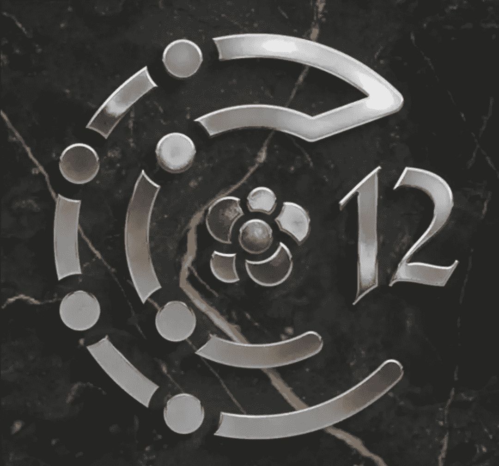
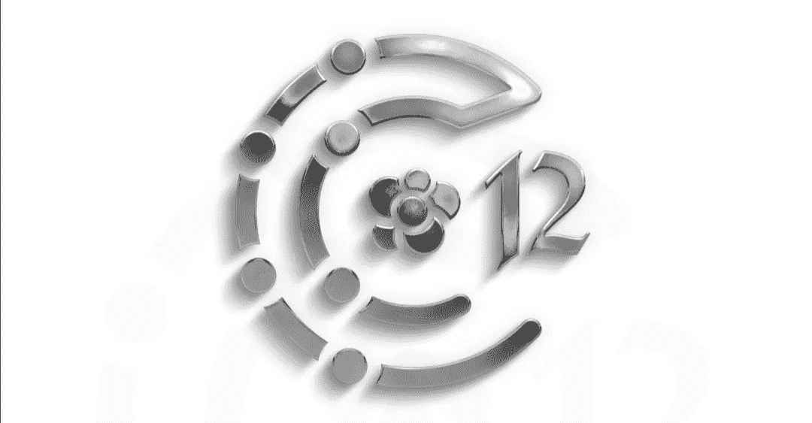
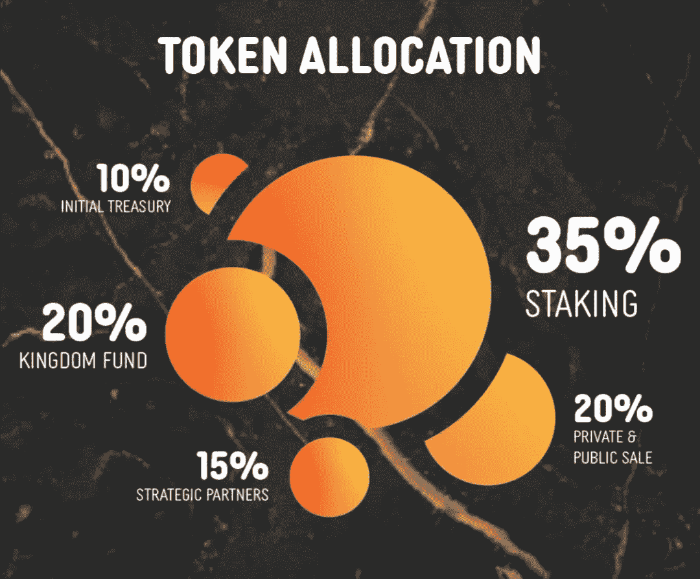
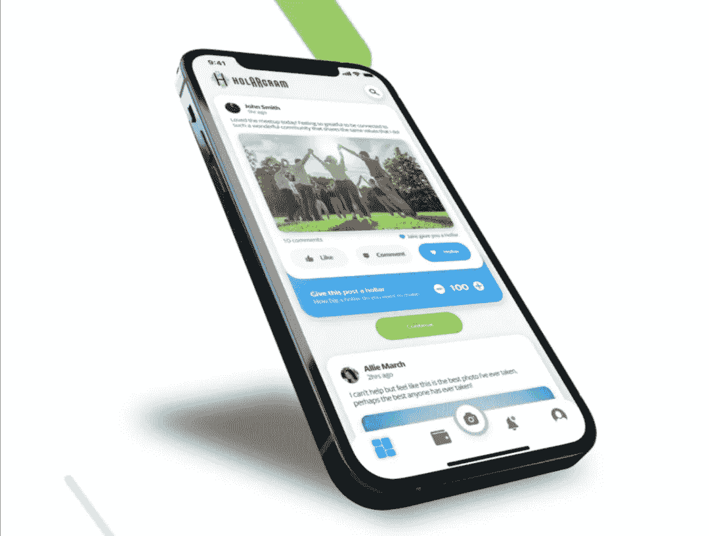
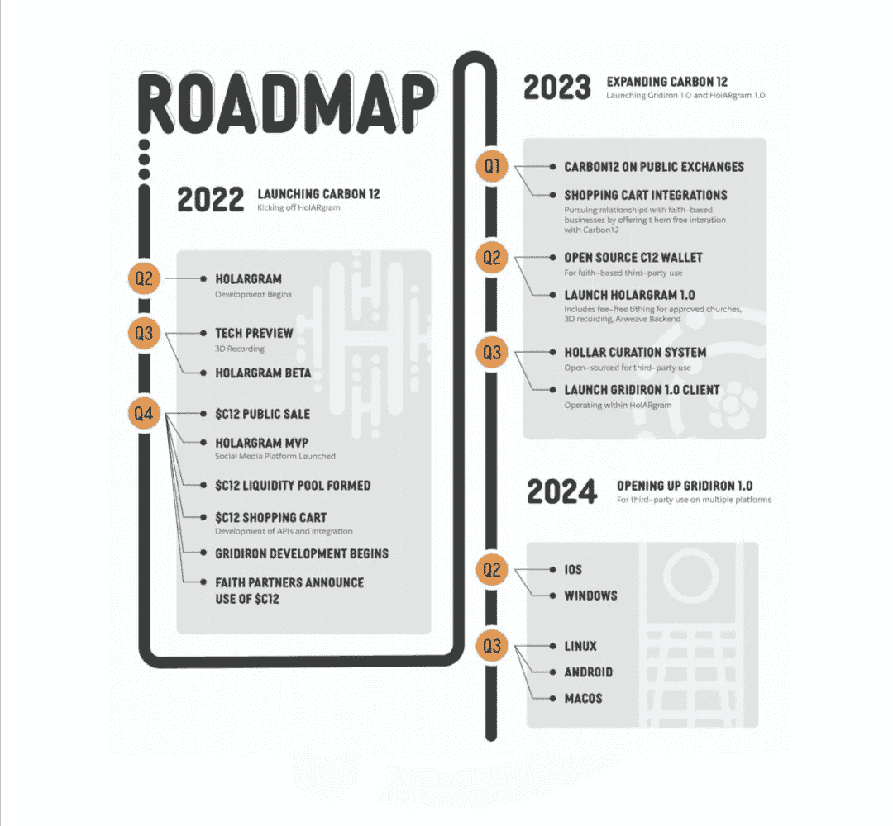
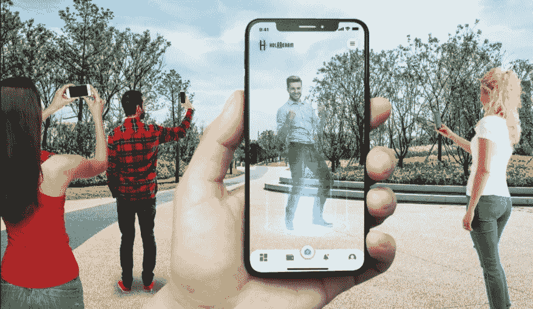
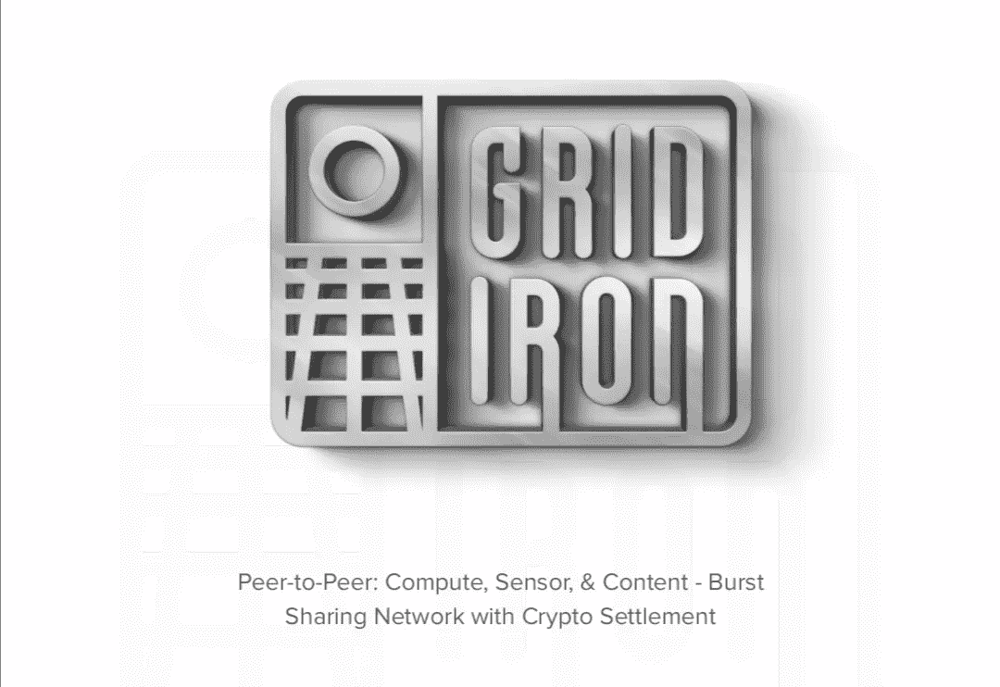
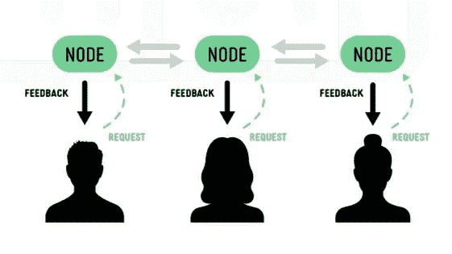
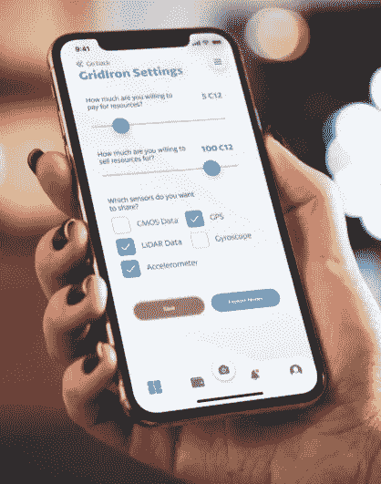
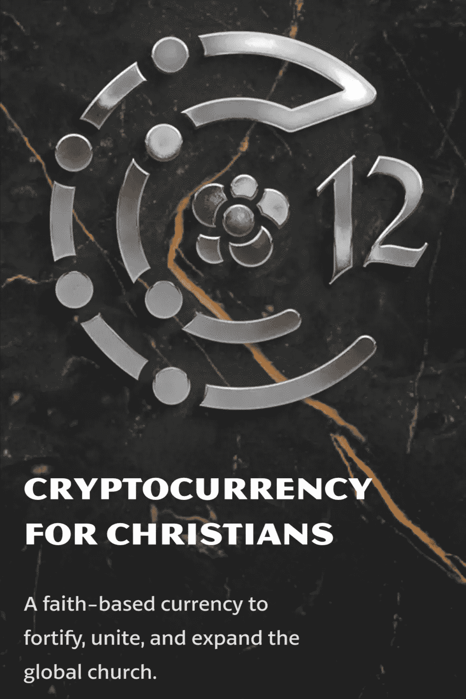

# 碳 12——融合信念、技术和创新

> 原文：<https://medium.com/coinmonks/carbon12-combining-faith-technology-innovation-9ba24c7aa14a?source=collection_archive---------23----------------------->

CARBON12

[**简介**](#394f)

[T5 什么是 CARBON12？](#0317)

[**关于碳 12**](#d2f9)

[**$C12 词汇学**](#d579)

[**整体的一部分——HolARgram**](#4baa)

[**为什么是 HolARgram？**](#ed91)

[**烤架**](#49c3)

**简介**

赤道几内亚位于中非西海岸，约有 200 万人口。根据世界银行的数据，这个国家的贫困率为 76.80%，这意味着超过四分之三的公民缺乏满足其必需品的资源。赤道几内亚近 90%的人口都是基督徒，如果说基督徒占了赤道几内亚贫困人口的绝大部分，这一点也不为过。

类似地，美国的基督徒占总人口的 65%以上，年收入 5.2 万亿美元，相当于全球所有基督教团体收入总和的一半。

一个基督教远见卓识的团队认识到这些基督教社区内财富分配的明显不一致，并提出了解决办法。这些基督教幻想家被称为[论坛](https://forum12.com/)。

解决方案是建立一个财富再分配的渠道，因为这个问题是不同基督教社区之间财富分配的不均衡，这可能会阻碍这些基督教社区朝着理想的方向发展(社区外展、慈善行为和传教扩展)。

现在是 2022 年，虽然我们可以吹嘘在国际和本地层面上拥有许多银行和支付处理器，但这些传统的支付方式仍然无法促进许多跨境支付。尽管他们尽了最大的努力，但他们还是没能像预期的那样为每个人提供服务。这些支付平台定期更新它们无法服务的国家名单，并通过制定不公平的政策和程序来限制进入特定地区。

在传统金融体系下，没有银行账户的人只能在黑暗中游荡。

幸运的是，现代可以获得区块链技术，中本聪 2009 年的创新已经成为合法的替代方案，可以避免第三方的限制和集权。

本次论坛达成的财富再分配的答案恰好是加密货币。

由于加密货币的显著波动性，需要一种更合适的方法来利用这种独特的技术，以符合 Forum12 的目标。这只是一个时间问题，直到他们决定推出 [CARBON12](https://carbon12.co/) ，一种服务于基督教社区的加密货币倡议。

虽然 CARBON12 可能是基于财富分配和财政援助的提供而成立的，但这仅仅是迈向多元愿景论坛 12 希望为基督教社区服务的第一步。

**什么是碳 12？**

信仰一直是全世界关注的话题。尽管信仰往往更关注人类生存的道德方面，但它偶尔也会出现在围绕金融和经济的讨论中。

在撰写本文时，基督徒拥有世界财富的 55%,使他们成为最大的财富拥有者。

Carbon12 是一个项目，其灵感来自最大限度地发挥基督徒潜力的愿望，同时利用他们的金融力量，挖掘他们在全球拥有的财富。

其目标是使用 Carbon12 加密货币令牌(表示为$C12)实现资金转移和其他相关交易，如基督教社区 23.8 亿成员的什一税支付和礼物。

**关于碳 12**

作为一种区块链产品，加密货币的范围不断扩大。我们已经看到他们超越了简单的“购买和 HODL 直到兰博”类型的项目，以吸引分散融资(DeFi)的常规使用，就像菲亚特一样。

基于信仰的加密货币项目 CARBON12 的目标是将世界各地的基督徒聚集在一起。

它致力于使基督徒能够在不依赖中央权威或第三方的情况下从事和完成金融活动。这将确保他们仍然可以自由地进行金融交易，即使基督教徒无法获得标准的金融服务。该项目的目标之一是帮助没有银行账户的地区的基督徒努力获得海外资助。它的目的是让获取金钱变得极其简单，这将帮助他们改善福利，并在必要时履行其他基督教承诺。

可以有把握地认为，碳 12 试图完全消除当前中央集权世界中基督徒金钱交易中存在的各种限制。它对此的回应是完全接受分权。

区块链是最接近、最实用的数字技术，可以带来 Forum12 此时所设想的统一。尽管是一项新技术，它已经引起了公众的极大兴趣和参与。

尽管区块链的技术工作可能相对复杂，但其最终产品——在本例中，是分散金融中使用的加密货币——很容易使用。它允许任何地方的任何人都能从这项技术中受益。开始发送和接收支付所需要的只是一个 Metamask 钱包:没有中央权威，没有第三方，绝对没有限制。

Carbon12 还旨在保护基督徒，使其不必采用单一世界货币，而不是专注于为整个世界开发单一货币，这是反基督者的普遍要求。相反，碳 12 将可以让基督徒在面对限制和约束时使用。

Carbon12 项目旨在将$C12 作为支付选项与基于信仰的企业和相关的基督教电子商务网站相结合。由于其区块链兼容性，$C12 将能够通过简单的钱包连接，在基于区块链的分散式电子商务应用上完成支付，前提是该应用支持令牌。

该项目旨在托管 Carbon12 treasury，以监管与常规加密货币相关的风险，这将在提款时用其 C12 捐款的原始总额补偿经批准的教堂。这样，$C12 的价格就可以稳定下来，这样教会就不用担心波动了。被授权的教会也将获得全额的汽油费资助，而不必担心支付任何额外的费用，因为这些费用会降低整体的捐赠金额。

Carbon12 将为属于少数群体的基督徒提供他们通常无法获得的资源，并使他们能够成为社区的一部分，在那里他们的声音被听到，他们的目标得到支持。通过这种方式，财富分配的不一致性得到了平衡，没有人被落下。

**$C12 记号经济学**

价值 10 美元的 C12 代币将总共供应 7.77 亿枚代币.预计该股票在首次交易时将以 0.04 美元的价格上市。

Tokenomics

分发:

10%进入初始国库

15%留给战略合作伙伴

20%将分配给王国基金

20%分配给私人和公共销售

35%将留作赌注

**整体的一部分——HolARgram**

$C12 代币仅仅代表了论坛 12 对碳 12 项目的一部分设想。该团队致力于建立一个分散的基督教社区，并促进基督教社区内的分散交易。

基督徒将能够通过聚集在一个分散的基督教社区来分享他们的精神经历、文化价值观和社区支持，以在更传统的社区中不可能做到的方式进行联系。

HolARgram 是碳 12 项目的关键部分。

虽然 HolARgram 不是第一个去中心化的社交平台，但它是第一个广泛使用[增强现实(AR)](https://en.m.wikipedia.org/wiki/Augmented_reality#:~:text=Augmented%20reality%20(AR)%20is%20an,%2C%20haptic%2C%20somatosensory%20and%20olfactory.) 技术的平台，也是第一个完全代表基督教社区的平台。

HolARgram

[HolARgram](https://holargram.com/holargram-whitepaper.pdf) 将成为基督徒自由言论的平台，不受任何审查，也不受试图压制宗教内容的中央集权的反对。

不管基督徒身在何处，基督教的很大一部分都专注于统一和一体。出于这个原因，该项目的开发者选择利用数字技术来建立一个地球村，让每个人和所有东西都相互联系。这个想法希望消除传统体制下教会之间的脱节。

为了给用户更全面的体验，并让他们进入元宇宙，AR 被作为 HolARgram 开发的一部分引入。它旨在强调，元宇宙不一定是作为完整的虚拟现实建造的，而是通过现实世界中的数字叠加来形成，这就是为什么增强现实(AR)被集成到这个过程中。

遵循 web3 创造者的经济原则，在 HolARgram 上发布原创内容的用户将获得$C12 代币的奖励。鉴于$C12 在发布时将有预先确定的用例，这预计将是其独特的用例之一。其他社区成员对用户内容的喜欢相当于对该用户内容的投资。该内容的所有者可以将其作为其他社区成员可以获得的 [NFT](https://www.investopedia.com/non-fungible-tokens-nft-5115211) 进行宣传，前提是该内容获得了广泛的流行度，这意味着社区认可该内容。这将类似于[杰克·多西的第一条推文，他以 290 万美元](https://www.google.com/amp/s/www.cnbc.com/amp/2021/03/22/jack-dorsey-sells-his-first-tweet-ever-as-an-nft-for-over-2point9-million.html)的价格卖了 NFT。

HolARgram 上将提供一个用于 C12 币的集成钱包。这将有助于 HolARgram 减轻应用程序用户的负担，并快速促进基于信仰的捐赠、什一税支付和其他相关捐赠。[超过 50%的 24 至 54 岁的基督徒已经倾向于使用电子工具进行与教堂相关的交易，包括筹款、会议和圣经研究](https://www.vancopayments.com/egiving/church-giving-statistics-tithing)。

研究还显示，通过使用电子捐赠替代方案，教会可以将整体捐赠量提高 26%。考虑到这些信息，HolARgram 应用程序可能会增加教堂捐赠。

让年轻人参与宗教活动的各种策略之一是将尖端技术与基于信仰的平台相结合。通过这样做，教会可以跟上由快节奏的技术环境定义的 Z 世代。数据显示[捐赠者参加教会会议的可能性比传统捐赠者高 12%](https://www.vancopayments.com/egiving/church-giving-statistics-tithing),这表明整合了在线捐赠的信仰平台可能会增加参与度。

RoadMap

**为什么是 HolARgram？**

***科技/区块链:***

根据 Vanco 的一位常去教堂做礼拜的人提供的研究，65%的基督徒愿意参加“科技为善”的活动。统计数据显示，多达 65%的基督徒渴望参与基于宗教的技术活动，因此有理由认为基督徒普遍开始拥抱技术，并愿意尝试新技术来促进他们的信仰。能够吸引基督徒进入像$C12 这样的项目和像 HolARgram 这样的平台的技术将增加成功的可能性，因为预计参与平台和令牌。区块链技术已经是一个蓬勃发展的行业，参与度越来越高。

***现代化&信仰:***

由于技术进步的增长和提高，当今世界的一切都在快速发展。成为发展的一部分是公平的。HolARgram 的设计和功能表明，其开发者了解前沿技术，并愿意在新经济中发挥积极作用。该平台将基督徒与他们信仰的核心原则联系起来，同时适应当前世界的需求。

**AR:**

HolARgram 大量使用的独特技术进步之一是增强现实。让人们进入元宇宙是 HolARgram 的一个重要组成部分。它通过提供一种先进的 AR 技术来实现这一点，这种技术可以呈现元宇宙可能会是什么样子的广阔愿景。有了 HolARgram，用户可以交流，听取彼此的证词，参加教会聚会，观看现场活动，就好像他们身临其境一样。这是传统 AR 技术的一个进步，通常用于游戏领域，也是对元宇宙体验只能在虚拟环境中实现的观点的反驳。

Augmented Reality

*HolARgram 是一个主要利用 web3 进步的概念，将拥有以其社区为中心的 NFTs 和 NFT 市场。希望能够将内容转换成 NFT 并将其出售给愿意出价购买的用户。因此，上传到 HolARgram 的每一条内容都是潜在的 NFT。一个内容在平台上获得的点赞数量决定了它在转化为 NFT 时的价值。因此，创建和销售 NFT 非常简单。*

****自动什一税:****

*HolARgram 积极推广自动什一税，因此什一税缴纳者不必总是手动设置。他们还可以避免为每笔什一税支付而产生的费用，这是任何传统支付系统都无法积极保证的。*

****数据所有权:****

*这无疑是创造 HolARgram 的主要驱动力之一。预计它将代表当前社交平台的进步。常规平台在未经用户同意的情况下获取用户数据，像对待产品一样对待用户，在线黑掉他们的数据。用户可以确信他们可以使用 HolARgram 完全控制他们的数据，并且可以主动选择对数据进行什么处理以及如何利用数据。*

****透明/开放网络:****

*通过利用区块链技术，碳 12 生态系统通常保持透明，因为区块链使访问相关数据变得简单。HolARgram 受益于作为应用程序后端的 [Arweave 协议](https://www.arweave.org/)。这种透明度是对更为隐秘的传统系统的升级。*

****社区:****

*碳 12 网络的所有项目都围绕着社区。虽然这个社区可能更侧重于基督教社区，但它的成败完全取决于选择参与其生态系统的个人。这将有助于保持项目的高度分散。*

***烤架***

*[GridIron](https://gridiron.app/) 是一个 Carbon12 生态系统开发项目，试图解决小型设备处理和计算能力受限的问题。*

*考虑到 HolARgram 旨在纳入 AR 等高级技术，这通常与复杂设备中的应用有关，因此需要考虑计算能力并确保应用程序可以在消费设备上运行。*

**

*GridIron*

*增强现实最广为人知的用途是吸引人们利用[可穿戴设备](https://www.investopedia.com/terms/w/wearable-technology.asp)来访问其技术。为了积极体验由 AR 实现的技术，GridIron 推出了一种不太复杂但非常优秀的 AR 技术，它不需要像可穿戴设备那样需要单个设备的计算能力。这个想法是在日常活动中使用增强现实，而不需要佩戴专门的设备或连接到特殊的计算机。GridIron 预计将仅使用智能手机的最小计算能力来投影完整的 AR 技术。*

*设备可以使用[对等系统](https://en.m.wikipedia.org/wiki/Peer-to-peer)访问其他设备的计算能力。该系统能够取代[用户到云](https://www.cloudoye.com/kb/generic/how-are-cloud-users-connected-to-their-cloud-resources)的交互，集中的网络/服务器预计将在 HolARgram 上使用 AR 技术，相应地使用更大设备的 CPU 中的功率进行操作。这样，不管设备的计算能力如何，HolARgram 的 AR 都不会出现任何问题。*

**

*peer-to-peer*

*由于 GridIron 使用的 Arweave 协议，无论有没有互联网连接，数据都可以很容易地存储和检索。它基于区块链并使用开源网络，允许完全透明和轻松访问链信息。*

*任何想让自己的设备在 GridIron 上共享计算能力的人都可以轻松做到。关于人们愿意用他们的设备提供多少计算能力以及他们愿意分享多少计算能力的信息将被包含在广告票中。计算能力将以美元 C12 支付，这是该货币的另一种应用。*

**

*区块链将自动结算在 GridIron 上使用和给予计算能力的各方之间的付款。*

*[GridIron](https://gridiron.app/gridiron-whitepaper.pdf) 将作为一个平台，将那些想要提供一些计算能力的人和那些需要获得更多计算能力的人联系起来。*

*即使是不使用 HolARgram 或者不积极拥有或交易$C12 令牌的人也可以使用这项服务来提供他们的计算能力，并获得一些$C12 作为回报。*

***结论***

*CARBON12 生态系统提供了参与加密货币社区的机会，该社区致力于改善基督徒的金融运营。它还提供易于与$C12 令牌互操作的服务，使得提供完整的用例及用户体验来支持生态系统成为可能。*

*碳 12 生态系统由$C12 代币、HolARgram 和 GridIron 支持，确保生态系统能够充分发挥潜力。*

*CARBON12 项目的创造者 Forum12 是美国增强现实和计算机视觉公司 [Gravity Jack](https://gravityjack.com/) 的投资者和参与者。*

**

*Bounty0x 用户名:@dammykhudz*

*为获得赏金而写的赞助文章*

*[Carbon12 网站](https://carbon12.co/)|[HolARgram](https://holargram.com/)|[GridIron](https://gridiron.app/)|[carbon 12 白皮书](https://carbon12.co/carbon12-whitepaper.pdf)|[Twitter](https://twitter.com/carbon12token)|[YouTube](https://www.youtube.com/channel/UC__KHJ1arEM4ul2zyxuFMww)|[Telegram](https://t.me/+jR4rZZ7YSTw2Zjcx)|[Discord](https://discord.gg/e5AM83eR)|[insta gram](https://www.instagram.com/carbon12token/)|[脸书](https://www.facebook.com/Carbon12token) | [Forum12](https://forum12.com/)*

> *交易新手？尝试[加密交易机器人](/coinmonks/crypto-trading-bot-c2ffce8acb2a)或[复制交易](/coinmonks/top-10-crypto-copy-trading-platforms-for-beginners-d0c37c7d698c)*