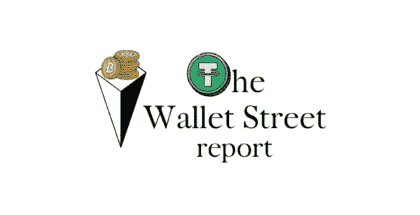
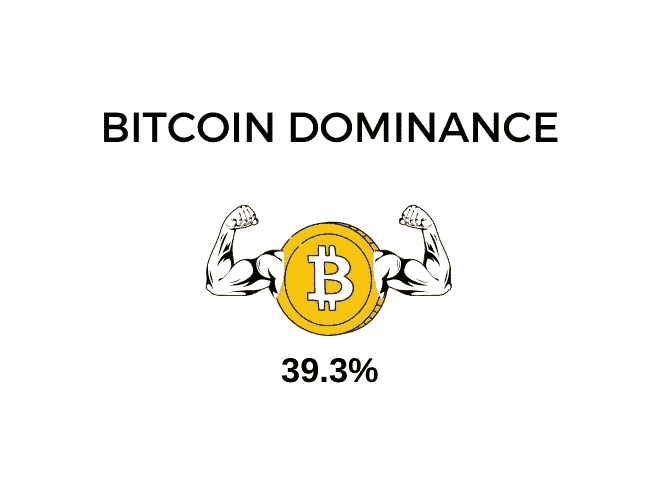
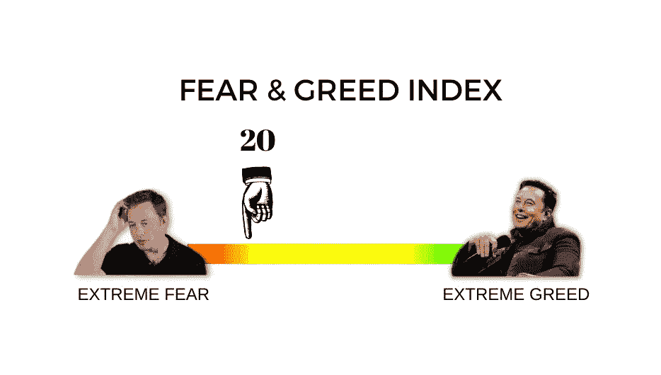
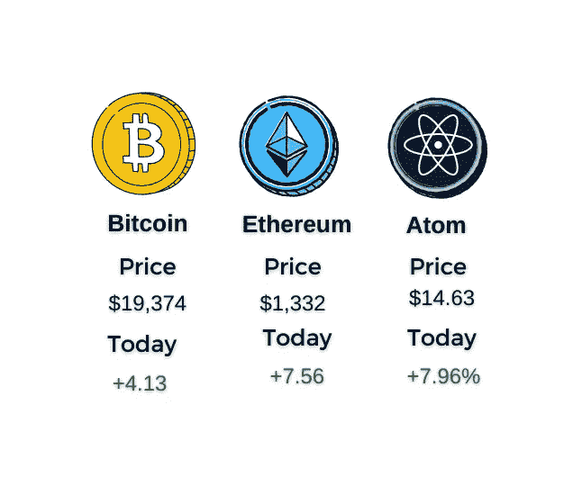
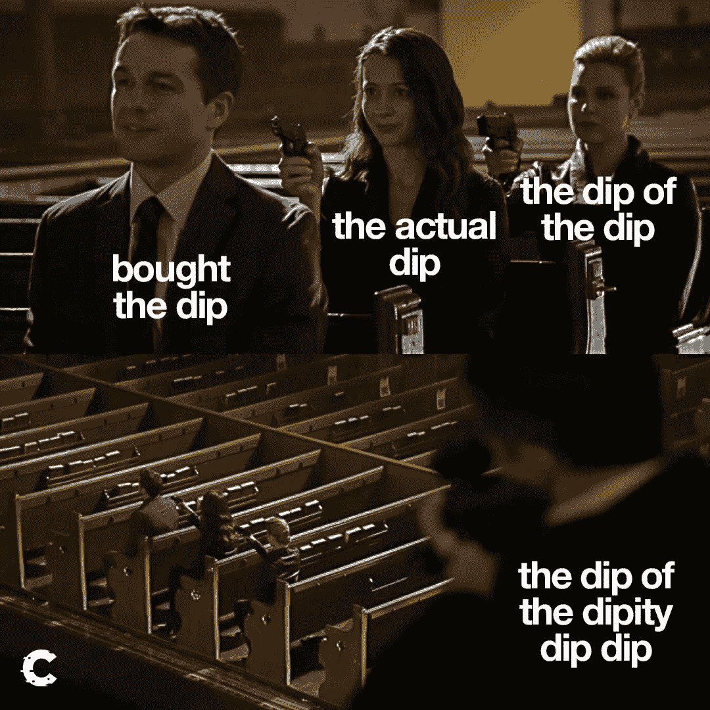
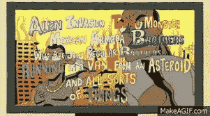
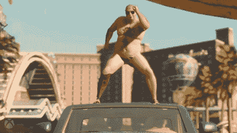

# 卡尔登战争和合并后的下降|钱包街报告#2

> 原文：<https://medium.com/coinmonks/cardanian-wars-and-post-merge-drops-the-wallet-street-report-2-ae8d2e990a6b?source=collection_archive---------8----------------------->

嘿大家好。

欢迎来到 Wallet Street Report，在你说服你的家人以$4k 全押以太坊后，当他们不和你说话时，唯一支持你的朋友。是的，我们知道这是一笔不错的投资。

上次我们谈话的时候，以太坊仍然在 PoW 上运行，我们仍然认为西班牙不会赢得欧洲篮球赛(又是 ffs)。但现在不是了。备受期待的合并获得了成功，以太坊正式成为了区块链股份的证明。更少的能源消耗(实际上更少，准确地说是-99%)，更少的象征性通货膨胀(有时甚至是通货紧缩！)，以及维塔利克总体规划的适当基础。那么，在这场可以说是看涨的事件之后，市场的反应如何呢？他们抛弃了。很难。

然后他们在周末再次抛售，因为人们预计周三的 FOMC 会议会出现最糟糕的结果。预期的 75 个基点的加息仍然是最受欢迎的，但在最近的通胀数据之后，100 个基点的加息似乎并不那么遥不可及。那么，在美联储宣布预期的 0.75%的增幅后，市场反应如何呢？实际上很难说。这个视频完美地总结了这一点。

价格飙升，然后他们弃核，当很明显，空头和多头都得到 rekt，猜猜发生了什么。市场再次下跌。

至少可以说这是艰难的一周。在撰写本文时，ETH 正在小幅回升，但在过去 10 天里仍下跌了近 23%，在某些时候跌幅甚至低至-28%。总体而言，市场状况不佳，似乎情况在好转之前会变得更糟。杰罗姆·鲍威尔说，宏观经济不好，软着陆看起来越来越不像是现实的情况，人们开始意识到，我们可能不会很快看到牛市。这种预期的停滞正在被消化，这就是为什么我们看到这么多红色蜡烛。

然而，如果你相信加密的未来，那就没什么好担心的。熊市是打折积累更多你喜欢的项目的最佳时机，当然，也是开始建设的最佳时机。充分利用这段时间，创造有价值的酷东西，丰富你的加密知识，磨练你的 web3 技能。你对下一次牛市准备得越充分，你就越能从中受益。

*但是牛市可能永远不会到来。我们在疫情看到的夸张价格是罕见的经济环境和过量印钞的结果！我们不会再看到如此极端的价格了！*

虽然印钞无疑是我们看到的增长的一个重要因素，但加密仍处于非常非常早期的阶段。增长空间如此之大，积极的价格行动空间如此之大，我 99.9%相信我们会涨得更高。我们知道时局艰难，所以在钱包街，我们列出了 19 个为什么好日子就在我们面前的理由。

所以，事不宜迟，我们向你呈现的是，**钱包街是我们仍然很早的原因，所以现在不要沮丧，因为我们可能会在未来的列表中走得更远**:(我们需要在这个名称上努力)

Props to you if you caught that reference

*   加密还没有被大量采用
*   机构投资仍有很大的空间
*   现有加密领域(DeFi、游戏、元宇宙等)仍有很大的创新空间，也有机会创造全新的领域
*   大多数人仍然对密码一无所知
*   主流媒体和社会情绪仍然不太积极
*   关于这个空间的错误叙述仍然存在
*   这个空间仍然不受管制
*   基础设施将会变得更好，并允许更快和更有效的解决方案
*   我们还没有看到一款基于区块链的产品变得如此受欢迎，拥有数亿用户
*   区块链技术和 web3 还没有在很大程度上扰乱日常生活
*   与人工智能和物联网等其他颠覆性技术的协同空间很大
*   我们还没有看到大规模的业务采用(尽管许多大公司已经表现出兴趣
*   可以说，已经提出了针对现有问题的更好的区块链解决方案，如凭证验证、消除产品伪造、向第三世界国家提供银行服务等，但是还没有被广泛实施
*   熟练劳动力供应仍然很低(开发人员和专家)
*   越来越多在科技行业事业成功的人正在转向 web 3.0
*   随着开发工具和 API 的增加，为 web3 开发将变得更加容易和便宜
*   UI 仍有很大的改进空间，并成为大规模采用的主要驱动力
*   对于非功能性测试，有很多用例需要探索
*   网络还不具备互操作性，令牌控制的商务几乎不存在

**所以总而言之:**

*   预计资源(基础设施、工具、资金、人力资本)的流入将带来更好的技术和产品
*   随着行业的成熟、高级解决方案的开发以及与区块链技术的交互变得更加容易，预计需求将会增加(大众采用、商业采用)
*   我们的金融、社会和政治结构预计将被颠覆，因为区块链技术可以重新分配权力，让我们走向一个更加分散的世界

所以下次你的一个朋友试图告诉你 crypto 已经死了，用这个列表告诉他 crypto 还没有诞生(确保你用它的名字 tho 来介绍这个列表)

# 其他新闻

## 黑客，白帽子，和利用

*   算法做市商 Wintermute [在其 DeFi 操作中被黑](https://twitter.com/evgenygaevoy/status/1572134271011225601?s=21&t=SEzpZOXPSsmwnCAdSpYFrg&utm_campaign=Good%20Morning%20Crypto&utm_medium=email&utm_source=Revue%20newsletter)1.6 亿美元。他们声称不存在破产问题，他们的 CeFi 和 OTC 业务保持完整。
*   一名白帽黑客发现了一个 Arbitrum 漏洞，该漏洞可能导致高达 4.7 亿美元的黑客攻击。他没有拿钱，而是告诉 Arbitrum 团队这个问题，Arbitrum 团队反过来奖励了他 400 ETH。如果你问我的话，我本可以更慷慨一点(这个家伙实际上拯救了这个项目)，但是，嘿，事情就是这样。
*   DeFi Derivatives protocol GMX 周日遭到攻击，当时一条鲸鱼利用其固定价格永久机制，在 CEXes 上操纵 AVAX 的价格，获利约 43 万美元。不过，攻击者[是否净赚](https://twitter.com/alphanonceStaff/status/1572845546217574405)还不清楚。

# 熊在行动

不，我们不是在谈论交易员在市场上抛售股票。NFT 收藏 OKBears [与世界知名的授权机构 IMG 合作](https://twitter.com/okaybears/status/1572250276182249474?s=20&t=_Kzhtn_AKzLH4mjzkHHIBw)，加入了许多大牌如 GAP、Buggati 和 Dorritos。这可能是一个巨大的转变，Marty 的这个帖子给出了一些关于这个交易对这个项目意味着什么的想法。

# 聚光灯下的卡尔达诺

过去一周，卡尔达诺·区块链在 Twitter 上获得了很多关注，主要是因为有影响力的人和 Sappy Seals 的创始人 wab.eth 发起了一场关于 Ada 的 NFT 生态系统的帖子活动。这些推文得到了 Cardano 社区的大量参与，并导致了来自 ETH、ADA 和 SOL 社区成员的 twitter 空间对话。这个空间包括 DeGods 创始人 [FrankDeGods](https://twitter.com/frankdegods) 以及 [web.eth](https://twitter.com/wabdoteth/status/1573042606711373825?s=46&t=CVQqsXPBi5w57zo6qQuxBw) 本人。提出了许多好的观点，并且我们确保创建了一个关于它的主题。

卡尔达诺还计划在今天接受 Vasil Hard Fork 更新，这是区块链历史上最重要的一次更新。这是 Ada 自己的 Merge 版本，它应该可以提高性能并帮助 dapp 开发。

## 钱包街的 take

在我看来，这是 Cardano 将自己树立为一个值得尊敬的项目的最后机会。如果未来几个月我看不到 dapps 和网络活动激增，我会认为这是一个死项目。我知道他们在努力工作，但那时候他们还远远落后。我想说的是关注生态系统，但在如此熊市的情况下，最好还是等等看。

# 3 分钟项目分析:ATOM

## 目标

成为区块链的互联网。

## 它是如何工作的

ATOM 通过成为“中枢”，即连接到所有其他链的链，促进了独立链之间的通信、伸缩和互操作。因此，每当宇宙生态系统中的区块链想要与生态系统中的另一个区块链通信时，它就使用宇宙中枢作为媒介。目前，每个单独的链负责自己的安全，其用户使用其本地令牌支付交易费用。这使得 ATOM 主要是一枚治理硬币，但这很快就会改变。

## 即将到来的升级

首先，ATOM 2.0 将在 Cosmoverse 活动上发布，并将升级 ATOM 的经济模式。但是大多数人感到兴奋的特性是链间安全。

## 链间安全性

链间安全性让新的或现有的区块链有机会使用现有的 ATOM 验证器，而不必担心找到自己的验证器。这太棒了，因为项目不仅要以本国货币支付费用，还要从近 50 亿美元的区块链中获得保障。

这太棒了，因为:

*   它提高了项目的安全性，因为它现在由一个 40 亿美元的区块链来保护，攻击起来要昂贵得多
*   项目将以本国货币支付费用，这些费用最终将落入 ATOM 股东的手中

## 最后的想法

非常体面的项目与雄心勃勃的愿景。他们是这次熊市中为数不多的表现出色的公司之一，并且还在继续壮大。互操作性令牌可能是下一件大事，所以您最好关注一下 ATOM

# 今日迷因

今天到此为止！周五快乐，很快再见！

**如果你喜欢这个简讯，在这里订阅******(免费)。****

***免责声明:这不是财务建议。本简讯仅供娱乐，并非买卖任何资产或做出任何财务决策的投资建议。自己做研究。***

> **交易新手？试试[加密交易机器人](/coinmonks/crypto-trading-bot-c2ffce8acb2a)或者[复制交易](/coinmonks/top-10-crypto-copy-trading-platforms-for-beginners-d0c37c7d698c)**