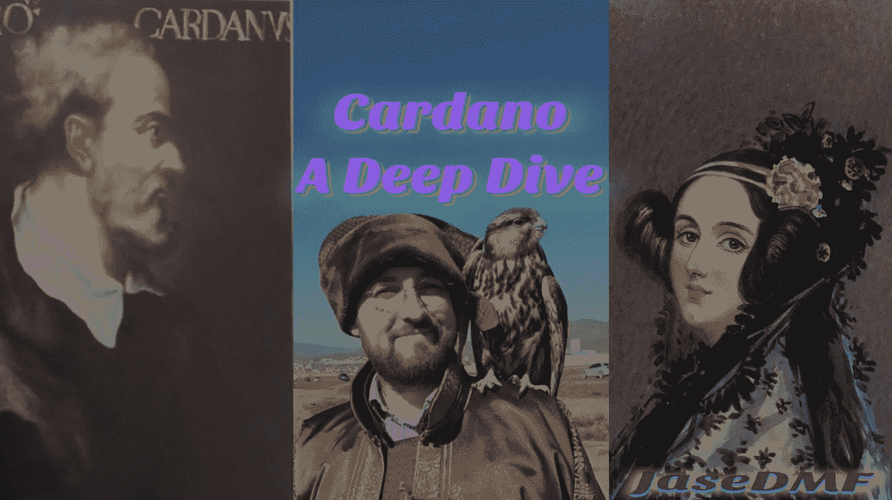

# 卡尔达诺:深潜

> 原文：<https://medium.com/coinmonks/cardano-a-deep-dive-c10fef89f16c?source=collection_archive---------10----------------------->

[Gerolamo Cardano](https://upload.wikimedia.org/wikipedia/commons/2/2f/Gerolamo_Cardano_%28colour%29.jpg), [*Charles Hoskinson*](https://upload.wikimedia.org/wikipedia/commons/d/db/Charles-Falcon2.jpg) *and* [*Ada Lovelace*](https://upload.wikimedia.org/wikipedia/commons/a/a4/Ada_Lovelace_portrait.jpg)*. Image sources: Wikipedia, public domain.*

亲爱的读者:

随着以太坊提高赌注并融入其新的身份，围绕 ETH 杀手的炒作似乎已经有所平息。这种向利益相关证明的成功过渡并没有完全排除竞争。王位的竞争者之一是 Cardano，这是一个流行的加密项目，与以太坊的历史有着内在的联系，但在许多方面也非常不同。