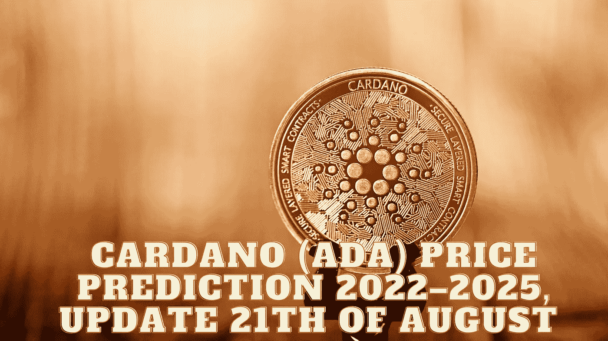

# 卡尔达诺(ADA)2022–2025 年价格预测，8 月 21 日更新

> 原文：<https://medium.com/coinmonks/cardano-ada-price-prediction-2022-2025-update-21th-of-august-a82fecfcdefb?source=collection_archive---------11----------------------->

Source photo Unsplash.com

## ADA 加密货币:是什么？

Cardano network 使用 ADA 作为其本地货币，是世界上第一个同行评审的分散区块链系统。它于 2017 年 9 月推出，由以太坊前联合创始人查尔斯·霍斯金森(Charles Hoskinson)开发。这种替代货币永远只会有 450 亿英镑…