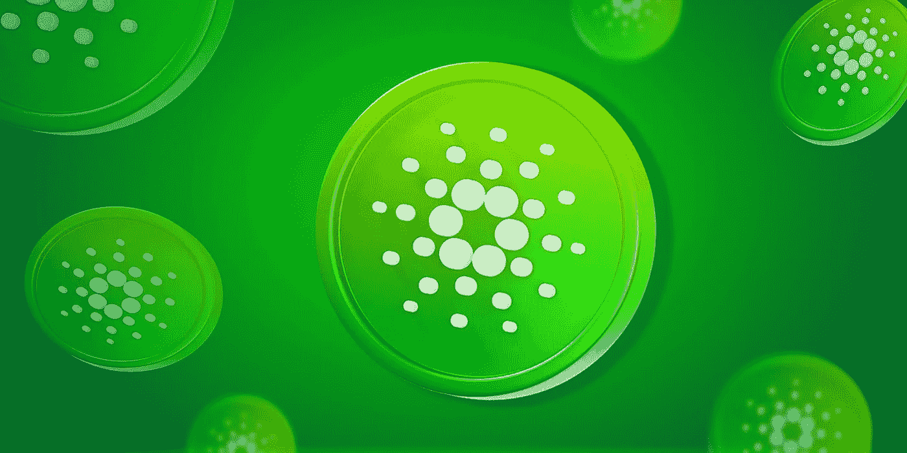

# 卡尔达诺(ADA)2022–2025 年价格预测，11 月 23 日更新

> 原文：<https://medium.com/coinmonks/cardano-ada-price-prediction-2022-2025-update-23th-of-november-22ea964da6ba?source=collection_archive---------5----------------------->

Source photo [Cardano Cripto Criptomonedă — Imagine gratuită pe Pixabay](https://pixabay.com/ro/illustrations/cardano-cripto-criptomoned%c4%83-7172952/)

## 什么是卡尔达诺(阿达)？

卡尔达诺是第一个接受同行审查的分散式区块链系统，它的原生硬币 ADA 是同类系统中的第一个。前以太坊联合创始人查尔斯·霍斯金森(Charles Hoskinson)开发了它，并于 2017 年 9 月发布。这种替代货币的发行量只有 450 亿英镑。