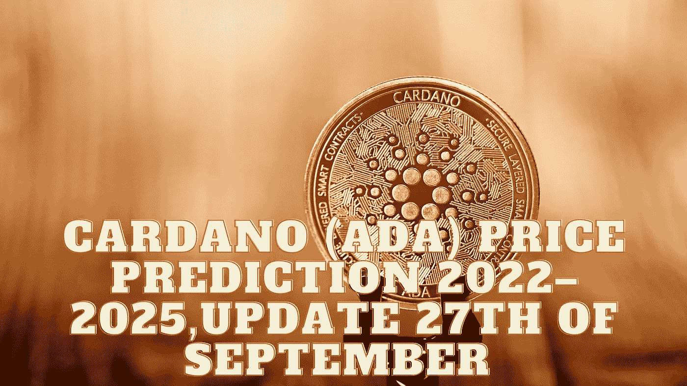

# 卡尔达诺(ADA)2022–2025 年价格预测，9 月 27 日更新

> 原文：<https://medium.com/coinmonks/cardano-ada-price-prediction-2022-2025-update-27th-of-september-fed88fda19c?source=collection_archive---------20----------------------->

Source photo Unsplash.com

# 什么是卡尔达诺(阿达)？

ADA 令牌是推动 Cardano 网络的燃料，Cardano 网络是世界上第一个通过同行评审的分散式区块链解决方案。它于 2017 年 9 月发布，由前以太坊联合创始人查尔斯·霍斯金森(Charles Hoskinson)开发。这种替代货币的最大发行量是 450 亿…