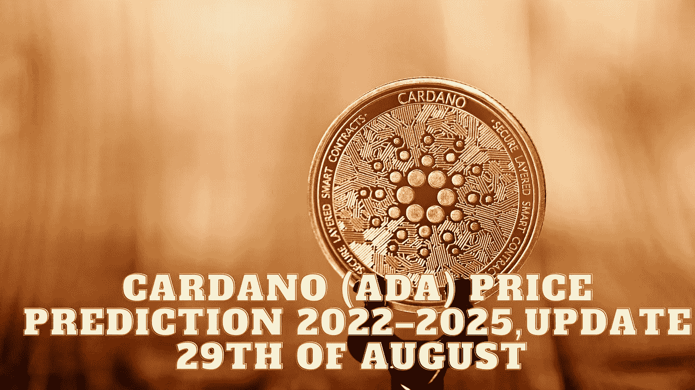

# 卡尔达诺(ADA)2022–2025 年价格预测，8 月 29 日更新

> 原文：<https://medium.com/coinmonks/cardano-ada-price-prediction-2022-2025-update-29th-of-august-1b59e7f2ac57?source=collection_archive---------14----------------------->

Source photo Unsplash.com

# 什么是卡尔达诺(阿达)？

ADA 是网络的原生币，是 Cardano 网络背后的协议驱动力，这是第一个通过同行评审的分散式区块链解决方案。前以太坊联合创始人查尔斯·霍斯金森是其创作和 2017 年 9 月首次亮相的幕后推手。这种替代货币永远只会有 450 亿英镑…