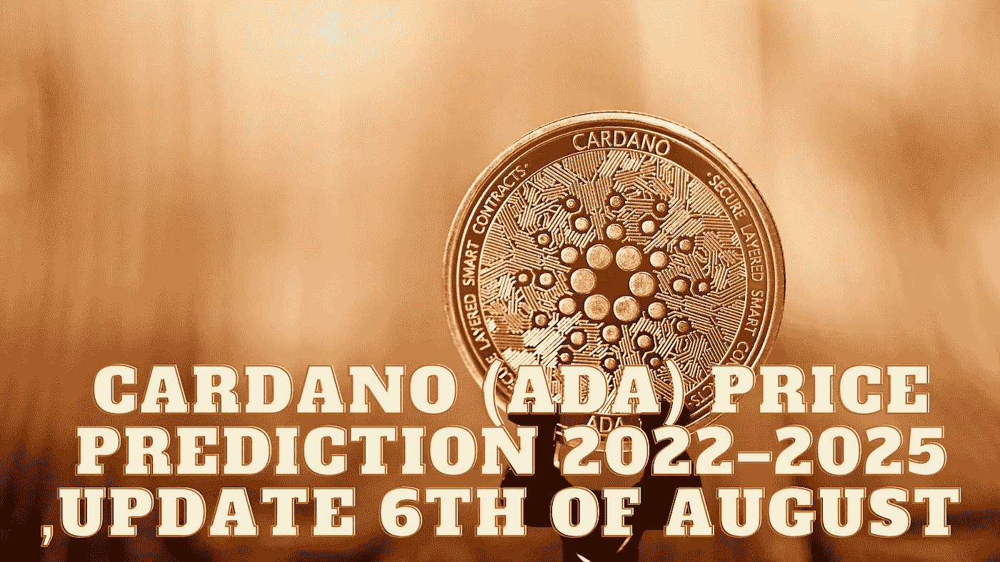

# 卡尔达诺(ADA)2022–2025 年价格预测，8 月 6 日更新

> 原文：<https://medium.com/coinmonks/cardano-ada-price-prediction-2022-2025-update-6th-of-august-36be79845588?source=collection_archive---------5----------------------->

Source photo Unsplash.com

## 卡达诺(ADA)是什么，是用来做什么的？

Cardano 是世界上第一个同行评审的分散区块链系统，它的原生硬币 ADA 驱动着协议。它由以太坊的前联合创始人查尔斯·霍斯金森创建，并于当年 9 月发布..只有 450 亿代币可以被创造出来…