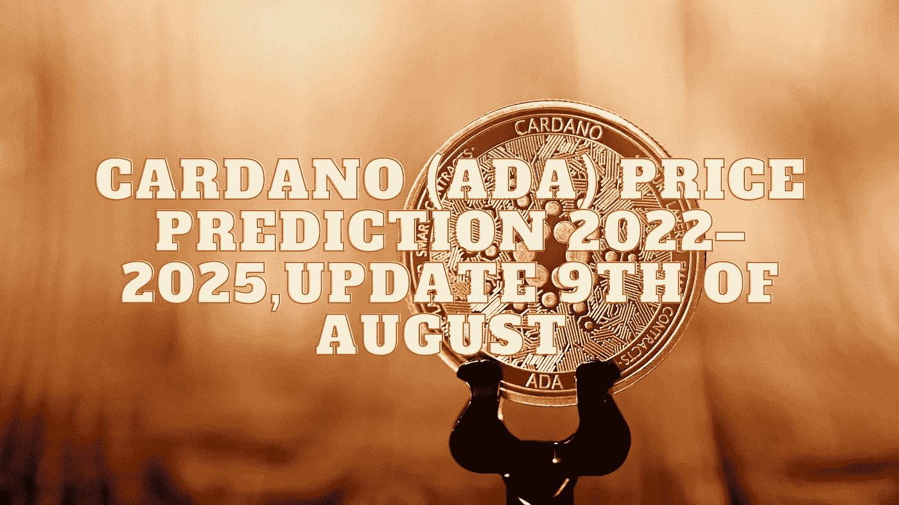

# 卡尔达诺(ADA)2022–2025 年价格预测，8 月 9 日更新

> 原文：<https://medium.com/coinmonks/cardano-ada-price-prediction-2022-2025-update-9th-of-august-dab25b4d8c1b?source=collection_archive---------17----------------------->

Source photo Unsplash.com

# 解释卡尔达诺(阿达):是什么？

除了是第一个经过同行评审的分散式区块链解决方案之外，Cardano network 还有自己的硬币，称为 ADA。它于 2017 年 9 月发布，由以太坊前联合创始人查尔斯·霍斯金森(Charles Hoskinson)开发。只有 450 亿个这样的…