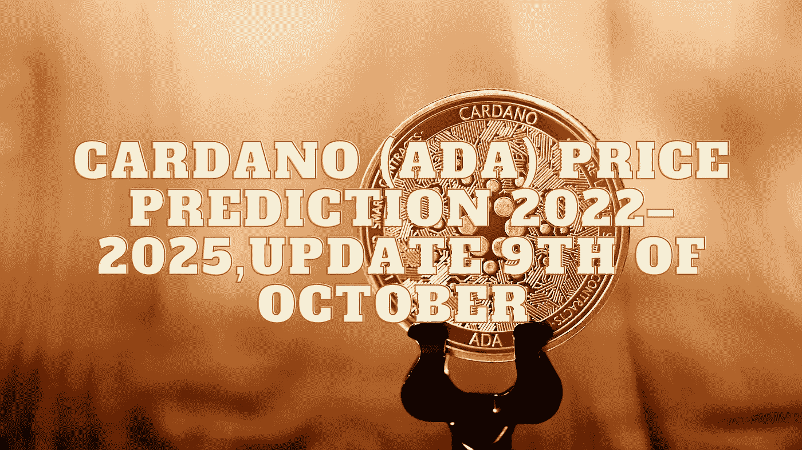

# 卡尔达诺(ADA)2022–2025 年价格预测，10 月 9 日更新

> 原文：<https://medium.com/coinmonks/cardano-ada-price-prediction-2022-2025-update-9th-of-october-5fd730e1099b?source=collection_archive---------8----------------------->

Source photo Unsplash.com

# 什么是卡尔达诺(阿达)？

除了是第一个同行评审的分散式区块链解决方案之外，Cardano network 还有自己的硬币，称为 ADA，用于在网络上进行交易。它于 2017 年 9 月发布，由以太坊团队早期成员查尔斯·霍斯金森(Charles Hoskinson)开发。这个的总数…