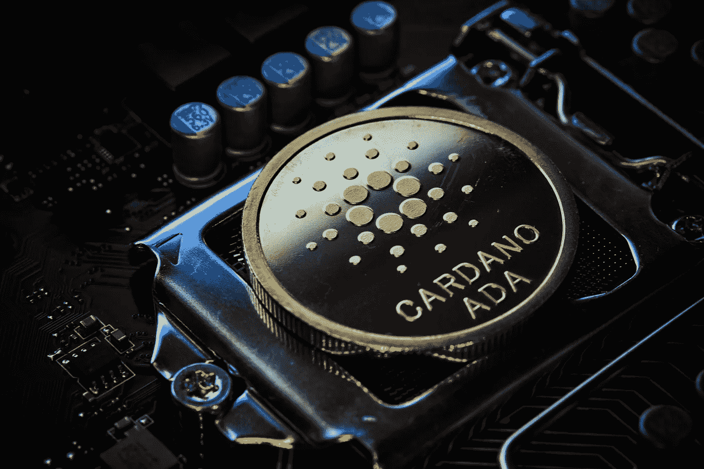

# 卡尔达诺(ADA)价格预测

> 原文：<https://medium.com/coinmonks/cardano-ada-price-prediction-995a116d12e9?source=collection_archive---------1----------------------->

Source photo Unsplash.com

## 卡尔达诺(阿达):什么事？

Cardano 是使用区块链技术的基于股权的分散加密货币项目的证明。它由以太坊联合创始人之一查尔斯·霍斯金森(Charles Hoskinson)创建，于 2017 年首次亮相。这个项目是以意大利科学家吉罗拉莫·卡尔达诺的名字命名的，而它的母语 ADA 是以英国数学家奥古斯塔·阿达·洛芙莱斯的名字命名的。