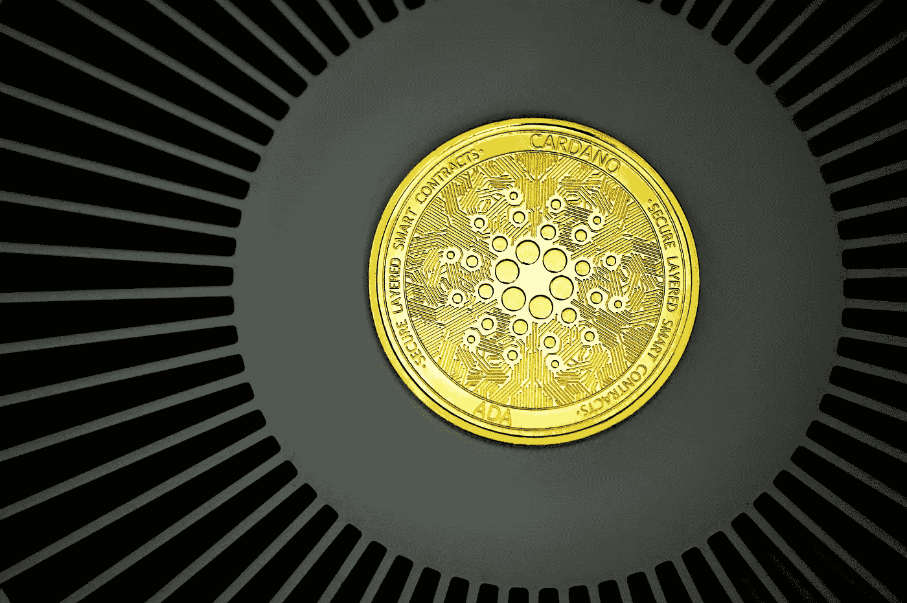

# 卡尔达诺(ADA)2022 年 12 月至 2025 年价格预测，12 月 10 日更新

> 原文：<https://medium.com/coinmonks/cardano-ada-price-prediction-december-2022-2025-update-10th-of-december-5dca3f81129d?source=collection_archive---------7----------------------->

Source photo Unsplash.com

# 这是什么？

由于卡达诺网络是第一个同行评审的分散区块链系统，它的原生硬币 ADA 也是历史上的第一个。以太坊团队的前成员查尔斯·霍斯金森(Charles Hoskinson)负责其创作。它于 2017 年 9 月首次亮相。这种替代硬币只能产生 45…