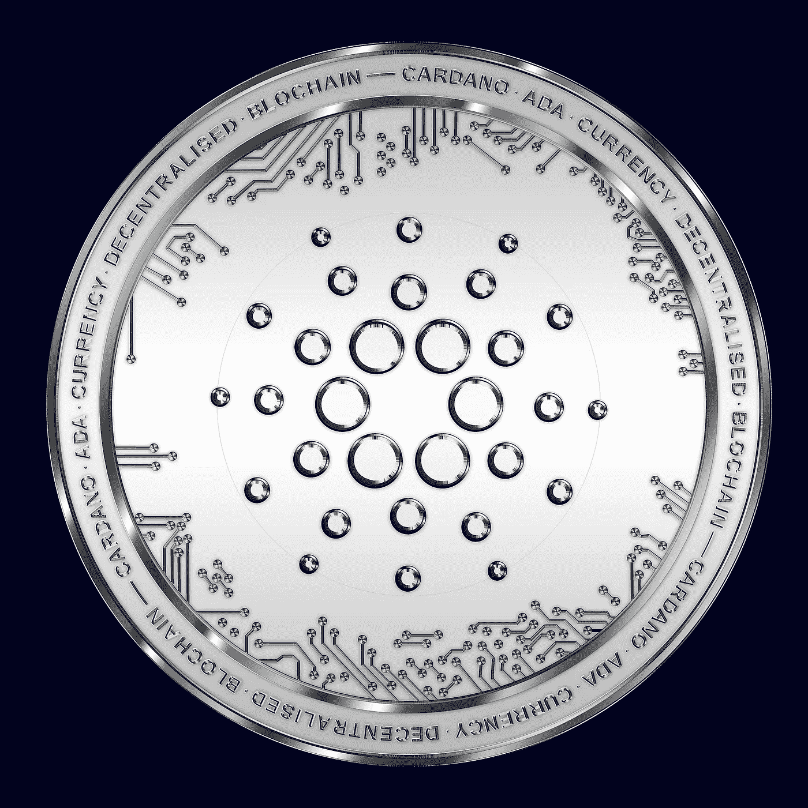

# 卡尔达诺(ADA)价格预测 2022 年 12 月–2025 年，12 月 7 日更新

> 原文：<https://medium.com/coinmonks/cardano-ada-price-prediction-december-2022-2025-update-7th-of-december-7af21149b9be?source=collection_archive---------14----------------------->

Source photo [Cardano Blockchain Criptomonedă — Fotografie gratuită pe Pixabay](https://pixabay.com/ro/photos/cardano-blockchain-criptomoned%c4%83-ada-6723393/)

## 这是什么？

ADA 是网络的本地加密货币，是推动 Cardano 网络背后协议的驱动力，这是第一个通过同行评审的分散式区块链解决方案。它于 2017 年 9 月发布，由以太坊团队早期成员查尔斯·霍斯金森(Charles Hoskinson)开发。最大数量的…