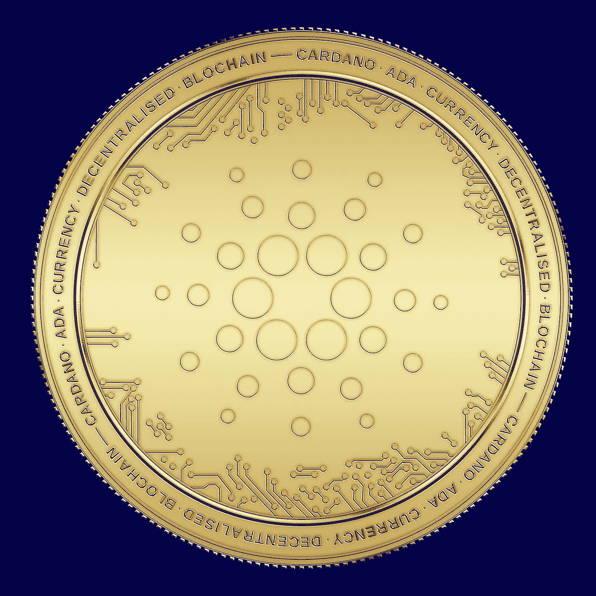

# 2022 年底至 2025 年卡尔达诺(ADA)价格预测

> 原文：<https://medium.com/coinmonks/cardano-ada-price-prediction-end-2022-2025-f1efe843fca0?source=collection_archive---------9----------------------->

Source photo [Coin Currency Money — Free image on Pixabay](https://pixabay.com/illustrations/coin-currency-money-cardano-ada-6723379/)

## 到底什么是卡尔达诺(ADA)？

ADA 令牌是推动 Cardano 网络的燃料，Cardano 网络是第一个通过同行评审的分散式区块链解决方案。它于 2017 年 9 月推出，由以太坊前联合创始人查尔斯·霍斯金森(Charles Hoskinson)开发。这种替代货币只能创造 450 亿英镑。