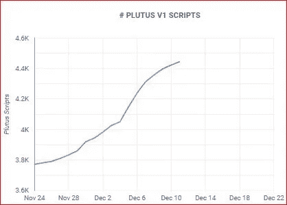

# 卡达诺(ADA)的网络智能合约 2022 年暴涨 359.83%。

> 原文：<https://medium.com/coinmonks/cardano-ada-s-network-smart-contract-surged-by-359-83-in-2022-fab2b2b392f6?source=collection_archive---------5----------------------->

自从在卡尔达诺(ADA)区块链增加智能合同业务以来，卡尔达诺网络经历了巨大的增长。

Image designed by the author

根据卡达诺区块链洞察的数据，截至 2022 年 12 月 11 日，普路托斯上约有 4445 份智能合同。

> 从顶级交易者那里复制交易机器人。免费试用。

这个区块链在 2022 年 1 月 1 日注册了 947 份智能合约。在 2022 年 1 月过去之前，由于阿隆佐 hard fork 的成功推出，卡尔达诺网络上的智能合同数量激增了 1000 多个。

Image from Cardano Blockchain Insight

这份智能合约自 1 月份首次注册以来，到本文撰写之时，增长了 359.83%(3，334)。在某一点上，在 Cardano 区块链上运行的智能合约数量出现了显著的峰值。正是在这个时候，Vasili 的 hard fork 推出了，Cardano 也推出了，以提升其在分散金融(Defi)网络上的可扩展性。

卡尔达诺网络上智能合约(SC)功能的指标记录了 SCs 活动的增加，从而帮助卡尔达诺(ADA)区块链有资格成为以太坊和 BNB 链等成熟的巨型加密货币区块链的竞争对手之一。这种 Cardano (ADA)网络智能合同的激增在旨在提高网络可扩展性和整体可用性的更多开发活动之后产生了更大的影响。

卡尔达诺(ADA)区块链公司声称，他们的网络团队已经更加专注于扩展普路托斯调试器 MVP、脚本容量、普路托斯调试器 MVP，并且还在普路托斯工具发布之前完成了完全巴贝奇支持的扩展。

## **什么是普路托斯？**

**普路托斯是卡尔达诺(ADA)区块链的智能合约平台。普路托斯允许卡尔达诺网络用户编写可以与卡尔达诺区块链互动的应用程序。**

## **卡尔达诺网络发展**

卡尔达诺的创始人查尔斯·霍斯金森曾经发表过一个关于卡尔达诺网络的声明。他说，Cardano 将像互联网一样无处不在，并且在未来将被数十亿人使用。这一声明即将实现。尽管卡尔达诺网络在 2021 年的开发者活动中明显领先于加密市场，其背后是波尔卡多特和草间弥生的互操作性网络，但 2022 年的智能合同活动为卡尔达诺区块链的发展增添了更多的香料。

2022 年 7 月下旬，Cardano 被披露为一个网络，当它定期更新 Github 活动时，它保持着区块链之王的地位。紧随其后的是以太坊(ETH)、波尔卡多(dot)、草间弥生(KSM)和心流(Flow)。这个 GitHub 事件跟踪事件的发展，而不仅仅是项目方法。这反过来可以避免任何特定的陷阱，比如项目分叉等等。

## **结论**

加密领域仍在从充满挑战的时代中复苏，许多数字资产包括 Cardano(ADA)都经历了熊市。尽管如此，在前一个月，2022 年 12 月 2 日来自 Finbold 的数据表明，Cardano(ADA)在其 GitHub 仓库中激增的开发活动方面胜过其他加密区块链。

## 关于作者

*Ojeniyi Rashidat Ayobami 是一名 web3 和区块链内容作家、图形设计师、视频营销人员和 web3 社区开发者。她是一名经验丰富的加密货币交易员，拥有五年的交易经验。你可以通过电报联系到她:t.me/ayobami001*

> 加入 Coinmonks [电报频道](https://t.me/coincodecap)和 [Youtube 频道](https://www.youtube.com/c/coinmonks/videos)了解加密交易和投资

# 另外，阅读

*   [Bookmap 评论](https://coincodecap.com/bookmap-review-2021-best-trading-software) | [美国 5 大最佳加密交易所](https://coincodecap.com/crypto-exchange-usa)
*   [加密交易机器人](/coinmonks/crypto-trading-bot-c2ffce8acb2a) | [造币评论](https://coincodecap.com/coingate-review)
*   最佳加密[硬件钱包](/coinmonks/hardware-wallets-dfa1211730c6) | [Bitbns 评论](/coinmonks/bitbns-review-38256a07e161)
*   [新加坡十大最佳加密交易所](https://coincodecap.com/crypto-exchange-in-singapore) | [购买 AXS](https://coincodecap.com/buy-axs-token)