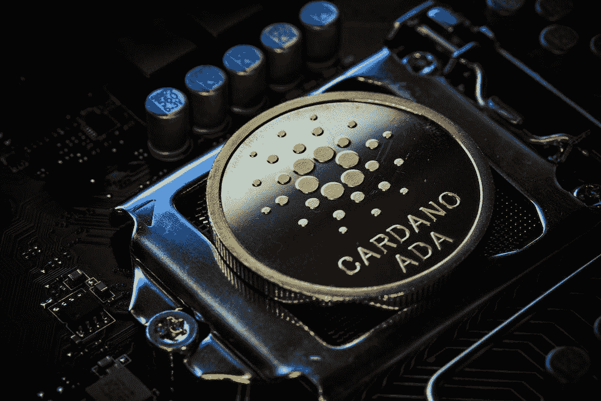

# 美国农业部将推出 Cardano (ADA) Stablecoin

> 原文：<https://medium.com/coinmonks/cardano-ada-stablecoin-usda-to-be-launched-cff97a867f85?source=collection_archive---------4----------------------->

Cardano (ADA)是世界上最受欢迎的加密货币之一，而且它将变得更加流行。卡尔达诺背后的团队正致力于推出一种名为 USDA 的稳定货币，这种货币将与美元挂钩。stablecoin 预计将于 2023 年推出，并将在 Cardano 网络上提供