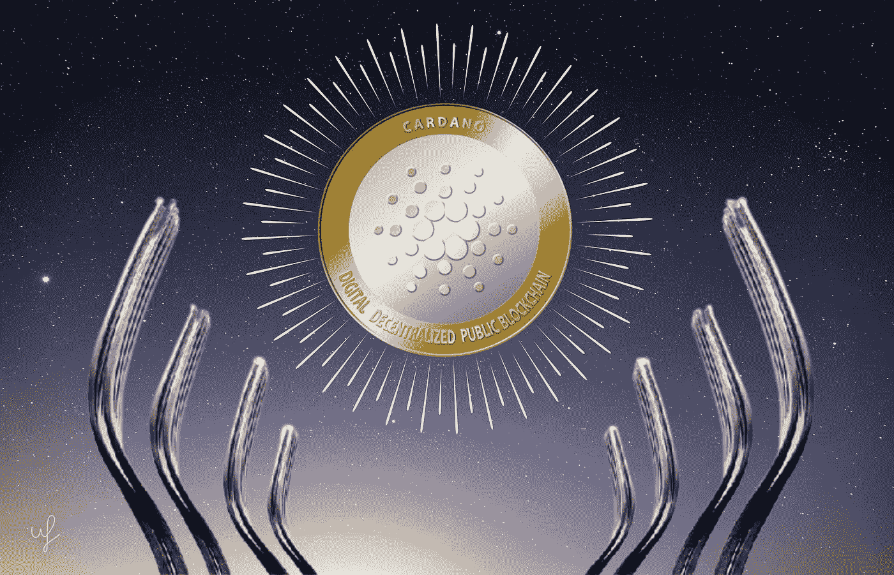

# Cardano 开发者在 testnet 上激活 Vasil 硬分叉

> 原文：<https://medium.com/coinmonks/cardano-developers-activate-vasil-hard-fork-on-testnet-cd10b71df8d1?source=collection_archive---------18----------------------->

7 月 3 日，开发 Cardano 的专家，输入输出全局(IOG)，在测试网上硬分叉 Vasil。

This preview will be included in the NFT collection called “[Uncle Fibonacci News](https://opensea.io/collection/uncle-fibonacci-news)”

在 mainnet 上发布之前，应用程序开发人员、赌注池运营商(spo)、交易所和其他生态系统参与者有四周时间来“最终测试和整合”更新。

> “瓦西里是一个全面的工作计划。项目将需要检查向后兼容性，spo 将需要对脚本执行进行一些更改。

该公司的专家回忆说，由于扩散管道处理，升级提供了更高的网络吞吐量。对于项目开发人员来说，这以较低的成本提高了脚本的性能和效率。

> 交易新手？试试[加密交易机器人](/coinmonks/crypto-trading-bot-c2ffce8acb2a)或者[复制交易](/coinmonks/top-10-crypto-copy-trading-platforms-for-beginners-d0c37c7d698c)

更新还包括:

▪️增强了 Cardano 的加密原语，以扩展到其他区块链的互操作性；
▪️配置了 Plutus 智能合同解释器；
▪️是 Plutus V2 脚本的一部分，是一个新的成本模型。

> “Vasil 更新是我们开展的最雄心勃勃的工作计划。整个社区都参与其中。我们的主要任务是确保安全可靠地管理升级，”IOG 开发人员强调道。

📰 ***订阅*** [***斐波那契***](/@unclefibonacci) ***我来保持最新***

☕️eth:0x40a 8443813 e 8 fa 4a 9 f 88 f 18 b 77442 aa 4ed 91 fd4c

☕️BTC:1kkekcmdrghajztfxjoq 5 otg bv 1 mgucwdj