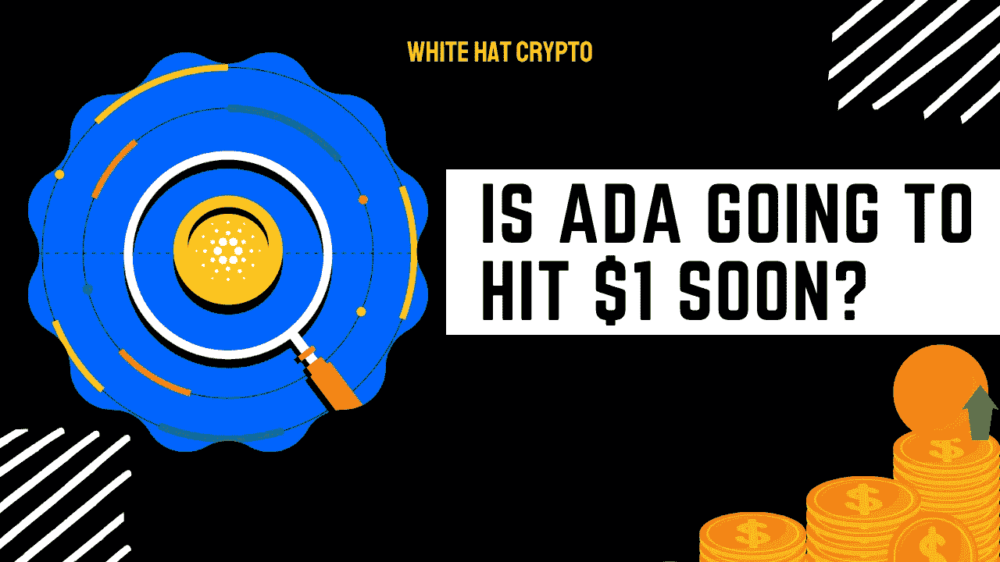

# 卡尔达诺翻转 XRP！艾达很快会涨到 1 美元吗？

> 原文：<https://medium.com/coinmonks/cardano-flips-xrp-is-ada-going-to-hit-1-soon-6c623e7fb0b8?source=collection_archive---------6----------------------->

ADA 最近获得了一些牵引力，因为它在主要加密货币的“十大”名单中攀升。够强到 1 美元吗？

几天前，当 BUSD 的估值超过其市值时，该资产跌至第七位。这发生在市场经历急剧下跌时，影响了 ADA 的价格。

尽管如此，当市场好转时，ADA 在价格飙升后恢复了第七的位置。

该资产现已超过 XRP，成为第六大加密货币。这发生在资产价格超过 0.55 美元的障碍水平之后。

# 让我们看看 ADA 的案例:

上周六，卡尔达诺的市值突破了 191 亿美元。这是该资产两个月来的最高估值。最后一次是在 6 月 11 日，当时它的资本随着市场下跌而缩水。

这一成就使 ADA beyond (XRP)成为市值最高的加密货币，价值 189 亿美元。ADA 的市值随后跌至 198 亿美元以下，但该资产仍排名第六。

正如预测的那样，这两种资产的上涨都遇到了障碍。随着 BTC 和瑞士联邦理工学院创下新高，最近一轮牛市重振了加密市场。

# 阿达会打到 1 美元吗？

最近资产价格的攀升立即推动了卡尔达诺市值的增长。在**0.55 美元**阻力位下方交易两个多月后，阿达成功突破。

从 6 月中旬到 7 月初，该资产在试图突破**0.50 美元**阻力时多次被拒绝。几次救援反弹推高了资产价值，但每次努力都在 0.50 美元附近遇到阻力。直到 7 月下旬，ADA 才开始安全地交易超过半美元。

8 月份加强了对这一水平的持有，因为它将目光投向了 0.55 美元的阻力。自 8 月 5 日以来，ADA 的下一次活动一直以 **$0.50** 作为其新的后盾而不成功。尽管事实上市场在 8 月份有所改善，但资产从未达到 0.55 美元——直到最近。救援反弹将阿达推升至 0.56 美元上方，然后小幅下跌至 0.558 美元。

在撰写本文时，ADA 的交易价格为 0.58 美元。如果多头推动市场上涨，ADA 的价值可能会超过 0.65 美元的阻力位，该资产已经部分确立了其位置。

这篇文章中提供的内容不是赞助的，据我所知是正确的。这篇文章不是金融建议，我们不对针对这篇文章采取的任何行动负责！

请随时查看我们的社交平台，了解每日加密更新，或通过以下渠道联系我们:

[YouTube](https://www.youtube.com/channel/UCjfinzatswbVaRd89zn5kJQ/featured)

[推特](https://twitter.com/whitehatcrypto)

[Instagram](https://instagram.com/white.hatcrypto?igshid=YmMyMTA2M2Y=)

[Gmail](http://cryptowhitehat@gmail.com/)

信息来源:CoinMarket Cap，ZyCrypto

> 加入 Coinmonks [电报频道](https://t.me/coincodecap)和 [Youtube 频道](https://www.youtube.com/c/coinmonks/videos)了解加密交易和投资

# 另外，阅读

*   [如何在 Bitbns 上购买柴犬(SHIB)币？](https://coincodecap.com/buy-shiba-bitbns) | [购买弗洛基](https://coincodecap.com/buy-floki-inu-token)
*   [CoinFLEX 评论](https://coincodecap.com/coinflex-review) | [AEX 交易所评论](https://coincodecap.com/aex-exchange-review) | [UPbit 评论](https://coincodecap.com/upbit-review)
*   [十大最佳加密货币博客](https://coincodecap.com/best-cryptocurrency-blogs) | [YouHodler 评论](https://coincodecap.com/youhodler-review)
*   [AscendEx 保证金交易](https://coincodecap.com/ascendex-margin-trading) | [Bitfinex 赌注](https://coincodecap.com/bitfinex-staking)
*   [最好的卡达诺钱包](https://coincodecap.com/best-cardano-wallets) | [冰棒副本交易](https://coincodecap.com/bingbon-copy-trading)