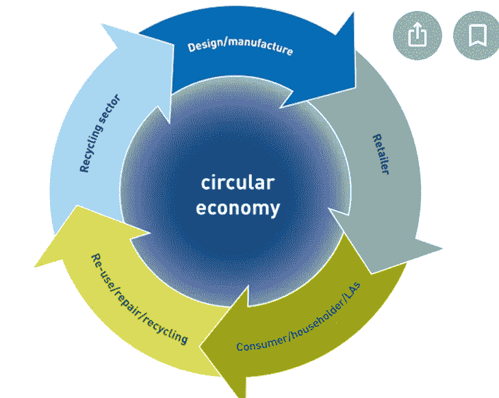

# 卡尔达诺:激励今天，给未来希望

> 原文：<https://medium.com/coinmonks/cardano-incentivizing-today-and-giving-hope-for-the-future-a3a0e924deb9?source=collection_archive---------52----------------------->

在生活中，我们陷入了无数的系统中。这些系统已经进化到可以操纵我们，控制我们，让我们服从他们的命令。这些系统可能是显而易见的，如学校、教堂、工作和商业，甚至家庭结构。

并非所有这些都是不好的。再说一遍，我说的是进化，所以这意味着我们，不管是直接的还是间接的，都参与了进化。我知道我们大多数人是无辜的参与者，但我们仍然是游戏中的一部分或玩家，所以我们就叫它是什么吧。

这些系统是如何操纵我们的？他们通常有一个立即激励的结构来让我们动起来，然后他们提供某种长期的“奖金”或希望让我们保持冷静，集中注意力(或者可能是从工作中分心？)，而这反过来又让我们成为了优秀的工蜂。所有这些对蜂群都有好处，尤其是对蜂王，对吗？

再说一遍，所有这些都不坏。结构、纪律、努力的协调等。可以创造出比他们自己更伟大的东西。问题是，很多时候，激励让我们无法做我们真正想做的事情，让我们无法获得真正的幸福和满足，并且肯定让少数顶层人士变得富有。

这些激励，更多的时候，是以金钱的形式给出的。啊，是的，众所周知的金钱，万恶之源。嗯，这是有一定道理的。但是我跑题了。如果我们能让摇钱树锋利的刀刃变钝。让它更可口。更诚实。少切。

我认为这就是加密的用武之地。它可以在边缘，微交易，奖励，奖金，不可改变的，棘手的好方法。所有这些都由智能合同保证，并且根据密码，有一个受控的和简洁的可用供应。不再被操纵。它迫使我们成为一个循环的、基于资源的经济体，就像我们应该成为的那样。

我们将集体开始做得更好，并为我们的行动、贡献、努力、创造，甚至我们的不贡献或我们选择不做某事得到公平的补偿。它可以被预先编程，以便不被自身利益所感染。

这就需要一个可靠、安全、智能、可扩展、分散的加密系统，并提供有限的生命周期。卡尔达诺符合要求！

> 交易新手？试试[加密交易机器人](/coinmonks/crypto-trading-bot-c2ffce8acb2a)或者[复制交易](/coinmonks/top-10-crypto-copy-trading-platforms-for-beginners-d0c37c7d698c)