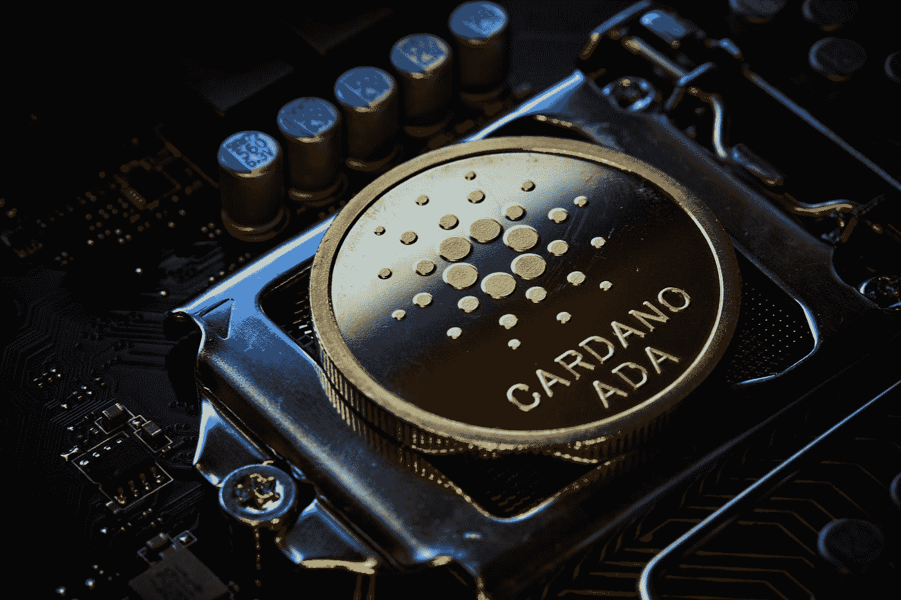

# 卡尔达诺投资者正在积极逢低买入

> 原文：<https://medium.com/coinmonks/cardano-investors-showing-strong-confidence-in-ada-buying-dips-aggressively-1919f97da723?source=collection_archive---------9----------------------->

## [加密货币与投资💰](/@TraderB/list/cryptocurrency-and-investment-8d81ae749faa)

Photo by [Michael Förtsch](https://unsplash.com/@michael_f?utm_source=medium&utm_medium=referral) on [Unsplash](https://unsplash.com?utm_source=medium&utm_medium=referral)

**加密货币的世界最近经历了很多活动，某些硬币和代币得到了投资者的显著增长和关注。**卡尔达诺(Cardano)是一枚备受关注的硬币，自今年 6 月以来，资金雄厚的投资者一直在稳步增加对它的投资。