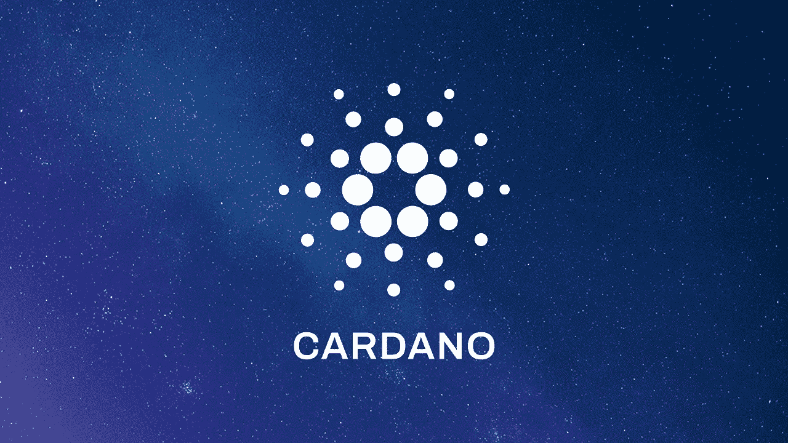

# 卡尔达诺被“低估”，阿达可以在 3 个月内“翻倍”

> 原文：<https://medium.com/coinmonks/cardano-is-undervalued-and-ada-can-double-in-3-months-8b21cebef980?source=collection_archive---------38----------------------->

卡尔达诺(ADA)是许多加密投资者的最爱。然而，一段时间以来，阿达的股价一直不太好。然而，根据加密分析公司 Santiment 的说法，ADA 目前的价格并不能很好地代表其价值。研究人员认为，ADA 被严重低估，在未来三个月内，它的价格很容易翻倍。

