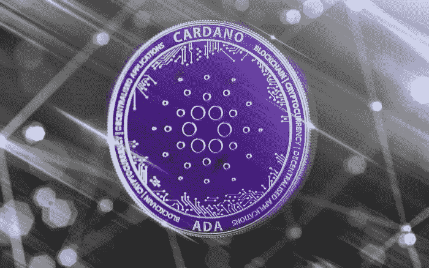

# 卡达诺网络已经为最大和最好的硬叉做好准备

> 原文：<https://medium.com/coinmonks/cardano-network-gets-ready-for-the-biggest-and-best-hard-fork-yet-98e1456cbb8a?source=collection_archive---------39----------------------->

卡尔达诺网络即将进行重大升级。7 月 3 日，测试网络投入运行，四周后将轮到 mainnet。根据香港开发商 Input Output Hong(IOHK)的说法，这将是“迄今为止最大和最好的硬叉”我们对新版本的[卡达诺](https://bitnewsbot.com/tag/cardano)测试网络到底有什么期望？

# 速度快、效率高、成本低

根据 IOHK 的说法，新的更新为开发者提供了更高的吞吐量、更好的脚本执行和更低的成本。最重要的更新之一是“扩散流水线”的实现，它提高了分散应用的可扩展性。

该更新允许更快地创建数据块，然后无需完全验证即可通过网络发送。因此，测试网络将于 7 月 3 日过渡，cardano 社区已经表示，它将需要四周时间来测试一切并更新应用程序。

IOHK 表示，当“每个人都对此感到满意并准备好升级”时，硬叉将会出现最初，mainnet 最早应该在 6 月 29 日更新，但在 6 月 22 日，该计划被推迟了一个月。当时，IOHK 称这个项目是“我们承担过的最复杂的工作”

> 交易新手？试试[密码交易机器人](/coinmonks/crypto-trading-bot-c2ffce8acb2a)或者[拷贝交易](/coinmonks/top-10-crypto-copy-trading-platforms-for-beginners-d0c37c7d698c)

# 最近一次更新卡达诺的时间可以追溯到 2021 年 9 月

cardano 区块链的最新重大更新可以追溯到 2021 年 9 月。当时，阿隆佐硬叉发生了，引入了期待已久的智能合同的可能性卡达诺网络。

自更新以来，这些智能合同可以用普路托斯脚本来构建，这是一种专门为卡尔达诺开发的编程语言。到目前为止，卡尔达诺社区大多以失望告终。

事实上，在撰写本文时，cardano 只有 11 个分散的应用程序在网络上运行。卡尔达诺的联合创始人查尔斯·霍斯金森预测，到 2021 年，卡尔达诺生态系统将会拥有成千上万个分散的应用程序。

然而，据霍斯金森称，大多数开发人员都在等待新的 Vasil 硬叉。Vasil hard fork 是以 Vasil Stoyanov Davod 的名字命名的，他是一名艺术家，也是 cardano 社区的一员，于 2021 年 12 月去世。

# 卡尔达诺和股权凭证

卡尔达诺是该行业中规模较大的项目之一，目前已经在运行。多年来，该项目一直被贴上所谓“以太博物馆杀手”的标签。

然而，迄今为止，它未能兑现这一承诺。cardano 只有 11 个分散的应用程序，市值比以太坊低得多，它还有很长的路要走。

因此，cardano 在以太坊上的唯一优势是，它已经开始运行了。以太坊也计划在今年晚些时候切换到共识机制。

价格方面，卡达诺一直比较好。在撰写本文时，代币的交易价格为 0.4249 欧元，该项目的市值约为 145 亿欧元。这意味着卡尔达诺目前的交易价格是去年历史最高水平的 85%左右。

*原载于 2022 年 7 月 4 日*[*【https://bitnewsbot.com】*](https://bitnewsbot.com/cardano-network-gets-ready-for-the-biggest-and-best-hard-fork-yet/)*。*