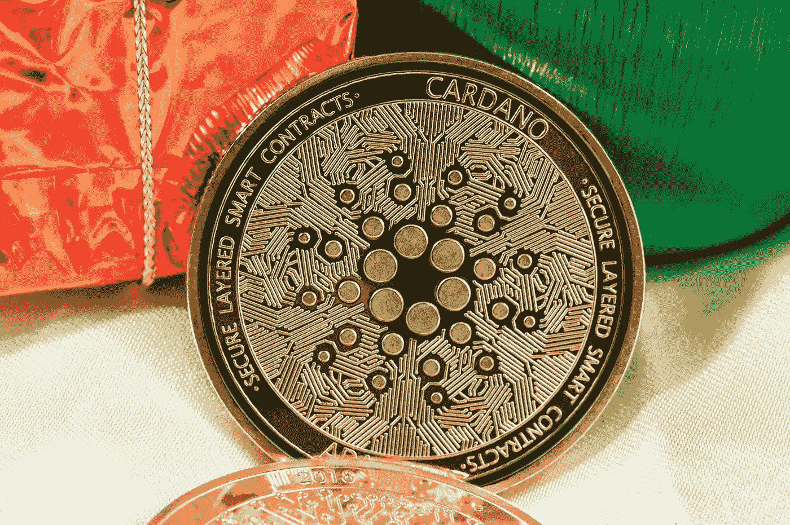

# 2023 年，卡尔达诺或露娜经典:哪种加密技术将首先突破 3 美元大关？

> 原文：<https://medium.com/coinmonks/cardano-or-luna-classic-in-2023-which-crypto-will-reach-the-3-mark-first-642faca1b35a?source=collection_archive---------8----------------------->

## [加密货币和新闻](/@TraderB/list/cryptocurrency-and-news-8d81ae749faa)📰

## Cardano 和 Luna Classic 在加密货币市场的竞争已经持续了一段时间。

Photo by [Traxer](https://unsplash.com/@traxer?utm_source=medium&utm_medium=referral) on [Unsplash](https://unsplash.com?utm_source=medium&utm_medium=referral)

虽然两者都有区块链发展的潜力，但它们有不同的主要…