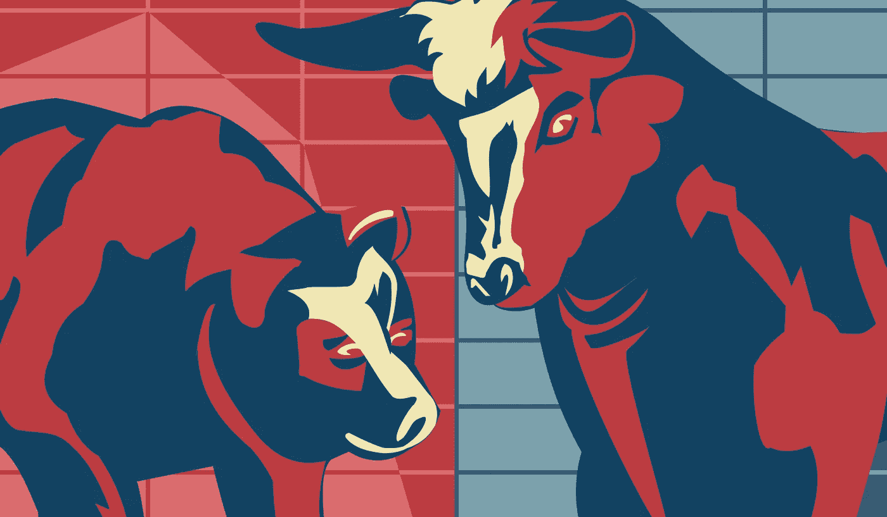

# 卡尔达诺在熊市中幸存

> 原文：<https://medium.com/coinmonks/cardano-survives-the-bear-market-369716e72c3c?source=collection_archive---------2----------------------->

2017 年后，Cardano 已经度过了一个熊市，仍然是前 10 名中的相关项目。由于糟糕的经济形势和比特币的后减半期，我们目前正处于熊市。让我们来看看为什么卡尔达诺也能轻松度过当前的熊市。

# TLDR:

*   卡尔达诺在 2017 年至 2021 年的熊市中幸存下来。在下一次牛市中…