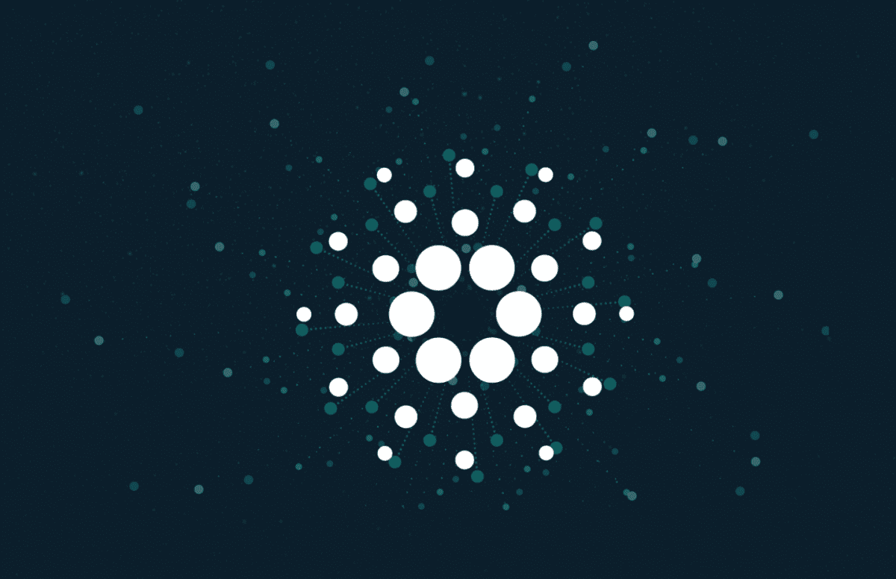

# 最去中心化的区块链 Cardano？

> 原文：<https://medium.com/coinmonks/cardano-the-most-decentralized-blockchain-4a823a791357?source=collection_archive---------11----------------------->

非常好的加密读者，这将是一篇简短但非常有趣的文章，我们不会深入分析 Cardano 生态系统，在这篇文章中，我们将分析他们将要实施的下一个更新，这个更新可能会使它成为目前加密领域中最分散的网络。你认为他们会成功吗？我们来分析一下这个！