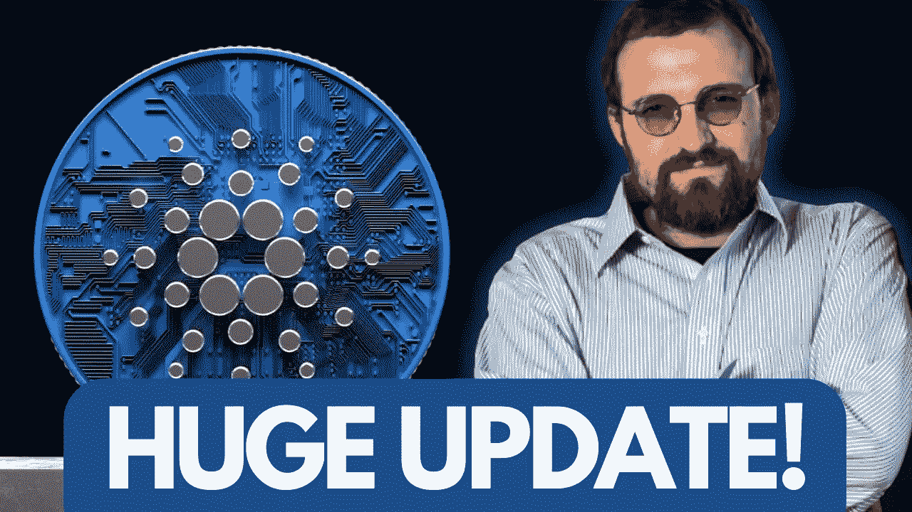
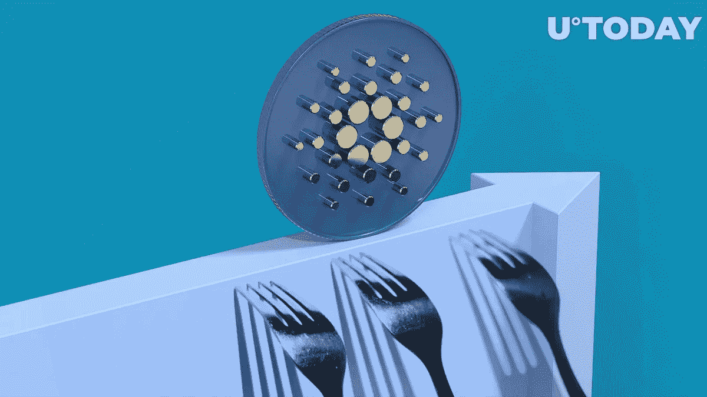
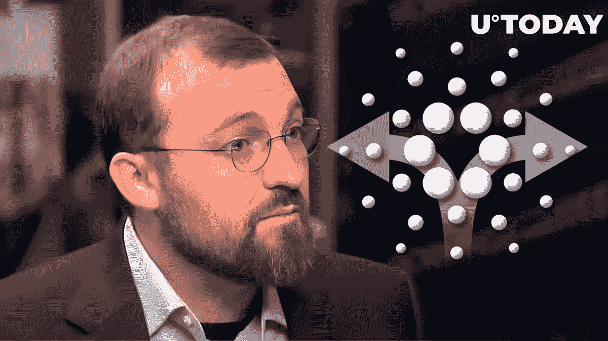

# 卡尔达诺史上最复杂的升级！VASIL HARDFORK 硬叉更新！最新消息！

> 原文：<https://medium.com/coinmonks/cardanos-most-complicated-upgrade-in-history-vasil-hardfork-hard-fork-update-latest-news-1026719d9efa?source=collection_archive---------6----------------------->

# 卡尔达诺的瓦西里硬叉经历延迟:详情

卡尔达诺最受期待的 Vasil 硬叉似乎再次遭遇延迟。在最近的 Cardano 360 活动中，IOG 的技术经理 Kevin Hammond 暗示可能会再推迟几周，但没有说明发布的具体日期。他说，这对于进一步测试和确保过程顺利是必要的。

IOG 的技术经理 Kevin Hammond 表示:

> 显然，从我们现在的情况来看，可能还需要几个星期才能到达真正的 Vasil hard fork。这非常重要。所有用户都必须准备好进行硬分叉，以确保流程顺利进行。

在内部监督组宣布将于 6 月底改变时间表后，Vasil mainnet 硬分叉暂定于 7 月最后一周进行。它当时表示，在 7 月 3 日发生的 testnet 硬分叉之后，交易所和 spo(股份池运营商)需要至少四周的时间进行测试。

## 反应:

对延期的消息反应不一。一名用户在推特上写道:“也许有点令人失望，但几周的延迟在大计划中不算什么。此外，想想看，人们已经等待了多少年的联邦理工学院合并，在这一点上链仍然只有 55%完成。他们做得很棒。”

# 卡尔达诺创始人在瓦西里硬叉子上打破沉默，给出了延迟的原因

> 卡尔达诺的创造者查尔斯·霍金森打破了他在瓦西里硬叉延迟上的沉默。在他位于科罗拉多州的家中，Hoskinson 在一个名为“关于 Vasil 的一些简短评论”的直播流中解释了延迟的原因:“……问题是每次发现一些东西，你都必须修复它。但随后你必须验证修复，并返回整个测试流程。”

> 他补充道，“所以你会有一个完整的特征。但是你必须测试，当你测试的时候，你可能会发现一些东西，然后你必须修复它，然后你必须回到整个测试管道。这就是导致发布延迟的原因。”

据 U.Today 报道，IOG 的技术经理 Kevin Hammond 在最近的 Cardano360 活动中表示，可能会推迟几周，但没有提供具体的发布日期。他声称，这样做对于进一步测试和保证过程顺利至关重要。

备受期待的 Vasil mainnet 硬分叉之前曾暂时预计在 7 月的最后一周进行，因为内部监督组在接近 6 月底时透露了时间的变化。

## 霍金森预计“不会再有延误”

7 月 3 日，IOG 开发人员将 Cardano testnet 硬移植到 Vasil 功能上。随着最初的 node v.1.35.0 的发布，在 testnet hard fork 发布之后，开发工作继续进行。由于发现了错误，内部监督组团队转而处理节点 v.1.35.1 和 v.1.35.2。

Cardano 的创建者称新的 node v.1.35.3 是硬分叉的可能候选版本。

> “好消息是，可能出错的事情已经变得如此之少，现在我们在这方面的测试正处于最后阶段，”霍金森说。“因此，除非有新的发现，否则我不认为我们会有任何进一步的延误。”

SCEZ 是一个创建智能合约、NFT、本地代币和卡尔达诺区块链交易的友好工具。一个完整的 REST api 解决方案，面向加密开发者、爱好者和企业家。

> 交易新手？试试[密码交易机器人](/coinmonks/crypto-trading-bot-c2ffce8acb2a)或者[复制交易](/coinmonks/top-10-crypto-copy-trading-platforms-for-beginners-d0c37c7d698c)