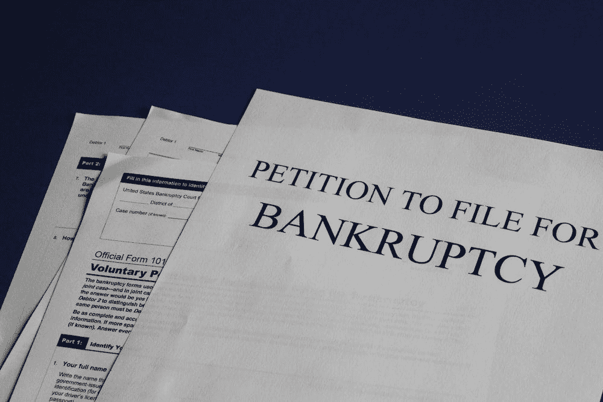

# 卡罗琳·埃里森和阿拉米达研究公司的破产

> 原文：<https://medium.com/coinmonks/caroline-ellison-and-the-bankruptcy-of-alameda-research-f0f7b4d5ba5f?source=collection_archive---------0----------------------->

卡罗琳·埃里森(Caroline Ellison)是阿拉米达研究公司(Alameda Research)的首席执行官，这是一家她在 2013 年联合创立的量化交易公司。她拥有哈佛大学的经济学学位和加州大学伯克利分校的金融工程硕士学位。

Caroline 是一位非常成功的女商人，也是加密货币交易领域的思想领袖。她是一个经常演讲的人…